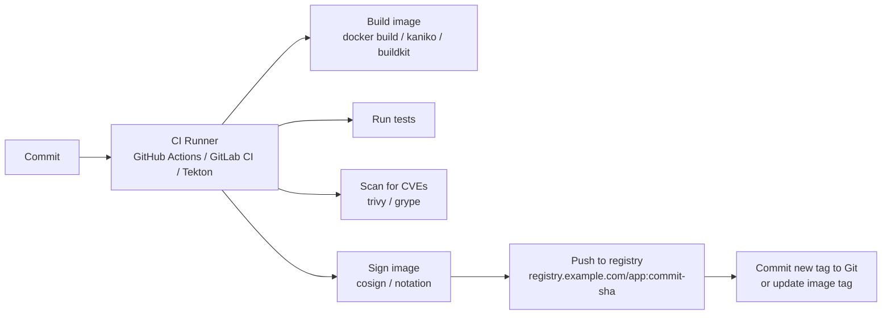

# CI/CD & Image Delivery Patterns

> **Category:** CI/CD / GitOps

## What It Is

**CI/CD** is the pipeline that moves code from a developer's commit into a **running Kubernetes Pod**:
- **CI** (Continuous Integration): build, test, and **push a container image**
- **CD** (Continuous Deployment): apply that image (and config) to a cluster — either via CI or **GitOps** (Argo CD / Flux)

## Why It Exists

- Manual deploys are slow, error-prone, and un-auditable
- You want **reproducible builds** and **rollback-able, traceable** releases
- Separation of **duties**: CI builds, CD deploys

## CI: Build, Test, Push



### Where CI runs

| Runner | When to use |
|--------|-------------|
| **GitHub Actions** (managed runner) | Public repos / small orgs; simple |
| **GitLab CI** | GitLab-native workflows |
| **Self-hosted runners** (on bare metal / Kubernetes) | Need isolation, custom tools, high-scale, or private networks |
| **Tekton / Argo Workflows** | CI **on** Kubernetes (cloud-native, Kubernetes-native CRDs) |
| **Kaniko / BuildKit on K8s** | Build inside the cluster (no Docker-in-Docker) |

### Building images on Kubernetes (no Docker daemon)

| Tool | Notes |
|------|-------|
| **Kaniko** | Builds from a `Dockerfile` inside a container (no daemon); pushes to registry. Needs a Secret for registry auth. |
| **BuildKit** (via `buildctl`) | Faster; supports caching. |
| **img / Earthly** | Daemon-less, cache-aware. |
| **ko** | For Go services — builds + pushes by import path. |

## CD: Deliver to the Cluster

Two approaches:

### 1. CI-driven deploy (push model)
CI commits/deploy tool applies manifests:
```yaml
# GitHub Actions / GitLab CI job:
- kubectl set image deployment/myapp myapp=registry/app:$GIT_SHA
- helm upgrade myapp ./chart --set image.tag=$GIT_SHA
```
- **Pro**: simple; CI pushes directly.
- **Con**: CI needs cluster credentials (a long-lived token); drift is possible.

### 2. GitOps (pull model) — recommended
CI pushes the image; **a Git commit updates the desired image tag**; a GitOps agent (Argo CD / Flux) **syncs** the cluster.

| Approach | GitOps Agent | Flow |
|----------|--------------|------|
| Argo CD | Pulls from Git | Compares live vs Git; auto-syncs (or manual) |
| Flux | Pulls from Git (Helm + kustomize) | Reconciles cluster → Git; auto-image-updates |

## Image Tag Strategies

| Strategy | Tag | Example | Pros | Cons |
|----------|-----|---------|------|------|
| Git SHA | `$SHA` | `app:abc1234` | Reproducible, traceable | Not human-friendly |
| Semantic | `v1.2.3` | `app:v1.2.3` | Human-friendly | Manual release |
| `latest` | `latest` | `app:latest` | Easy | **Non-reproducible** (never use in prod) |
| Git tag + env | `$SHA-dev` | `app:abc1234-dev` | Traceable per env | Multiple tags |

**Best practice:** tag with `git rev-parse --short HEAD` and also `latest` in dev only.

## Image Signing & Verification

Verify images weren't tampered with before running:

| Tool | Sig scheme | Notes |
|------|-----------|-------|
| **Cosign** | Keyless (OIDC) or keys | Sigstore standard; integrates with Kyverno / Kritis |
| ** Notation** | Keys / OIDC | Microsoft's tooling; used by Azure/Acrylic |
| **Docker Content Trust (DCT)** | Keys | Older; Notary v1 |

Example (cosign):
```bash
# Sign the image
cosign sign registry.example.com/app:v1.1 --yes
# Verify in CI, or enforce in-cluster via Kyverno / Gatekeeper policy:
# "Only run images signed by cosign"
```

## CI/CD Security: Supply Chain

- **Image scanning** (Trivy, Grype) at build time — block CVEs
- **SAST/DAST** — static/dynamic analysis in CI
- **Image signing** (cosign) — only signed images can run (Admission policy)
- **Least-privilege CI runners** — GitHub App with minimal permissions
- **Secrets in CI** — use GitHub OIDC / GCP Workload Identity Federation (no long-lived keys)

## Kubernetes Manifests in the Pipeline

### Pattern 1: Generated manifests committed
- `helm template` / `kustomize build` output is **committed to Git** (a `/deploy/` folder).
- **Pro**: fully auditable, deterministic.
- **Con**: large diffs with every change; potential drift.

### Pattern 2: GitOps agent generates + reconciles (preferred)
- Git stores the `HelmRelease`, `Kustomization`, or `Application` (Argo CD) + `values`.
- The agent renders (`helm template`/`kustomize build`) on its own schedule.
- **Pro**: clean Git (no rendered manifests), always reconciles drift.

## Example: Argo CD App-of-Apps
```yaml
# root application pointing at per-env apps
apiVersion: argoproj.io/v1alpha1
kind: Application
metadata:
  name: my-app
  finalizers:
  - resources-finalizer.argocd.argoproj.io
spec:
  project: default
  source:
    repoURL: https://github.com/my-org/my-manifests.git
    targetRevision: HEAD
    path: prod
    helm:
      valueFiles:
      - prod-values.yaml
  destination:
    server: https://kubernetes.default.svc
    namespace: prod
  syncPolicy:
    automated:
      prune: true            # Delete manifests removed from Git
      selfHeal: true          # Reconcile drift automatically
    syncOptions:
    - CreateNamespace=true
    - ApplyOutOfSyncFields=atCreation
```

## Example: Flux kustomization + image automation
```yaml
apiVersion: kustomize.toolkit.fluxcd.io/v1
kind: Kustomization
metadata:
  name: myapp-prod
  namespace: flux-system
spec:
  interval: 5m0s
  path: ./prod
  prune: true              # Remove resources no longer in Git
  sourceRef:
    kind: GitRepository
    name: my-git-repo
  postBuild:
    substituteFrom:
    - name: image-tag-ref     # Substitute a value from a SecretRef
```

## CI/CD on Kubernetes (Tekton)

```yaml
apiVersion: tekton.dev/v1
kind: Pipeline
metadata:
  name: build-and-push
spec:
  tasks:
  - name: fetch-repository
    taskRef:
      name: git-clone
    params:
    - name: url
      value: https://github.com/my/app
  - name: build-image
    taskRef:
      name: kaniko-build
    params:
    - name: IMAGE
      value: registry.example.com/app:$(params.revision)
```

## Deployment Strategies (tie-in)

| Strategy | Tooling | Downtime |
|----------|---------|----------|
| Rolling | Deployment `RollingUpdate` | None |
| Blue/Green | Separate Deployments + Service | None (switch Service) |
| Canary | Argo Rollouts / Flagger / ingress weight | Gradual |
| Recreate | `Recreate` strategy | Brief |

See [Deployment Strategies](../03-workloads/deployment-strategies.md).

## Commands Cheat Sheet (CI/CD)

```bash
# CI: build + push (example, in a GitHub Action)
docker build -t registry/app:$SHA .
docker push registry/app:$SHA
cosign sign registry/app:$SHA

# CD (Argo CD)
argocd app sync my-app
argocd app diff my-app
argocd app rollback my-app

# Flux
flux suspend hr/my-app -n prod
flux reconcile source git my-git-repo
kubectl get gitrepository,helmrelease -A
```

## Common Issues

### CI can't push to registry
```
# Check: image pull secret (regcred) for the CI runner
# Check: the runner's identity has `storage.objects:create`/`get` on the bucket
```

### Argo CD shows "Out of Sync / Unknown"
```bash
argocd app diff <name>        # See what differs from Git
argocd app wait <name>        # Wait for sync
# Check: the Git repo has the expected manifests at targetRevision
```

### Flux keeps reconciling (loop)
```bash
kubectl get kustomization <name> -o yaml
# Check: spec.interval — too short, or a diff (drift / prune) keeps it busy
kubectl get gitrepository <name> -o yaml
```

### Deployment "stuck" after image update
```bash
kubectl get rs,deploy -n <ns>
# A new ReplicaSet isn't rolling — maybe the image tag didn't change (or `latest` didn't roll).
# Pin by sha: registry/app@sha256:<digest> — guarantees a new RS each build
```

### Image signature verification blocks deployment
```bash
# A Kyverno/Gatekeeper policy rejected the unsigned image.
kubectl get clusterpolicy <name> -o yaml | grep -A5 results
# Re-sign with cosign, or relax the policy in dev.
```

## Best Practices

1. **Tag images by git SHA** (never rely on `latest` in prod)
2. **Sign images** and enforce in-cluster (cosign + Kyverno policy)
3. **Scan images** in CI (Trivy/Grype) — fail on high CVEs
4. **Keep manifests in Git** as the source of truth (GitOps)
5. **Use immutable tags** (SHA) so a deploy is reproducible
6. **Separate CI (build) from CD (deploy)** — CD is GitOps
7. **No long-lived cluster tokens in CI** — use short-lived creds / impersonation
8. **Use a ServiceAccount with least privilege** for CI runners
9. **Test the pipeline** — canary, then promote
10. **Observe the deploy** — link commits to rollouts (in Argo CD / Git)

## Interview Questions

**Q: What is the difference between CI and CD?**
A: **CI** (Continuous Integration) builds/tests/pushes the image (code → registry). **CD** (Continuous Deployment/Delivery) deploys it to a cluster (registry → cluster).

**Q: What is GitOps?**
A: A paradigm where Git is the **single source of truth** for cluster state. A GitOps agent (Argo CD / Flux) **pulls** the desired state from Git and reconciles the cluster continuously — reconciling drift automatically.

**Q: How is Argo CD different from Flux?**
A: Argo CD uses an **imperative, diff-based** UI/app model; Flux uses a **declarative, GitOps-toolkit** set of CRDs (`GitRepository`, `Kustomization`, `HelmRelease`) and integrates tightly with Helm. Both pull from Git.

**Q: How should images be tagged for reproducible deploys?**
A: With the **git commit SHA** (e.g., `app:$(git rev-parse --short HEAD)`), so the same tag always points to the same build. `latest` is non-reproducible.

**Q: How do you verify an image hasn't been tampered with?**
A: **Sign it** (cosign / notation) at build time, and enforce verification in-cluster via an admission policy (Kyverno/Gatekeeper) so unsigned images can't run.

## Related Resources

- [Helm](../10-package-management/helm.md)
- [Kustomize](../10-package-management/kustomize.md)
- [Argo CD](argo-cd.md)
- [Flux](flux.md)
- [Tekton](tekton.md)
- [Deployment Strategies](../03-workloads/deployment-strategies.md)
- [Security](../06-security/README.md)
