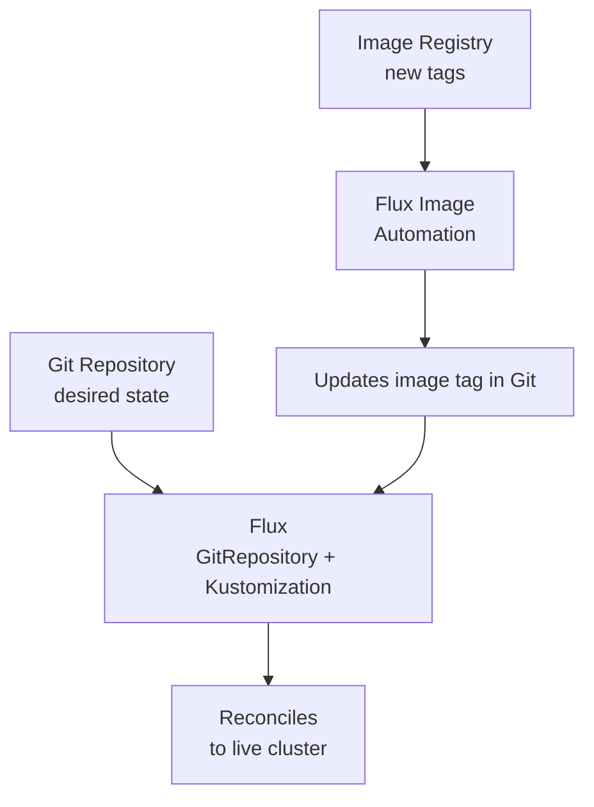

# Flux

> **Category:** CI/CD / GitOps

## What It Is

**Flux** is a GitOps toolkit (CNCF graduated) that **continuously reconciles** a Kubernetes cluster to match a Git repository. Unlike Argo CD (UI-centric), Flux is **declarative and Kubernetes-native** — you manage cluster state with `GitRepository`, `Kustomization`, and `HelmRelease` CRDs.

Flux also does **image automation** — it can watch an image repo and bump the tag in Git when a new image is published (with **image automation**).

## Why It Exists

- Push-based CD (CI) requires long-lived tokens with cluster write access (risk).
- Flux **pulls** from Git (read-only token), so CI doesn't touch the cluster.
- **Drift correction** happens automatically (every `interval`).
- Works with **Helm** and **Kustomize** (via CRDs).

## Architecture



## Flux Components

| CRD | Purpose |
|-----|---------|
| `GitRepository` | Points to a Git repo (URL, branch/tag, secretRef) |
| `Kustomization` | Reconciles a path in a GitRepository to the cluster (kustomize) |
| `HelmChart` + `HelmRelease` | Reconciles a Helm chart + values |
| `OCIRepository` | Sources an OCI artifact (e.g., image config, policies) |
| `ImageRepository` + `ImagePolicy` + `ImageUpdateAutomation` | Watch + bump image tags |

## Installation (Flux CLI)

```bash
# Install the CLI
curl --silent https://fluxcd.io/install.sh | sudo bash

# Bootstrap onto your cluster (creates the flux-system namespace + CRDs)
flux bootstrap github \
  --owner=my-org \
  --repository=my-gitops \
  --branch=main \
  --path=./clusters/my-cluster \
  --personal
```

The bootstrap:
1. Creates the `flux-system` namespace
2. Installs the Flux CRDs and controllers
3. Commits `gotk-components.yaml` and `gotk-sync.yaml` to Git
4. Starts reconciling your manifests

## Core CRDs

### 1. GitRepository
```yaml
apiVersion: source.toolkit.fluxcd.io/v1
kind: GitRepository
metadata:
  name: my-git-repo
  namespace: flux-system
spec:
  interval: 30s                        # How often to fetch Git
  url: https://github.com/my-org/my-manifests.git
  ref:
    branch: main                       # or tag: v1.2
  secretRef:
    name: my-git-cred                  # Kubernetes Secret with the PAT (for private repos)
  ignore: |                            # Exclude paths
    /*
    !prod/
```

### 2. Kustomization (reconcile manifests)
```yaml
apiVersion: kustomize.toolkit.fluxcd.io/v1
kind: Kustomization
metadata:
  name: my-app-prod
  namespace: flux-system
spec:
  interval: 5m0s               # Re-sync every 5 min
  path: ./prod                 # The path in the GitRepository
  prune: true                  # Delete resources removed from Git
  sourceRef:
    kind: GitRepository
    name: my-git-repo
  validation: client          # Verify manifests before apply (strict)
  postBuild:                  # Export values for substitution
    substituteFrom:
    - name: image-tag          # Read from a ConfigMap/Secret
      key: tag
```

### 3. HelmRelease (release a chart)
```yaml
apiVersion: helm.toolkit.fluxcd.io/v2
kind: HelmRelease
metadata:
  name: my-app
  namespace: prod
spec:
  releaseName: my-app
  chart:
    spec:
      chart: my-chart
      sourceRef:
        kind: HelmRepository
        name: my-repo            # A HelmRepository CR
        namespace: flux-system
      version: "1.2.3"            # Pin the chart version
  values:
    image:
      repository: registry.example.com/app
      tag: 1.2.3
    ingress:
      enabled: true
    env:
      LOG_LEVEL: debug
  interval: 5m
  upgrade:
    cleanupOnFail: true
    remediation:
      retries: 3
      retryInterval: 5m
  install:
    remediate:
      retries: 3
```

### 4. Image Automation (auto-bump tags)
```yaml
# Watch an image repo for new tags:
apiVersion: image.toolkit.fluxcd.io/v1beta1
kind: ImageRepository
metadata:
  name: my-app
  namespace: flux-system
spec:
  image: registry.example.com/my-org/my-app
  interval: 1m
---
# Pick a policy (e.g., semver range):
kind: ImagePolicy
spec:
  imageRepositoryRef:
    name: my-app
  policy:
    semver:
      range: ">=1.2.3"           # Or: alphabetical / latest
---
# Apply the newest image tag into Git:
apiVersion: image.toolkit.fluxcd.io/v1alpha1
kind: ImageUpdateAutomation
metadata:
  name: my-app
  namespace: flux-system
spec:
  interval: 1h
  sourceRef:
    kind: GitRepository
    name: my-git-repo
  git:
    commit:
      authorName: fluxcd
      authorEmail: fluxcd@example.com
      messageTemplate: |
        flux: automated update
        {{ range .Changed.FILES }}{{ println . }}{{ end }}
    checkout:
      name: '{{ range .Checkout.BRANCH }}{{ . }}{{ end }}'
  update:
    path: ./prod
    strategy: Setters
```

## Flux vs Argo CD

| Feature | Flux | Argo CD |
|---------|------|---------|
| State store | Git (CRDs in Git) | Argo CD's CRD store (Application) |
| UI | Minimal / read-only | Full UI (diff, sync, tree view) |
| Image automation | Built-in (ImageAutomation) | Optional (Flux + Argo CD, or external) |
| Drift detection | Every interval (reconciles) | Every 3 min (compare) |
| Multi-tenancy | AppProject (Flux 2) | AppProject |
| Learning curve | Moderate (YAML + kustomize/helm fluency) | Moderate (UI + CLI) |

## Commands

```bash
flux bootstrap github --owner=org --repo=gitops --branch=main --path=./clusters/prod

kubectl get gitrepository,kustomization,helmrelease -n flux-system
kubectl describe kustomization my-app-prod -n flux-system   # Logs, events
flux get kustomizations --watch
flux get helmreleases -A
flux get images repository          # Show watched images + last tags
flux suspend kustomization my-app   # Temporarily pause
flux resume kustomization my-app

# Image automation:
flux create image repository my-app --image=registry/app
flux create image policy my-app --policy=semver:>=1.2.0
flux create image update my-app --interval=1h --update=
```

## Common Issues

### "no changes" after committing a new image
```
# ImageUpdateAutomation has an interval (e.g., hourly). It bumps the tag on a schedule.
flux create image update my-app --interval=1m    # faster for testing
```

### Kustomization failed to apply: "namespace not found"
```bash
kubectl describe kustomization <name> -n flux-system
# A resource references a namespace that doesn't exist yet.
# Fix: add a Kustomization that creates the namespace first (with `dependsOn`).
```

### Image policy: "no image tags found"
```bash
kubectl describe imagepolicy <name>
# Check: can Flux reach the registry (auth / TLS / rate limit)?
# Check: the tags match the semver range (or `latest`)
```

### HelmRelease: "failed to install" (chart not found)
```yaml
# Verify the HelmRepository is healthy:
kubectl get helmrepository,helmchart -n flux-system
# Check the chart version exists in the repo
```

### "context deadline exceeded" / reconcile stuck
```bash
kubectl describe kustomization <name> -n flux-system
# Look under Events / Logs for the failing resource.
kubectl get <resource> -n <ns>                 # Is the object there in a bad state?
```

## HelmRepository (Flux's Helm chart source)

```yaml
apiVersion: source.toolkit.fluxcd.io/v1
kind: HelmChart
metadata:
  name: my-chart
  namespace: flux-system
spec:
  chart: bitnami/nginx
  sourceRef:
    kind: HelmRepository
    name: bitnami
    namespace: flux-system
  version: "18.x.x"
---
apiVersion: source.toolkit.fluxcd.io/v1
kind: HelmRepository
metadata:
  name: bitnami
  namespace: flux-system
spec:
  url: https://charts.bitnami.com/bitnami
  interval: 5m
  # For private repos, set up a Secret + certRef:
  # certRef:
  #   name: my-registry-cert
```

## Flux Kustomize Patches

Flux uses **kustomize** — so you can layer patches (e.g., prod-values via `patches:`):

```yaml
# kustomization.yaml in prod/
resources:
- ../../base
patches:
- target:
    kind: Deployment
    name: my-app
  patch: |-
    spec:
      replicas: 5
```

## Best Practices

1. **Pin chart versions** / `targetRevision` — never `:latest` (reproducibility)
2. **Use `prune: true`** — delete resources removed from Git
3. **Enable `validation: client`** — validates manifests (strict mode)
4. **Structure as appsets** (`infra/` + `teams/` + `clusters/` — the "Flux Structure")
5. **Watch images** + automate bumps (Flux v2 image automation)
6. **Set `interval` sensibly** (5m for apps, 1m for infra)
7. **Separate credentials** — Flux has its own Git SSH key (rotate regularly)
8. **Suspend reconciliation** temporarily when debugging
9. **Use `dependsOn`** for dependency ordering (namespace before workloads)
10. **Alert on reconciliation failures** (`<resource> is not ready` alerts)

## Interview Questions

**Q: How is Flux different from Argo CD?**
A: Flux is **Kubernetes-native** (CRDs manage everything, including being stored in Git) and **declarative** — Argo CD is centered on an `Application` CRD + UI. Flux is minimal UI (read-only via the dashboard), Argo CD has a full sync/diff UI.

**Q: How does Flux reconcile state?**
A: Every `interval`, Flux (1) fetches the Git/Helm repo, (2) computes the desired state, (3) applies it to the cluster, (4) sets the resource's `Ready`/`Reconciler` status. Drift is corrected automatically.

**Q: What is a HelmRelease?**
A: A Flux CRD that wraps a Helm chart + values — Flux's `HelmRelease` controller reconciles the Helm release (install/upgrade/rollback) just like `helm upgrade --install` would, on its interval.

**Q: Can Flux auto-update image tags?**
A: Yes — via the **image automation** components: `ImageRepository` (watches a registry), `ImagePolicy` (picks a tag by semver/policy), and `ImageUpdateAutomation` (writes the new tag back into Git).

**Q: How does Flux handle failures?**
A: A failing reconciliation is marked `Ready=False`, with `reason` and `message`. Flux retries on the next interval; `HelmRelease` supports `upgrade.remediation` (retries + rollback) and `install.remediate`.

**Q: Does Flux need cluster write credentials in Git?**
A: No — Flux **pulls** (Git read only). CI needs write access to bump image tags in Git, but **does not** need cluster credentials.

## Related Resources

- [Argo CD](argo-cd.md)
- [CI/CD Overview](ci-cd.md)
- [Helm](../10-package-management/helm.md)
- [Kustomize](../10-package-management/kustomize.md)
