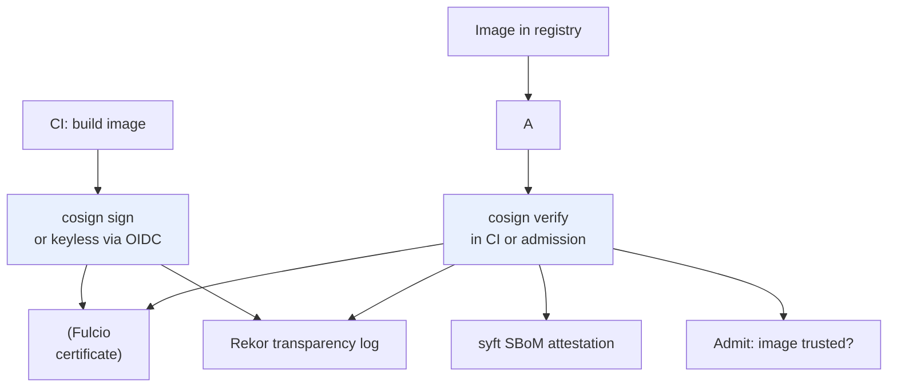

# Cosign — Image Signing & Supply Chain (Sigstore)

> **Category:** Supply Chain / CI

**Cosign** (part of **Sigstore**) signs container images and attestations and verifies them in CI/CD **and** at admission time. It supports **keyless** signing (identity-bound, via Fulcio + OIDC) so you never manage a signing key, plus **SBoM** generation (`syft`) attached as an attestation. This is how you stop "a compromised registry serves a trojaned base image."



## Keyless flow (recommended)

1. `cosign sign` triggers an **OIDC challenge** (GitHub Actions OIDC, or `cosign login`).
2. Fulcio issues a short-lived **certificate bound to your OID identity**.
3. The signature + cert is uploaded; Rekor logs a **transparency entry** (auditability).
4. At pull time: `cosign verify` checks the cert chain **and** the Rekor inclusion proof.

## Signing & verifying

```bash
# keyless (OIDC) — no key to manage:
cosign sign ghcr.io/acme/app:v1.2.3
# keyed (old workflow):
cosign sign -key cosign.key ghcr.io/acme/app:v1.2.3

# verify in CI before shipping to prod:
cosign verify ghcr.io/acme/app:v1.2.3 \
  --certificate-oidc-issuer=https://token.actions.githubusercontent.com \
  --certificate-identity-regexp=https://github.com/acme/.*
```

## SBoM + attestations

```bash
syft ghcr.io/acme/app:v1.2.3 -o spdxjson > app.spdx.json
cosign attest -predicate app.spdx.json ghcr.io/acme/app:v1.2.3
```

## Admission (policy at the gate)

Gate image pulls via **Kyverno** so unsigned images never run:
```yaml
apiVersion: kyverno.io/v1
kind: ClusterPolicy
metadata: { name: require-signatures }
spec:
  validationFailureAction: enforce
  background: false
  rules:
  - name: verify-image-signature
    match:
      resources: { kinds: [Pod] }
    verifyImages:
    - image: "ghcr.io/acme/app:*"
      keyless:
        url: https://fulcio.sigstore.dev
        identities:
        - issuer: https://token.actions.githubusercontent.com
          regexp: https://github.com/acme/.*
```

## Common failures

| Symptom | Cause | Fix |
|---------|-------|-----|
| `cosign verify: no matching signatures` | signed a different digest, or key mismatch | verify the exact digest; `cosign verify --insecure-ignore-tlog` only for testing |
| `no matching certificate for identity` | OIDC identity regex wrong | match `--certificate-identity` to your actual GitHub org/repo |
| CI can't reach `fulcio`/`rekor` | firewall/proxy block in air-gap | use key-based signing, or host `rekor`/`fulcio` privately |
| unsigned image still runs | admission policy not applied to that namespace | enforce a `ClusterPolicy` + `pod-security` on the namespace |

## Interview Questions

**Q: Keyless vs keyed signing — why prefer keyless?**
A: Keyless binds trust to your **OIDC identity** (e.g. GitHub Actions) via Fulcio, so you never store or rotate a static signing key and can't be phished for it. Trade-off: depends on the public Fulcio/Rekor (or a private Sigstore) — fine on the internet, extra work air-gapped.

**Q: Why attach an SBoM — what does the signature alone not prove?**
A: A signature proves **who** vouches for the digest; the **SBoM** (attached via `cosign attest`) proves **what is in** the image (packages, known CVEs). Together you gate identity *and* content — a signed image can still contain a vulnerable package.

## Related Resources
- [Security](../06-security/security.md)
- [GitOps](../11-ci-cd-gitops/ci-cd.md)
- [OCI](../10-package-management/oci.md)
