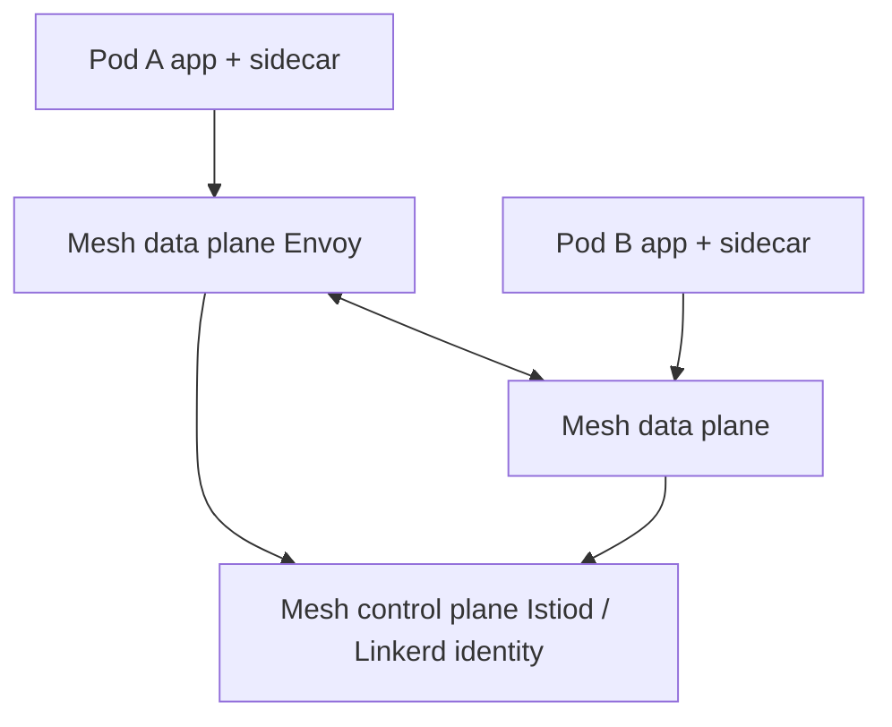

# 12. Service Mesh

> **Category:** Service Mesh / Networking

A **service mesh** is a dedicated infrastructure layer for **service-to-service communication** (east-west traffic) — adding observability, security (mTLS), and traffic control to Pods **without changing application code**.

## Core Concepts

| File | Topic |
|------|-------|
| [service-mesh.md](service-mesh.md) | What a mesh is, sidecar injection, mTLS |
| [istio.md](istio.md) | Istio components + routing |
| [linkerd.md](linkerd.md) | Linkerd (lightweight alternative) |

## Architecture

## Key Questions

- Why a service mesh? mTLS, retries, timeouts, canary, observability without code changes.
- How does mTLS work? Sidecars intercept traffic; the control plane rotates certs.
- How is traffic routed? Via CRDs (VirtualService, DestinationRule, Gateway), not just Services/Ingress.

## Related Resources

- [Networking](../04-networking/README.md)
- [Security](../06-security/README.md)
- [CI/CD](../11-ci-cd-gitops/README.md)
