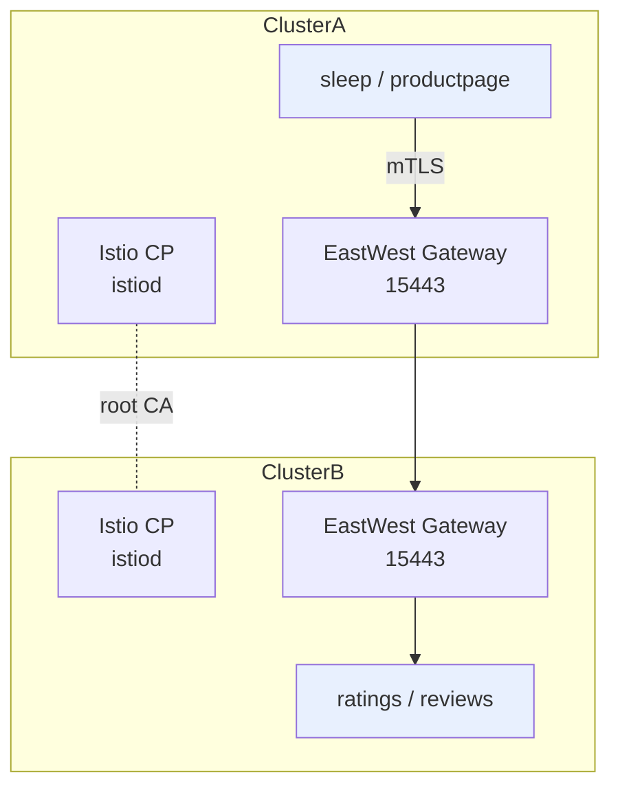

# Multi-Cluster Kubernetes

> **Category:** Service Mesh / Patterns

**Multi-cluster Kubernetes** is running one workload across two or more clusters for **HA, locality/failover, or regulatory isolation** (data-residency, air-gapped envs). K8s doesn't natively federate clusters — so you pick a strategy: **multi-control-plane, fleet/spokes, service-mesh federation, external-dns + gateways, or a dedicated multi-cluster API.** The hard parts are *identity* (certs), *service discovery* (how does `cluster-a` find `cluster-b`'s service), and *traffic routing* (failover/latency).

## Strategy matrix

| Strategy | Discovery | Traffic | Use case | Ops |
|----------|-----------|---------|----------|-----|
| **Service mesh federation** (Istio multi-primary) | `ServiceEntry` + `DNS` | mTLS via gateways | active-active, shared root of trust | medium |
| **Cilium Cluster Mesh** | `Service`/`Endpoints` + identities | eBPF + NodePort + L2/L3 | low-latency east-west, K8s-native | low |
| **Fleet / GitOps** (ArgoCD, Rancher, Flux multi-cluster Kustoma) | per-cluster manifests | per-cluster Ingress/Gateway | config sync across clusters | medium |
| **External DNS + Gateways** | DNS names per cluster | DNS failover/health check | simple multi-region, internet-facing | low |
| **Cluster API + Cluster API Provider** | declarative clusters | separate clusters | provisioning + lifecycle | high |

## Istio multi-primary (active-active)

Two clusters share a root CA (or cross-sign) and each runs an Istio control plane; cross-cluster traffic goes over a **mTLS Gateway** on a dedicated port (e.g. 15443). Each cluster exposes its services via `ServiceEntry`/`Gateway`.


- Both istiods get the same `cacerts` so mTLS certs validate in both clusters.
- `ServiceEntry` points cluster A at `cluster-b` services; the **EastWest Gateway** terminates/terminates mTLS.

## Cilium Cluster Mesh (eBPF)

Cilium stitches clusters at L3 via encrypted VXLAN/Geneve tunnels and **federates identities** so a Pod in `cluster-a` can call `service` in `cluster-b` by name without changing app config. Service `LoadBalancer`/`NodePort` semantics are extended across the tunnel. Lighter than a mesh (no sidecar), but you lose in-mesh L7/mTLS.

```yaml
# cluster config for mesh
cilium:
  kubeProxyReplacement: strict
  cluster:
    id: 1
    name: cluster-a
  clusters:
  - name: cluster-a
    address: 10.0.0.1:2379   # cluster-a apiserver reachable
  - name: cluster-b ...
```

## Common Issues

| Symptom | Cause | Fix |
|---------|-------|-----|
| mTLS handshake fails across clusters | mismatched root CA / cert not federated | ensure both istiods use the same `cacerts`; rotate cross-signed CAs |
| `ServiceEntry` resolves but 503/timeout | EastWest GW port/firewall not open | open `15443` between clusters; confirm GW selector |
| cross-cluster `kubectl` / discovery fails | API endpoints not network-reachable | mesh/vpc peering; use a `LoadBalancer` per cluster GW |
| identity collisions | two clusters use same Pod CIDR | give each cluster a unique `cluster.id` + distinct Pod CIDRs |

## Interview Questions

**Q: How do you do cross-cluster service discovery without a service mesh?**
A: Use **Cilium Cluster Mesh** (federates identities + Service across tunnels, no sidecars), or **ExternalDNS + per-cluster Gateways** so `reviews.cluster-b` resolves via DNS to a cluster-B gateway. Mesh is preferred when you also need in-cluster mTLS/failover.

**Q: What's the difference between "multi-primary" and "active-passive" for Istio?**
A: In **multi-primary (active-active)**, both clusters serve traffic and replicate via east-west gateways; failure of one fails over transparently. In **active-passive**, only the primary serves — the secondary is a standby; cross-cluster is one-directional. Multi-primary needs a shared root CA and open ports both ways.

**Q: What two things must be unique per cluster in a mesh or Cluster Mesh?**
A: (1) **Pod/Service CIDRs** (no CIDR overlaps — eBPF and routing break otherwise), and (2) the **cluster identity/id** (`cluster.id` in Cilium, or the `cacerts`/SA signing key in Istio so certs/mTLS validate correctly across clusters).

## Related Resources
- [Service Mesh](service-mesh.md)
- [Gateway API](../04-networking/gateway-api.md)
- [Cilium](../04-networking/cilium.md)
- [Cluster API](../08-cluster-operations/cluster-api.md)
- [HA Control Plane](../08-cluster-operations/kubeadm.md)
