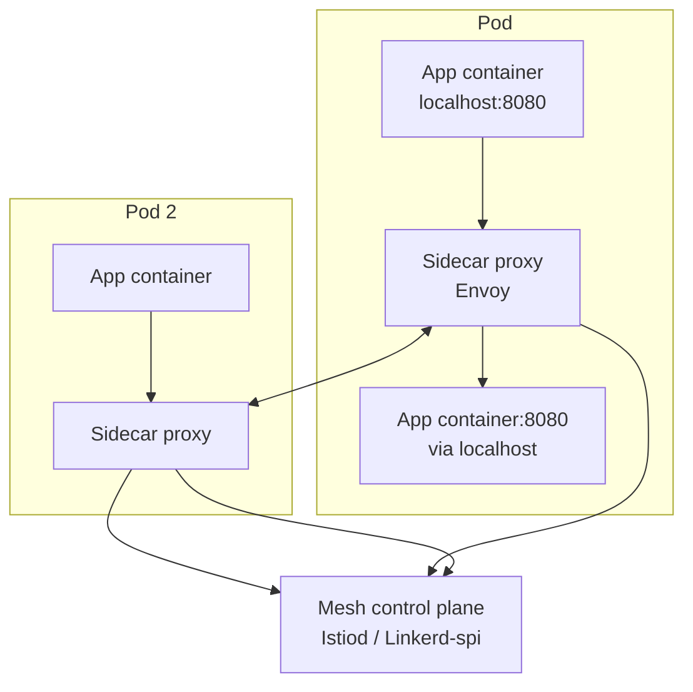
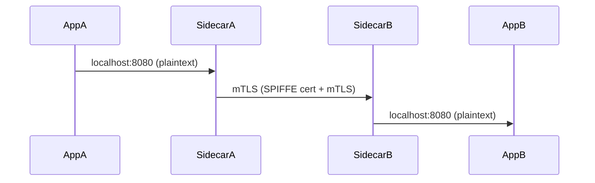

# Service Mesh

> **Category:** Service Mesh / Networking

## What It Is

A **service mesh** is a **dedicated infrastructure layer** for **service-to-service communication** (east-west traffic) within the cluster. It adds observability, security (mTLS), and traffic control **without modifying application code** — by injecting a **sidecar proxy** (Envoy, or Linkerd-proxy) next to each application container.

## Why It Exists

Apps are hard to secure and observe at the mesh layer:
- TLS/mTLS between Pods is complicated to set up manually
- Retries, timeouts, circuit-breaking require app-level libraries
- Traffic shifting (canary), fault injection, and observability need control-plane glue

A service mesh moves all this logic into the **networking plane** (via sidecar proxies), so apps just connect to "localhost" and the mesh handles the rest.

## Architecture



Every Pod gets a **data-plane proxy** (Envoy for Istio, `linkerd-proxy` for Linkerd) — injected automatically via a MutatingWebhookConfiguration. The **control plane**:
- Programs the **routing rules** (VirtualService, etc.)
- Issues and rotates **identity certificates** (SPIFFE IDs) for mTLS
- Collects **telemetry** (metrics, traces, logs)

All traffic between Pods goes: `app -> localhost:proxy -> proxy-to-proxy -> localhost:upstream-app`.

## Sidecar Injection

### Automatic
The control plane ships a **MutatingAdmissionWebhook** that adds the sidecar to every Pod in a labeled namespace:

```bash
# Istio:
kubectl label namespace bookinfo istio-injection=enabled
# Linkerd: the proxy is injected by `linkerd inject` (a webhook or CLI step)
kubectl annotate namespace myapp linkerd.io/inject=enabled
```

### Manual (for debugging / testing)
```bash
# Istio:
kubectl apply -f <(istioctl kube-inject -f deployment.yaml)
# Linkerd:
kubectl get deploy -o yaml | linkerd inject - | kubectl apply -f -
```

### Sidecar resources

The proxy sidecar needs resources of its own — a small request/limit:
```yaml
annotations:
  proxy.istio.io/proxyVCPU: "100m"
  proxy.istio.io/proxyVMemory: "128Mi"
```

## Mutual TLS (mTLS)

With mTLS, service-to-service traffic is **mutually authenticated** — both the caller and callee present certificates (SPIFFE-based SVIDs) that the control plane rotates automatically.



- The app sees plain HTTP (no code change).
- The proxies present rotating certs (rotated every ~24h by default).
- Identity is based on the service account (`spiffe://cluster.local/ns/<ns>/sa/<sa>`).

### mTLS Modes

| Mode | Behavior |
|------|----------|
| `DISABLE` | No mTLS (plaintext) |
| `PERMISSIVE` | Accept both plaintext and mTLS (gradual rollout) |
| `STRICT` | Only mTLS — reject plaintext (production) |

(Istio) Switch via a `PeerAuthentication`:
```yaml
apiVersion: security.istio.io/v1
kind: PeerAuthentication
metadata:
  name: default
  namespace: istio-system
spec:
  mtls:
    mode: STRICT
```

## Traffic Management (CRDs)

The mesh uses CRDs to program the data plane:

| CRD | Purpose | Mesh |
|-----|---------|------|
| `Gateway` | Ingress/egress gateway + listener | Istio |
| `VirtualService` | HTTP routing (hosts, paths, retries, timeouts) | Istio |
| `DestinationRule` | Subsets, load-balancing, outlier detection | Istio |
| `AuthorizationPolicy` | Allow/deny at L3/L4/L7 | Istio |
| `EnvoyFilter` | Raw Envoy config tweaks (advanced) | Istio |
| `ServiceProfile` | (Linkerd) per-route metrics + retries | Linkerd |
| `HTTPRoute` (gateway API) | Standardized routing CRD | Shared |

### Istio example: canary routing
```yaml
apiVersion: networking.istio.io/v1beta1
kind: VirtualService
metadata:
  name: reviews-route
spec:
  hosts:
  - reviews.prod.svc.cluster.local
  http:
  - match:
    - headers:
        cookie:
          regex: ".*release=candidate.*"
    route:
    - destination:
        host: reviews.prod.svc.cluster.local
        subset: v2          # 5% to v2
  - route:
    - destination:
        host: reviews.prod.svc.cluster.local
        subset: v1          # 95% to v1
```

## Observability

All traffic through the sidecar is observable by default:
- **Metrics** — Envoy stats (`/stats`) → scraped by Prometheus (Prometheus `stats` or native integration)
- **Tracing** — distributed tracing via a tracer (Jaeger, Zipkin) — requires `RequestID` + a tracer plugin
- **Logs** — access logs (via Envoy) → stdout / Fluentd

Example Istio metrics on a workload:
```
istio_requests_total{response_code="200"}    # Requests/sec
istio_request_duration_seconds_bucket         # Latency (histogram)
istio_tcp_connections_opened_total            # TCP connections
```

## Security Features

| Feature | How (mesh) |
|---------|------------|
| mTLS | Automatic cert rotation + SPIFFE identity |
| Authorization | `AuthorizationPolicy` (L3-L7 allow/deny, JWT) |
| Rate limiting | `EnvoyFilter` or `QuotaSpec` (Istio) |
| Egress control | `ServiceEntry` + `EgressGateway` (restrict outbound) |
| Certificate rotation | Control plane rotates SVIDs (no app downtime) |

## Cost & Complexity (the trade-off)

| Concern | Impact |
|---------|--------|
| CPU/memory overhead | Each Pod has an extra proxy (~20-30% of app CPU, ~60-100Mi RAM) |
| Sidecar count | 2x containers per Pod |
| Complexity | CRDs, control plane, injection, mTLS debugging |
| Observability | Must query proxy metrics (extra Prometheus targets) |

**Best practice:** Start with mTLS only, then layer traffic management and observability where you need it. Don't run a mesh on every namespace.

## How mTLS Is Established

1. The **control plane** (Istiod / Linkerd identity) starts a **CA** (or connects to Vault / AWS PCA).
2. Each Pod's identity (from its ServiceAccount) gets a signed **SVID** (X.509 SPIFFE cert).
3. The cert is **mounted/rotated** into the sidecar (e.g., `/etc/certs/`).
4. When SidecarA → SidecarB, they do a TLS handshake using these certs and the CA root.
5. Certs rotate automatically (~24h by default), transparently.

## Common Terminology

| Term | Meaning |
|------|---------|
| **Data plane** | The sidecar proxies (Envoy) handling actual traffic |
| **Control plane** | Istiod / Linkerd control — config + cert issuance + health |
| **SVID** | SPIFFE Verifiable Identity Document (the workload's short-lived X.509 certificate) |
| **Trust domain** | The top-level identity namespace (e.g., `cluster.local`) |
| **Sidecar** | The injected proxy container per Pod |

## Commands (Istio)

```bash
# Install the control plane (or use istiod via Helm)
istioctl install --set profile=demo -y
kubectl label namespace default istio-injection=enabled

# Verify injection
kubectl get pods -n default -o jsonpath='{.items[*].spec.initContainers[*].name}'

# Verify mTLS
kubectl exec <src> -c istio-proxy -- curl -sS http://istiod:15014/ready
istioctl authn tls-check <src-pod> <dst-host>       # mTLS is on?

# Traffic management
kubectl apply -f virtual-service.yaml
kubectl get virtualservice
kubectl get peerauthentication

# Observability
istioctl dashboard prometheus
istioctl dashboard kiali      # (if installed) — topology + metrics
kubectl -n istio-system get pods -l app=stats
```

## Commands (Linkerd)

```bash
linkerd install | kubectl apply -f -       # Install the control plane
linkerd check                               # Verify the install
kubectl annotate namespace my-ns linkerd.io/inject=enabled
linkerd -n my-ns get deploy my-app --proxy-log-level=debug
linkerd -n my-ns statutory ... 
linkerd stat deployment -n default          # Success rate, RPS, latency
linkerd tap deployment/myapp               # Live request stream
linkerd viz ...                            # (linkerd-viz add-on: metrics + dashboard)
```

## When NOT to use a service mesh

- **Small clusters** (< 50 Pods) — overhead > benefit
- **Latency-sensitive workloads** (the proxy adds a hop)
- **Teams can't manage the complexity** (CRDs, mTLS debugging, upgrades)
- **No mTLS need** — NetworkPolicies + TLS can often suffice
- **Serverless / FaaS / Knative** — meshes can conflict with request/response flows

## Interview Questions

**Q: What's the difference between a service mesh and a NetworkPolicy?**
A: A **NetworkPolicy** operates at L3/L4 (IP/port allowlists — no encryption). A **service mesh** operates at L7 (HTTP methods, headers, retries) **and** does mTLS encryption + observability + traffic shifting. NetworkPolicies are a firewall; the mesh is an L7 platform.

**Q: How does mTLS work without changing my app?**
A: The **sidecar proxy** intercepts traffic. The app connects to `localhost`; the proxy presents certificates and does the mTLS to the upstream proxy, which forwards plain text to the upstream app. The app never sees TLS.

**Q: What is a sidecar, and how is it injected?**
A: A sidecar is the injected proxy container (Envoy) added to every Pod. It's inject**ed via a MutatingAdmissionWebhook** that watches labeled namespaces.

**Q: What is a VirtualService?**
A: An Istio CRD that defines **HTTP routing rules** (hosts/paths/matches) and where to send traffic (clusters, subsets, retries, timeouts) — decoupling routing logic from Services.

**Q: What is mTLS in a service mesh?**
A: Mutual TLS — the mesh automatically issues certs (SPIFFE SVIDs) to each workload and the proxies negotiate mTLS between them, so service-to-service traffic is encrypted **and** authenticated.

## Related Resources

- [Networking](../04-networking/README.md)
- [CoreDNS](../04-networking/coredns.md)
- [Ingress](../04-networking/ingress.md)
