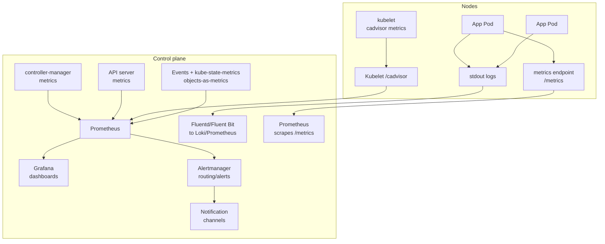

# 13. Observability

> **Category:** Monitoring & Logging

Observability = understanding what your cluster and apps are doing through **metrics**, **logs**, and **traces**. In Kubernetes, this means collecting resource usage, events, and app signals — then alerting and debugging from them.

## Core Concepts

| File | Topic |
|------|-------|
| [monitoring-fundamentals.md](monitoring-fundamentals.md) | Metrics, logging, tracing; Prometheus + kube-state-metrics |
| [prometheus.md](prometheus.md) | Prometheus operator, ServiceMonitors, alerts |
| [grafana.md](grafana.md) | Dashboards for K8s + app metrics |
| [logging.md](logging.md) | Logging architecture (stdout vs sidecars) |
| [tracing.md](tracing.md) | Distributed tracing (OpenTelemetry, Jaeger, Tempo, sampling) |

## Architecture

## Key Questions

- **What are the "three pillars"?** Metrics (numeric, time-series), Logs (discrete events), Traces (request journeys across services).
- **What is a metric vs a log?** Metrics = aggregated numeric signal over time (latency, CPU); Logs = discrete timestamped events (the full picture). Metrics drive alerts; logs help debug them.
- **How is a Kubernetes metric scraped?** Prometheus hits `/metrics` on (1) apps, (2) kubelet (`/metrics/cadvisor`) and (3) the API via kube-state-metrics.
- **How do you alert?** Write `PrometheusRule` resources — Prometheus evaluates them, Alertmanager deduplicates + routes them.

## Related Resources

- [Cluster Operations](../08-cluster-operations/README.md)
- [Security](../06-security/README.md)
- [Service Mesh](../12-service-mesh/README.md)
- [Networking](../04-networking/README.md)
