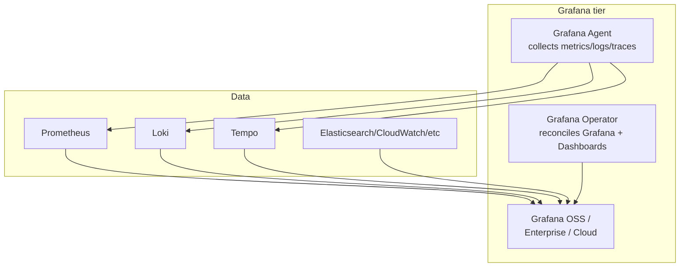

# Grafana

> **Category:** Observability / Monitoring

## What It Is

**Grafana** is the UI layer for metrics/visualization. It queries many data sources (Prometheus, Loki, Elasticsearch, InfluxDB, Tempo, etc.) and renders dashboards, panels, and **alert rules**. In Kubernetes, it's almost always paired with **Prometheus** for dashboards and **Loki** for logs.

## Why It Matters

- Dashboards-as-code live alongside your K8s manifests (via the **Grafana Operator** or **JSON provisioning**).
- Native Prometheus support — Grafana panels are mostly PromQL.
- Alert rules (Grafana Alerting) can live in the dashboard or as separate **Contact Points / Notification Policies**.

## Architecture



### Components

| Piece | Role |
|-------|------|
| `grafana` (pod) | Runs the web UI + rendering + alert engine |
| **Grafana Operator** | CRD (`Grafana`, `GrafanaDashboard`, `GrafanaDataSource`, `GrafanaAgent`) — renders dashboards into instances |
| **Grafana Agent** | Lightweight collector (drop-in for Prometheus + Loki + Tempo agents) |
| **datasources** | Configured via Secret (YAML) or the Operator's `GrafanaDataSource` CR |

## Installation

### Helm (quick start)
```bash
helm repo add grafana https://grafana.github.io/helm-charts
helm install grafana grafana/grafana \
  --namespace monitoring --create-namespace \
  --set adminPassword='your-admin-password' \
  --set datasources."datasources\.yaml".apiVersion=1 \
  --set datasources."datasources\.yaml".datasources[0].name=Prometheus \
  --set datasources."datasources\.yaml".datasources[0].type=prometheus \
  --set datasources."datasources\.yaml".datasources[0].url=http://kube-prometheus-stack-prometheus:9090 \
  --set datasources."datasources\.yaml".datasources[0].access=proxy
```

### With the Grafana Operator (GitOps-native)
```yaml
apiVersion: integreatly.org/v1alpha1
kind: Grafana
metadata:
  name: my-grafana
  namespace: monitoring
spec:
  ingress:
    enabled: true
    hostname: grafana.example.com
  config:
    auth.Provider.hide: 'false'          # show 'Log in with Grafana.com'
    users:
      allow_sign_up: 'false'
  datasources:
    datasources.yaml:
      apiVersion: 1
      datasources:
      - name: Prometheus
        type: prometheus
        url: http://prometheus-operated.monitoring.svc:9090
        access: proxy
        isDefault: true
---
apiVersion: integreatly.org/v1alpha1
kind: GrafanaDashboard
metadata:
  name: k8s-cluster
  namespace: monitoring
  labels:
    app.kubernetes.io/part-of: grafana-dashboard
spec:
  name: k8s-cluster
  folder: Kubernetes
  plugins: []
  configmaps:
  - configKey: k8s-cluster.json       # a ConfigMap holding the dashboard JSON
```

## Data Sources

| Datasource | Use |
|------------|-----|
| **Prometheus** | Metrics (default). PromQL. |
| **Loki** | Logs. LogQL. |
| **Tempo** | Traces. Native trace search + linking to logs/metrics (correlation). |
| **ElasticSearch** | Logs (alternative to Loki). |
| **CloudWatch / Datadog / NewRelic** | Cloud / SaaS metrics. |

### Multiple data sources per dashboard panel
Grafana 11+ supports **standard (mixed) queries** — each panel item can be a different datasource:

```
Visualization: Time series
Queries:
├── [A] Prometheus — `sum(rate(container_cpu_usage_seconds_total[5m])) by (pod)`
└── [B] Prometheus — `sum(rate(container_network_receive_bytes_total[5m])) by (pod)`
```

## Dashboards as Code (GitOps)

Two main approaches:

### 1. Grafana Operator (`GrafanaDashboard` CR)
- Reference a `ConfigMap` with the dashboard JSON.
- Dashboards live in K8s — versioned, reviewed in PRs.

```yaml
apiVersion: v1
kind: ConfigMap
metadata:
  name: k8s-node-dashboard
  namespace: monitoring
  labels:
    grafana_dashboard: "1"        # this label is what the Operator scans
data:
  k8s-node.json: |
    { "annotations": {...}, "panels": [...], "title": "Kubernetes Node" }
```

### 2. JSON provisioning (filesystem)
- Mount a folder `/var/lib/grafana/dashboards/` with JSON.
- `grafana.ini` / `provision/dashboard.yaml` maps the folder.

## Panel Types

| Panel | When to use |
|-------|-------------|
| Time series | Trend over time (latency, RPS) |
| Stat / Gauge | Current single value (up, replicas) |
| Bar gauge | Discrete categories (per-node CPU) |
| Table | Multi-dimensional (Pod + CPU + Mem sorted) |
| Logs panel | Loki query results (tail, filter) |
| Trace to logs | Click a trace → jump to related logs |
| Node graph | Distributed call graph (from traces) |

## Alerting (Grafana Alerting)

Grafana Alerting (>= 11) is the built-in engine. Rule types:
- **K8s / Grafana** — evaluate a query over a window → alert.

```yaml
apiVersion: 1
groups:
- orgId: 1
  name: my-alerts
  interval: 1m
  rules:
  - uid: high-cpu
    title: Node CPU high
    condition: A
    data:
    - refId: A
      relativeTimeRange:
        start: 10m
        end: 0s
      datasourceUid: prometheus
      model:
        expr: 100 - (avg(rate(node_cpu_seconds_total{mode="idle"}[5m])) by(node) * 100)
        refId: A
    ...
```

Notification goes to a **Contact Point** (Slack, PagerDuty, webhook…).

## Common Dashboards

| Dashboard | What it shows |
|-----------|----------------|
| Kubernetes Cluster Monitoring | Cluster health, kubelet, core DNS, API |
| Kubernetes Compute Resources | Per-node, per-Pod CPU/Mem |
| Kubernetes Pods Status | Pod ready vs pending, restarts, OOM |
| Node Exporter | Disk, network, processes |
| Kubernetes Networking | Network traffic + errors (per node/Pod) |

## Debugging

```bash
# Which data sources are configured?
kubectl -n monitoring get secret grafana-config -o jsonpath='{.data}'

# Reload dashboards (no restart):
curl -X POST http://grafana.monitoring/api/dashboards/db/<uid>/reload \
  --user admin:$PASSWORD

# Query a Prometheus datasource via Grafana:
kubectl -n monitoring port-forward svc/grafana 3000
open http://localhost:3000          # login admin / $PASSWORD

# Test a panel query directly against Prometheus instead
kubectl -n monitoring port-forward svc/prometheus 9090
open http://localhost:9090/graph
```

## Common Issues

### "Panel shows No data"
- Check the `expr` in the Prometheus UI — does it return anything?
- Time range: maybe your data is older/newer than the panel window.
- Variable filters: `$namespace` may be empty → empty result set.

### "Data source not found"
- In Operator installs: ensure the `GrafanaDataSource` CR exists + the name matches.
- In Helm: the datasource YAML must be at `.config.maps."datasources.yaml"`.

### "Can't edit / save the dashboard"
- RBAC — your user needs `edit` role on the folder. For provisioned dashboards, they may be locked.

### "Loki logs query returns nothing"
- The `LogQL` label selector doesn't match — e.g. `{app="nginx"}` vs `{container="nginx"}`.
- Time shift: the log timestamp differs from the dashboard's time range.

## Interview Questions

**Q: How do you manage dashboards in a GitOps workflow?**
A: Use the **Grafana Operator** (`GrafanaDashboard` CR referencing a ConfigMap) — dashboards are YAML/JSON in the repo, applied by Argo CD / Flux. Alternatively, JSON provisioning into a ConfigMap mounted into the Grafana pod.

**Q: What's the difference between Grafana Alerting and Prometheus Alertmanager?**
A: Grafana Alerting is the newer built-in engine (eval rules → contact points, all UI-driven). Alertmanager is the separate component that Prometheus pushes alerts to (deduplication, grouping, routing, inhibition). You can use Grafana Alerting alone, or keep Alertmanager for K8s-level alerts while Grafana handles dashboard alerts.

**Q: How does Grafana link logs, metrics, and traces?**
A: Via consistent labels/timestamp (e.g., `trace_id`, `pod`) across Loki/Prometheus/Tempo. A trace panel can open related logs ("trace to logs"), a log line can link to its trace ("trace ID"), and a dashboard variable (`$trace_id`) ties them together.

**Q: What common Kubernetes dashboard panels should you always have?**
A: (1) Pod ready count vs desired (is the rollout healthy), (2) Pod restarts (OOM/crash), (3) CPU + Memory by Pod/Node, (4) Network Rx/Tx + errors, (5) API server latency + error rate. These four cover the majority of K8s incidents.

## Related Resources

- [Monitoring Fundamentals](monitoring-fundamentals.md)
- [Prometheus](prometheus.md)
- [Logging](logging.md)
- [Cluster Operations](../08-cluster-operations/README.md)
- [Service Mesh](../12-service-mesh/README.md)
