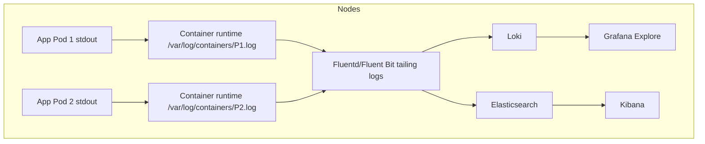
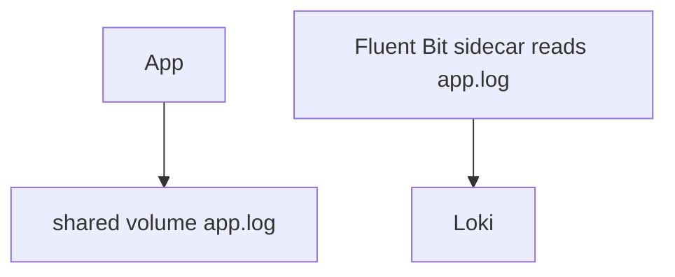

# Logging

## What It Is

**Logging** in Kubernetes = collecting, central storing, and searching the stdout/stderr and files from Pods across the cluster. The standard pattern: apps log to **stdout**, a node-level agent (Fluentd/Fluent Bit) tails the container log files (`/var/log/containers/*.log`) and ships structured records to a backend (Loki / Elasticsearch), then Grafana (for Loki) or Kibana (for Elasticsearch) provides search.

## Why It Matters

- Containers restart — logs in a dead Pod are gone (node disk is local).
- Logs are **lossy by default** unless you ship them off-node.
- You need **structured** logs (JSON) so you can filter by label (`level`, `trace_id`, `pod`) rather than regex.

## Architecture



### Sidecar pattern (when stdout isn't enough)

If your app writes to a file or needs rotation, a sidecar collects it:



## The Logging Stack

| Component | Options | Notes |
|-----------|---------|-------|
| Agent (DaemonSet) | **Fluent Bit** (lighter) / **Fluentd** (more mature) / **Filebeat** | TAILS `/var/log/containers/*.log`, adds K8s metadata |
| Backend | **Loki** (cheap, label-based) / **Elasticsearch** (full-text, expensive) | Loki is the Prometheus of logs |
| Query UI | **Grafana** (Loki) / **Kibana** (Elasticsearch) | |
| App instrumentation | OpenTelemetry / language loggers | Emit JSON with `level`, `time`, `trace_id` |

## Fluent Bit + Loki (the CNCF stack)

### Fluent Bit DaemonSet

```yaml
apiVersion: apps/v1
kind: DaemonSet
metadata:
  name: fluent-bit
  namespace: logging
spec:
  selector:
    matchLabels: {name: fluent-bit}
  template:
    spec:
      serviceAccountName: fluent-bit
      containers:
      - name: fluent-bit
        image: fluent/fluent-bit:3.0
        volumeMounts:
        - name: varlogcontainers
          mountPath: /var/log/containers
          readOnly: true
        - name: varlibdockercontainers
          mountPath: /var/lib/docker/containers
          readOnly: true
        env:
        - name: FLUENT_LOKI_HOST
          value: "loki.logging.svc"
        - name: FLUENT_LOKI_PORT
          value: "3100"
      volumes:
      - name: varlogcontainers
        hostPath:
          path: /var/log/containers
      - name: varlibdockercontainers
        hostPath:
          path: /var/lib/docker/containers
          readOnly: true
```

### Fluent Bit config (Loki output + labels)

```
[SERVICE]
    Flush         1
    Log_Level     info
    Daemon        off
    Parsers_File  parsers.conf

[FILTER]
    Name   kubernetes
    Match  kube.*
    Merge_Log  On
    Keep_Log   False

[OUTPUT]
    Name              loki
    Match             *
    Host              loki.logging.svc
    Port              3100
    Labels            job=fluent-bit, cluster=prod
    BatchWait         1
    BatchSize         30720
    LineFormat        json
```

The **kubernetes filter** (`kubernetes.*` labels) is why you can query by `pod` and `namespace` in Loki even though the raw log line only has a message.

## Loki (the label-based log store)

Loki is **label-based** (not full-text). You query with **LogQL**.

```logql
# All error lines from myapp Pods:
{app="api", level="error"} |= "failed to connect"

# Count errors per Pod over 5m:
sum by (pod) (
  count_over_time({app="api"} |= "level=error" [5m])
)

# Extract a JSON field:
{app="web"} | json | line_format "{{.level}}: {{.msg}}"

# Parse + filter on a field:
{app="api"} | json | level="error"
```

### Loki sizing

- Disk usage grows ~log volume times compression (~3x smaller than raw).
- Store on S3/GCS for long-term retention; local disk for recent blocks.

## Elasticsearch + Kibana (full-text search)

| Trade-off | Detail |
|-----------|--------|
| Full-text search | You can grep arbitrary text. |
| Cost | High — each line is a full inverted-index term. |
| ILM | Indices are rolled over/shrunk/deleted via policies. |
| Use when | You need grep, not just label filters. |

### Typical ES mapping

```json
{
  "@timestamp": "2024-01-01T00:00:00Z",
  "kubernetes": {
    "namespace": "default",
    "pod_name": "my-app-xyz",
    "container": "app"
  },
  "message": "failed to connect to db",
  "level": "error"
}
```

## Structured Logging (the app side)

**Prefer JSON** logs so the shipper can parse labels without regex.

### Go (zerolog)

```go
log := zerolog.New(os.Stderr).With().Timestamp().Logger()
log.Error().Err(err).Str("trace_id", tid).Msg("db connection failed")
```

### Python (structlog)

```python
import structlog
log = structlog.get_logger()
log.error("db connection failed", trace_id=tid, exc_info=True)
```

### Standard key fields

| Field | Reason |
|-------|--------|
| `time` | For time-series alignment |
| `level` | Filter by severity |
| `trace_id` | Correlate to distributed traces |
| `msg` | Human-readable summary |
| K8s labels | Added by the shipper, not the app |

## Multi-line / Pod-level Logs

Container logs are **one line per record** (the runtime splits on newlines). If your app writes a Java stack trace (multi-line), you must re-join it. Use the agent's multiline parser or the **kubernetes filter's `Merge_Log On`** option.

## Common Issues

### Missing logs from some Pods

- The agent's `hostPath` mount of `/var/log/containers` is missing on some nodes.
- Log rotation truncated the file while the agent was tailing it.
- The agent can't resolve Pod metadata (the Pod is already deleted) so logs arrive unlabeled.

### Loki returns no logs

- Label selector mismatch — the container name label is stale after redeploy. Always filter on a stable label like `app`, not `container`.
- The kubernetes filter isn't applied so the `pod`/`namespace` labels are blank.

### Logs arrive with the wrong timestamp

- The app's `time` field differs from the container stdout ingestion time.

## Interview Questions

**Q: What are the "three signals" of observability?**
A: Metrics (aggregated numeric time-series), Logs (discrete events), Traces (distributed request journeys). The three together let you both alert (metrics) and debug (logs, traces).

**Q: What is the standard logging pattern on Kubernetes?**
A: App writes JSON to stdout. Container runtime buffers it to `/var/log/containers/<pod>.log`. A node-level agent (Fluent Bit/Fluentd) tails that file, adds Kubernetes metadata (namespace, pod, container), parses JSON, and ships to a backend (Loki/Elasticsearch).

**Q: Why not just tail /var/log/containers directly on each node?**
A: Logs are local to the node and lost on Pod restart/redeploy. Plus, you can't search across the whole cluster. A shipper + central backend gives you persistent, queryable, correlated logs.

**Q: What is the difference between Fluent Bit and Fluentd?**
A: Fluent Bit is lightweight (small footprint, fast parsing pipeline) and is what most modern setups use. Fluentd has more plugins but a larger footprint. Both tail `/var/log/containers`.

**Q: How do you handle multi-line logs (Java stack traces)?**
A: Configure a multiline parser (regex-based or the "merge log" feature) in the shipper. The kubernetes filter merges indented lines into a single log entry, so one trace appears as one log line.

**Q: What's the difference between Loki and Elasticsearch?**
A: Loki is label-based and cheap (it only indexes labels, not the log text). Elasticsearch is full-text search (every term is indexed), which is powerful but expensive at scale. Loki queries by `pod=`/`level=`; Elasticsearch queries by arbitrary text.

## Related Resources

- [Monitoring Fundamentals](monitoring-fundamentals.md)
- [Grafana](grafana.md)
- [Prometheus](prometheus.md)
- [Cluster Operations](../08-cluster-operations/README.md)
