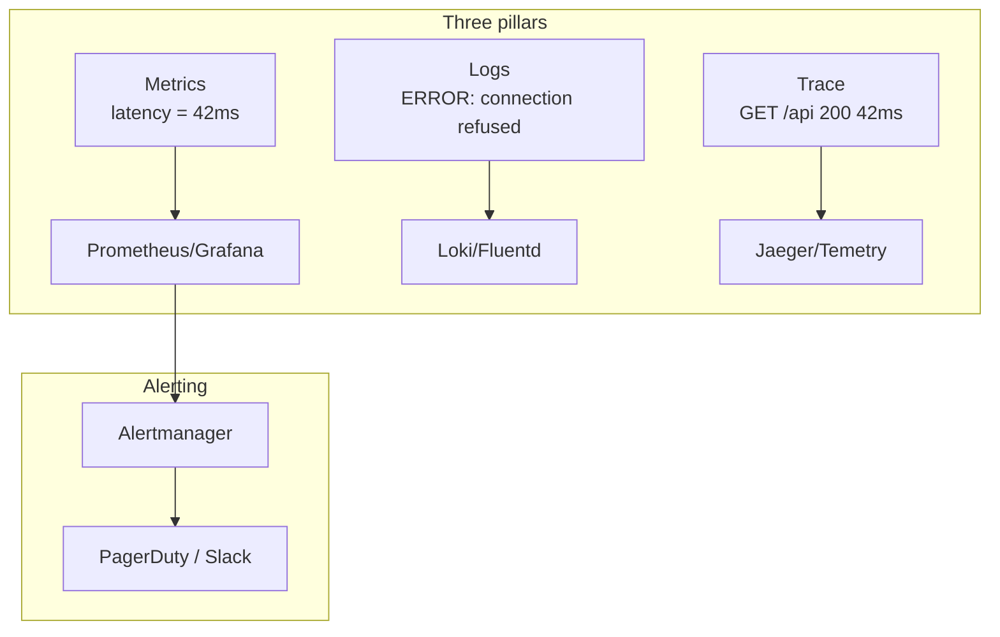
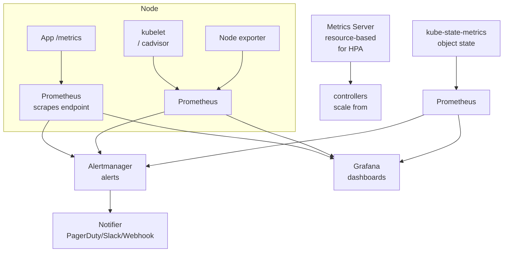
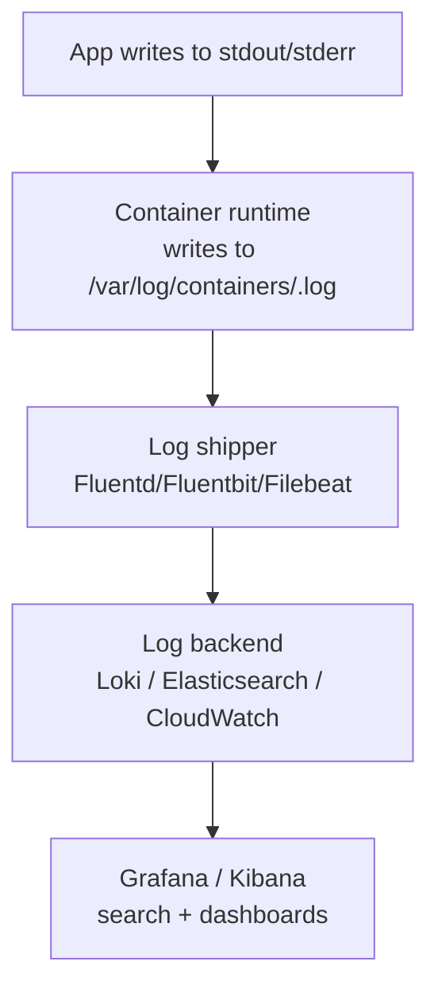

# Monitoring Fundamentals

> **Category:** Observability

## What Observability Is

Observability = the ability to **infer the internal state of a system from its external outputs**. In Kubernetes, that means combining:

1. **Metrics** — aggregated numeric signals over time (CPU %, latency, RPS, queue depth)
2. **Logs** — discrete, timestamped events (errors, audit entries, app logs)
3. **Traces** — request journeys across services (how a single HTTP request hops through microservices)

Metrics drive **fast alerting**; Logs and Traces drive **debugging**.

## The Three Pillars, Side by Side

| Pillar | Format | Strength | Use case |
|--------|--------|----------|----------|
| **Metrics** | Time-series (timestamp + value + labels) | Fast aggregation, alerting | "Is it on fire? How bad?" |
| **Logs** | Text/JSON event | Rich context, debugging | "Why did this specific thing fail?" |
| **Traces** | Spans (request flow) | Root-cause across services | "Where is the latency coming from?" |



## Kubernetes-Specific Signals

The control plane itself emits metrics you must monitor:

| Source | Metrics to watch | Why it matters |
|--------|------------------|----------------|
| `kubelet` | `container_cpu_usage_seconds`, `container_memory_usage_bytes`, `kubelet_runtime_operations` | Node health + Pod resource pressure |
| `kube-state-metrics` | `kube_pod_status_ready`, `kube_deployment_status_replicas_available`, `kube_node_status_condition` | Object state (replicas, health) |
| API server | `apiserver_request_duration_seconds`, `apiserver_current_inflation_running` | Cluster responsiveness, throttling |
| `controller-manager` | `controller_runtime_reconcile_errors_total`, leader-election | Controller health |
| coredns | `coredns_client_do_requests_total` | DNS failures → app timeouts |
| etcd | `etcd_disk_backend_commit_duration_seconds`, `etcd_server_has_leader` | Store health (cluster-down risk) |

## The "RED" + "USE" Methodology

### RED (for services/HTTP)
- **Rate** — requests per second
- **Errors** — error rate (5xx)
- **Duration** — latency distribution (histogram)

### USE (for resources/nodes)
- **Utilization** — % of the resource used (CPU, memory)
- **Saturation** — how "full" the resource is (queued work)
- **Errors** — error counts (disk, network)

These two sets cover almost every alert you need: if a service is slow or failing, RED flags it; if a node is overloaded, USE flags it.

## Resource Metrics in K8s

### Two kinds of metrics
1. **kubelet / cAdvisor** — actual usage (`container_cpu_usage_seconds_total`, `container_memory_working_set_bytes`). Scraped via `https://<node>:10250/metrics/cadvisor`.
2. **kube-state-metrics** — object state (`kube_pod_status_ready`, `kube_deployment_status_replicas_available`). Translates K8s objects into time-series.

```bash
# Inspect the kubelet's own metrics:
kubectl get --raw /api/v1/nodes/<node-name>/proxy/metrics | grep -i container
# Inspect kube-state-metrics:
kubectl -n kube-system get svc kube-state-metrics
kubectl port-forward svc/kube-state-metrics -n kube-system 8080 &
curl localhost:8080/metrics
```

## The Metrics Pipeline (Kubernetes-native)



- **Prometheus** scrapes targets from a list (static + ServiceMonitors).
- **kube-state-metrics** exposes object state as metrics (no app instrumentation needed).
- **metrics-server** provides CPU/Memory for `kubectl top` + HPA (built on kubelet metrics).

## Logs in Kubernetes

### Default: stdout/stderr → node file → aggregator



- **stdout logging** (12-factor) is preferred: the container runtime captures logs to a file.
- Use a **node-level shipper** (Fluentd/Fluent Bit) to tail `/var/log/containers/*.log` → push to L**oki** or **Elasticsearch**.
- **Sidecar loggers** (the app writes to a shared volume; sidecar ships it) are used when stdout isn't possible.

### Log aggregation design

```yaml
# DaemonSet shipping logs (DaemonSet so it runs on every Node):
# - Mounts /var/log/containers from the host
# - Parses JSON/regex
# - Tags with namespace/pod/container labels
# - Forwards to the backend
```

The shipper is the part that gives you **labels** (namespace, Pod, container name) back when querying — because the node file is just `pods/<hash>_kube-system_<pod-id>.log`.

## Traces in Kubernetes

Distributed tracing requires:
1. **Instrumentation** — the app must emit trace spans (e.g., OpenTelemetry SDK) and propagate a trace-context header (`traceparent` / `x-b3-traceid`).
2. **A collector** — the **OpenTelemetry Collector** (or Jaeger agent) receives spans, enriches them with K8s metadata (namespace, Pod, node), batches them, and forwards to a backend (Jaeger, Tempo, Datadog).
3. **A backend** — stores the trace DAG and lets you search (by service, latency, error).

See [Distributed Tracing](tracing.md) for the full Trace/Span model, OpenTelemetry Collector patterns, and tail-based sampling.

```mermaid
graph TD
    A[App emits\nOpenTelemetry spans] --> B[OTel Collector Agent\n(DaemonSet)]
    B --> C[Collector Gateway\n(batching, K8s metadata)]
    C --> D[Jaeger / Tempo / OTLP backend]
    D --> E[Grafana\ntrace UI]
```

The collector's **auto-instrumentation** feature can inject the SDK into your app's language runtime — so you get traces without code changes.

## What "Good" Looks Like

- **Metrics on everything**: app (RED), node (USE), control plane, dependencies (DB, external APIs).
- **Healthy baselines**: alert on *symptom*, not just cause (latency > error rate > resource usage).
- **Logs are structured**: JSON fields (`{"level":"error","trace_id":"abc","error":"timeout"}`) so you can query by label.
- **Traces for cross-service latency**: 90th-percentile latency is one thing; "where did it come from?" is another.

## Quick Checks

```bash
# Is kubelet exposing metrics?
kubectl get --raw /api/v1/nodes/<node>/proxy/metrics | head

# Is kube-state-metrics up and exporting?
kubectl -n kube-system get deploy,pods -l app.kubernetes.io/name=kube-state-metrics

# Can Prometheus see a target?
kubectl -n monitoring port-forward svc/prometheus-operated 9090
kubectl get --raw /apis/monitoring.coreos.com/v1/namespaces/<mon>/prometheuses

# Does the app expose /metrics with the right labels?
kubectl port-forward svc/myapp 8080
curl localhost:8080/metrics
```

## Common Pitfalls

| Mistake | Consequence |
|---------|-------------|
| Alerting on `node_cpu > 80%` | Noise — the node isn't necessarily a problem |
| No histogram buckets | "p99 latency" is unknowable |
| stdout logs not JSON | Can't filter/query reliably |
| Tracing not propagated | "trace graph" is actually many tiny traces |
| Mixing prod + test metrics | Noisy, useless dashboards |

## Interview Questions

**Q: What are the three pillars of observability, and how do they differ?**
A: Metrics (aggregated numeric time-series), Logs (discrete timestamped events), and Traces (distributed request journeys). Metrics drive fast alerting; logs give context for debugging; traces show latency/error propagation across service boundaries.

**Q: What is RED, and why does it matter?**
A: RED = Rate, Errors, Duration — a minimal set of metrics every service should expose. It's the fastest way to know whether a service is healthy (serving traffic and serving it well).

**Q: What is kube-state-metrics, and why not just scrape kubelet?**
A: kubelet exposes *usage* metrics (CPU, memory). kube-state-metrics translates object *state* (e.g., how many replicas are actually available vs. desired, or a Pod's ready status) into metrics — crucial for alerting on deployments, not just nodes.

**Q: How does metrics-server differ from Prometheus?**
A: metrics-server is minimal — it serves CPU/Memory to `kubectl top` and the HPA. It scrapes kubelet and does not persist or alert. Prometheus scrapes many more sources (apps, kubelet cadvisor, kube-state-metrics, exporters) and retains history for alerting/dashboards.

**Q: What is the difference between a metric and a log?**
A: A metric is a **numeric** value over a **window** (rate, mean, percentile) and is aggregated (lossy). A log is a **discrete event** with a full **message** and context (lossless) — you keep individual lines and search/filter them.

**Q: How do you trace a request through multiple services?**
A: The caller emits a trace-id (propagation header: `traceparent`) with each request. Each service records its own span under that trace-id. The collector correlates spans into a single trace, showing the full latency + error path.

## Related Resources

- [Prometheus](prometheus.md)
- [Grafana](grafana.md)
- [Logging](logging.md)
- [Cluster Operations](../08-cluster-operations/README.md)
- [Service Mesh](../12-service-mesh/README.md)
- [Security](../06-security/README.md)
