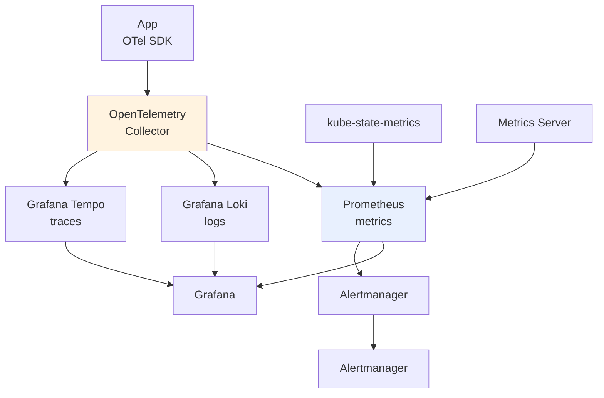

# Observability — Metrics, Logs & Traces

> **Category:** Observability / Operations

K8s is distributed and concurrent, so you can't "SSH and look around" as much — you need **golden signals** (latency, traffic, errors, saturation) plus the three pillars of observability (**metrics, logs, traces**). The standard stack is: an SDK → **OpenTelemetry Collector** → **Prometheus** (metrics) + **Tempo/Loki** (traces/logs) → **Grafana** dashboards + **Alertmanager**.

## The four golden signals (SRE)

| Signal | Where it lives | Dashboard / Alert |
|--------|----------------|-------------------|
| **Latency** | `histogram_quantile` (request duration) | SLI `apiserver_request_duration_seconds`; RED alerts |
| **Traffic** | request rate (`http_requests_total`) | capacity planning; ingress dashboard |
| **Errors** | `5xx` / `error_total` | SLO `error_rate < 1%` |
| **Saturation** | CPU/mem `utilization %`, `kube_pod_container_status_terminated_reason` | node `usage_node` vs `allocatable`; OOM-kill alerts |

## Metrics sources

- **kube-state-metrics** — turns K8s objects (Pod phase, Deployment status, PVC bound) into metrics (`kube_deployment_status_replicas_available`, etc.).
- **Metrics Server** — CPU/memory of containers (powers `kubectl top` + HPA CPU/memory). Not for querying history.
- **node-exporter** — host-level (disk, network, NFS, CPU throttling).
- **Application metrics** — expose `/metrics` (Prometheus format) and let the collector scrape, or push via OTel.

## Logs (Loki)

- `kubectl logs` is for one-off; for **searchable retention** use Loki (`{app="api"} |= "ERROR"`).
- Ship container logs via OTel/filebeat. Forward pod metadata (`kubernetes.*`) so you can filter by namespace/pod.

## Traces (Tempo)

- Use **OpenTelemetry SDKs** with W3C `traceparent` headers so traces follow across Services.
- In K8s, inject `OTEL_EXPORTER_OTLP_ENDPOINT` and ensure the collector `otlp` receiver accepts the trace.

## Alerting (Alertmanager)

- Alerts on **SLO burn rate** (e.g. 14.40→2hr window) so you page only when customer impact is real.
- Route by `severity:` to PagerDuty / Slack; inhibit `info` while `critical` fires.

## Cues for each role
- **Developers**: traces + app logs on error; RED dashboards.
- **SRE**: saturation (node memory/CPU), kube-state-metrics, etcd/leader-elections.
- **Security**: audit logs (`apiserver_audit_event_total`), `kubectl auth can-i` trails.

## Interview Questions

**Q: Why use kube-state-metrics *and* Metrics Server — aren't they both metrics?**
A: No. **Metrics Server** is CPU/memory **resource** metrics (live, in-memory, for `kubectl top` and HPA). **kube-state-metrics** is **object-state** metrics (Pod phase, Deployment replicas, PVC status) — things no Prometheus scrapes from `/metrics`. You need kube-state-metrics to alert "the Deployment has 0 available replicas" or "PVC is Pending."

**Q: How do you trace a request across Services in Kubernetes?**
A: Instrument each service with an **OpenTelemetry SDK** that emits W3C `traceparent` headers; the headers propagate in-band so the collector stitches one trace. In-cluster, you also need the collector to capture ingress/egress (Gateway, Istio, or Envoy metrics) and the same service name in every cluster's OTel pipeline.

## Related Resources
- [Monitoring](monitoring-fundamentals.md)
- [Logging](logging.md)
- [Pods](../03-workloads/pods.md)
- [Disaster Cases](../14-troubleshooting/disaster-cases.md)
