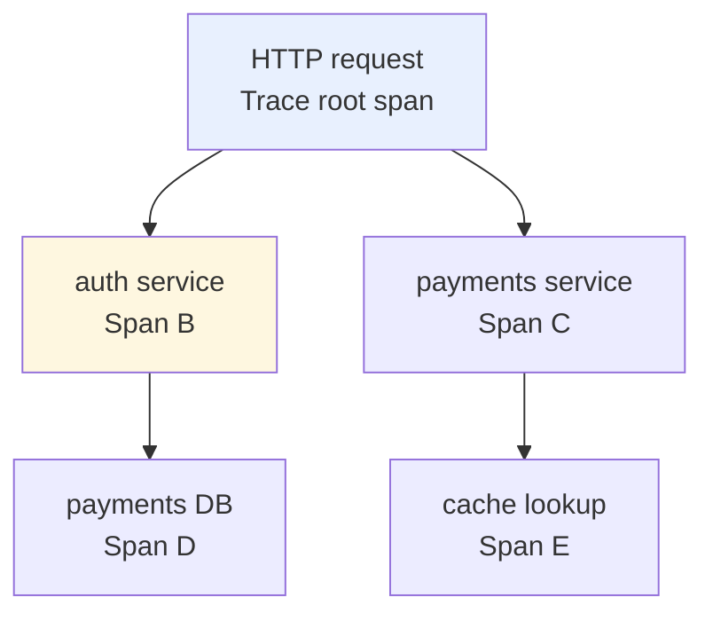
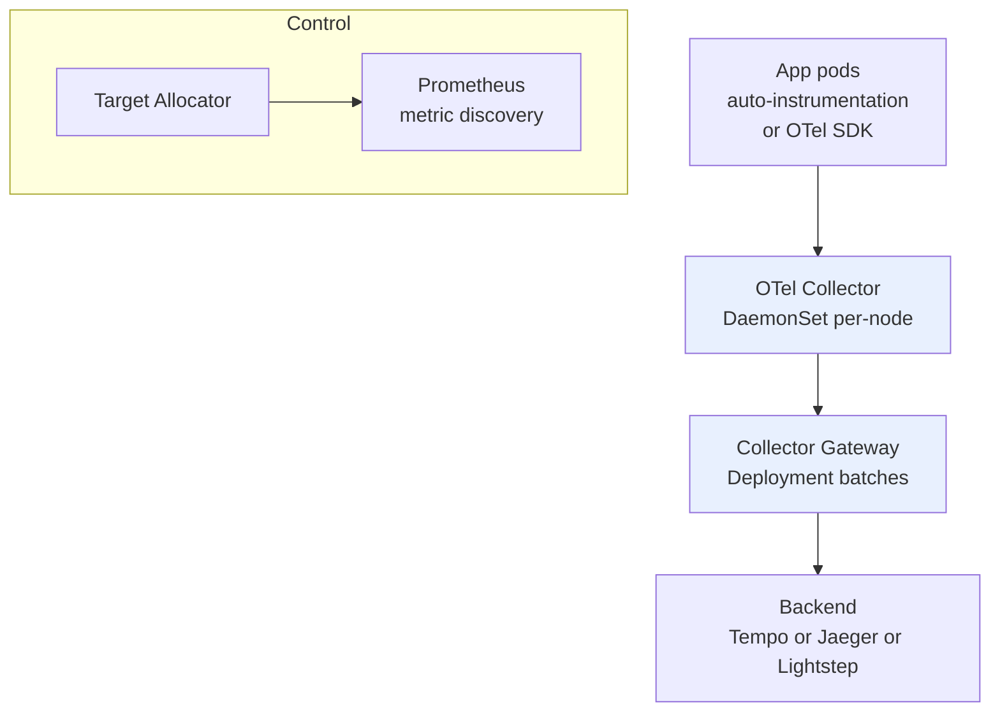
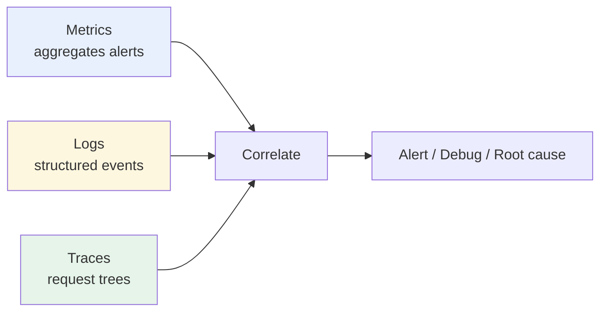

# Distributed Tracing — OpenTelemetry, Jaeger & Tempo

> **Category:** Observability / Three Pillars

**Distributed tracing** follows a single request as it travels through many microservices — recording each hop as a **Span** and grouping those into a **Trace**. It is the third pillar of observability alongside metrics and logs: where metrics tell you *something is wrong* and logs tell you *what happened*, **traces tell you *where* and *why* it happened** across service boundaries (the nagging 500ms p95 that lives between two services you cannot reproduce locally).

## The Trace Model

- **Span** — one unit of work (an RPC, a DB call, a middleware handler). Has: an ID, a **parent** span, a start/end time, **attributes** (key/value), **events** (timestamped logs), and a status.
- **SpanContext** — the data carried across the wire (trace-id, span-id, trace-flags). The child Span references the parent SpanContext.
- **Trace** — the full tree of causally-related Spans for one request.



A 500ms request that hits the auth service then the payments service shows up as one Trace with spans A leads to B leads to D leads to C in a flamegraph — instantly revealing the 400ms spent in the cache lookup.

## OpenTelemetry — the standard

**OpenTelemetry (OTel)** is the CNCF project unifying tracing (and logs/metrics) instrumentation. It provides:
- **SDKs** in every language (auto-instrumentation agents + manual APIs).
- **The OpenTelemetry Collector** — a vendor-neutral agent/gateway process that **receives, batches, and exports** telemetry to many backends.
- **Protocol**: OTLP (over gRPC/HTTP) — the standard wire format.

### Architecture (K8s)



- **DaemonSet collector** (per-node agent): low-latency, scrapes/metrics from localhost, forwards to a gateway.
- **Gateway collector** (Deployment): batches, retries, fans out to backends.
- **Target Allocator** (for Prometheus metrics via the OTel operator): tells collectors which targets to scrape.

## Backends

| Backend | Type | Notes |
|--------|------|-------|
| **Tempo** (Grafana) | object storage (S3/GCS/Azure) | uses a block/index store on cheap object storage; pairs with Loki |
| **Jaeger** | in-house (Cassandra/Elasticsearch) | mature, storage-coupled; the classic option |
| **Zipkin** | in-house (MySQL/Elasticsearch) | legacy; simple |
| **Lightstep / Datadog / New Relic** | SaaS | managed, with OTel exporters |
| **Amazon X-Ray** | AWS managed | via OTLP or the X-Ray emitter |

## Instrumentation (the easy way)

```bash
# auto-instrumentation (Java shown), single line, no continuation:
java -javaagent:/opentelemetry-javaagent.jar -Dotel.service.name=payments -Dotel.traces.exporter=otlp -Dotel.exporter.otlp.endpoint=http://otel-collector:4317 -Dotel.propagators=tracecontext,baggage -jar app.jar
```
Or in K8s, use the **OpenTelemetry Operator**, which injects the auto-instrumentation agent via a sidecar and manages `OpenTelemetryCollector` custom resources.

## Sampling

- **Head-based** (decide at the root span before it finishes): cheap, but you may drop traces that turn out to be interesting.
- **Tail-based** (decide after the trace completes): expensive, but you keep interesting traces (errors, high latency). The Collector `tail_sampling` processor does this.

## The Three Pillars, Together


You alert on a metric anomaly, open a log to see what failed, then open a trace to see the path and latency through the services.

## Common Issues

| Symptom | Cause | Fix |
|---------|-------|-----|
| Trace shows only 1 span | context not propagated (missing traceparent or baggage header) | ensure the SDK emits W3C TraceContext; check the HTTP client propagates headers |
| Many spans missing | head-based sampling dropping, or no upstream context | lower the sampler denominator; check sampling config |
| Trace latency looks wrong | clock skew between nodes | sync NTP; OTel uses monotonic clocks where possible |
| Collector CrashLoopBackOff | bad exporter config, no backend | kubectl logs the collector; validate the export endpoint |
| TraceID changes at service boundary | context dropped at a proxy/mesh hop | check sidecar (Envoy) trace header propagation or the mesh W3C support |

## Interview Questions

**Q: What is the difference between a Trace, a Span, and a SpanContext?**
A: A **Trace** is the whole request tree. A **Span** is one operation/node in that tree (timing, attributes, status, parent). A **SpanContext** is the identifying data carried across process boundaries (trace-id, span-id, trace-flags) so the next service can create a child span that joins the same trace — if it is not propagated, the trace breaks.

**Q: How do metrics, logs, and traces differ, and why do you need all three?**
A: Metrics = aggregated numeric signal over time (CPU, p95 latency) — good for alerting, bad for details. Logs = discrete timestamped events — good for debugging a single incident, but hard to correlate across services. Traces = the request journey across services — good for where a slowdown or cascade happened. One alert (metric) leads to its log line leads to its trace to find the cross-service root cause.

**Q: What is tail-based sampling and when would you use it?**
A: A sampler decides to keep or drop a trace after it completes (for example, keep traces that contain an error, or that exceeded a latency threshold). It is more expensive than head-based sampling but guarantees you keep the interesting traces (failures, slow requests) — essential on a busy site where head-sampling would drop 99% of traces and also most errors.

## Related Resources
- [Monitoring Fundamentals](monitoring-fundamentals.md)
- [Prometheus](prometheus.md)
- [Logging](logging.md)
- [Grafana](grafana.md)
