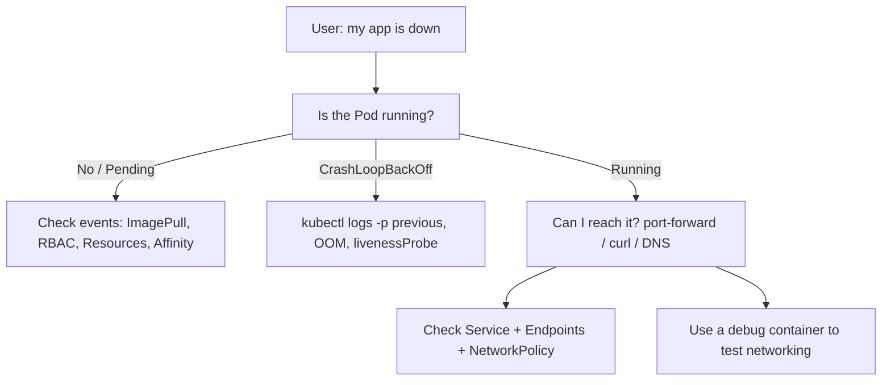

# 14. Troubleshooting

> **Category:** Operations / Debugging

Everyday Kubernetes work is often "a Pod won't start", "my request is slow", or "I can't reach a Service". Troubleshooting in K8s is methodical: inspect the object, its events, its logs, and the layer below (Node, kubelet, network).

## Core Concepts

| File | Topic |
|------|-------|
| [troubleshooting-patterns.md](troubleshooting-patterns.md) | A decision-tree for "Pod not working", plus slowness and networking |
| [kubectl-debug.md](kubectl-debug.md) | `kubectl describe`, events, ephemeral containers, port-forward |

## Architecture

## Key Questions

- **A Pod is `ImagePullBackOff` — what's next?** `docker login` to the registry, check secret type (`kubernetes.io/dockerconfigjson`), image tag exists.
- **My Pod is `CrashLoopBackOff` — why?** `kubectl logs -p` the previous container; check exit code (OOM = 137), liveness/readiness probe failures.
- **My Service has no endpoints — why?** `kubectl get endpoints`; selector mismatch, Pods not Ready, or headless Service + StatefulSet mismatch.
- **DNS not resolving — how to check?** `kubectl run busybox --image=busybox --restart=Never -- nslookup <svc>`.

## Related Resources

- [Cluster Operations](../08-cluster-operations/README.md)
- [Networking](../04-networking/README.md)
- [Security](../06-security/README.md)
