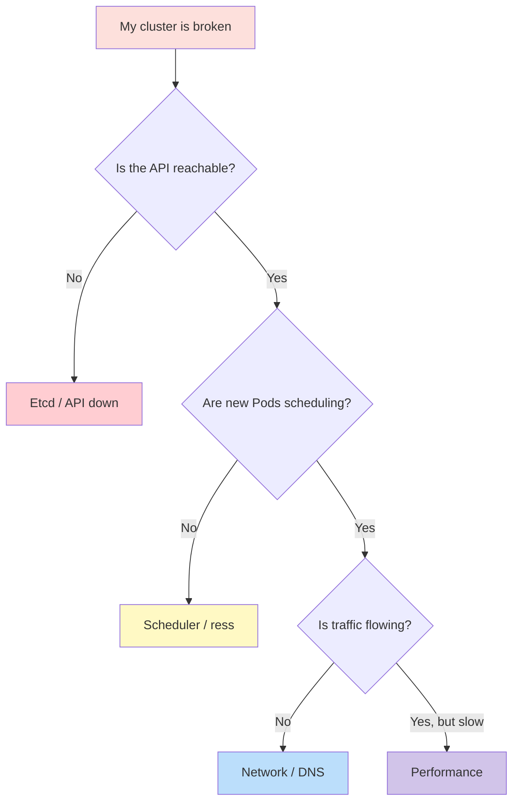

# Disaster Cases — Real Incidents Companies Face with Kubernetes

> **Category:** Troubleshooting / Production

Every production K8s shop eventually hits a crisis. This is an incident catalog: **what breaks, how you see it, the root cause, the fix, and how to prevent recurrence.** Use the decision diagram to triage first.



## DC-1. etcd: "database space exceeded" (cluster-wide freeze)

**Symptom:** `kubectl` is extremely slow or times out; "too many requests"; `etcd` logs `mvcc: database space exceeded`.
**Root cause:** etcd keeps a *revision* history forever by default; after days of churn the DB ballooned (GBs) and compaction was never configured.
**Fix:**
```bash
ETCDCTL_API=3 etcdctl --endpoints=https://127.0.0.1:2379 \
  --cacert=/etc/kubernetes/pki/etcd/ca.crt \
  --cert=/etc/kubernetes/pki/etcd/server.crt \
  --key=/etc/kubernetes/pki/etcd/server.key \
  compact $(etcdctl rev)        # compact to current rev
ETCDCTL_API=3 etcdctl defrag    # defrag each member (one at a time!)
ETCDCTL_API=3 etcdctl alarm disarm
```
**Prevention:** enable `--auto-compaction-retention=8h` + `--auto-compaction-mode=periodic`, alert on `etcd_mvcc_db_total_size_in_bytes` > 80% of disk, and **test restore from snapshot weekly** (`etcdctl snapshot save`).

## DC-2. Control plane: cert expiry "x509: certificate signed by unknown authority"

**Symptom:** after a year, `kubectl` returns `x509: certificate signed by unknown authority`; `crictl ps` shows apiserver static pods crash-looping.
**Root cause:** the root-of-trust for the kubelet ↔ apiserver certs (and service-account signing) expired and wasn't renewed (happened in Y2K-style clusters after 1 year).
**Fix:** `kubeadm certs check-expiration` → `kubeadm certs renew all` → restart the control-plane static pods (kubelet picks up the new manifests). Re-generate client `kubeconfig`s.
**Prevention:** schedule `kubeadm certs renew` via cron (the kubelet auto-renews *its own* certs if `--rotate-certificates=true`; the apiserver/admin certs do not auto-renew). Alert on cert expiry at 60/30/7 days.

## DC-3. Runaway controller / API throttling ("too many requests")

**Symptom:** all `kubectl` operations hang; HorizontalPodAutoscaler stops scaling; `kubectl get events` floods with `too many requests`.
**Root cause:** a misbehaving Operator or a watch storm (many clients + `--cache-index-interval`) hammered the apiserver; or a finalizer loop (`foregroundDeletion` stuck) made the GC queue grow forever.
**Fix:** `kubectl get --raw /debug/pprof/trace` to find the client; `kubectl delete --force --grace-period=0` to nuke a stuck Pod; temporarily raise `--max-requests-inflight`; patch stuck finalizers off.
**Prevention:** rate-limit Operator `clientsets`, set `--cache-sync-timeout`, and alert on apiserver `request_latencies_summary` > 1s.

## DC-4. Pod explosion OOM / node death ("the noisier neighbor")

**Symptom:** one Pod hogs memory/CPU; the node hits `MemoryPressure`; the kubelet evicts *other* Pods; cascading restarts.
**Root cause:** a container with **no memory limit** and a leak, run on a node shared with critical workloads.
**Fix:** identify the offender (`kubectl top pods --sort-by=memory`), `kubectl delete pod` it, cordon+drain the node (`kubectl cordon`/`kubectl drain --ignore-daemonsets`) to let it stabilise.
**Prevention:** enforce a `LimitRange` + `ResourceQuota`, **never allow containers without limits**, run critical infra on dedicated node pools / taints, enable Pod `priorityClassName` so best-effort pods get evicted before critical ones.

## DC-5. Image registry outage ("everything ImagePullBackOff")

**Symptom:** rolling update stalls; new Pods all show `ImagePullBackOff`; existing Pods still serve.
**Root cause:** the primary registry went down (or a secret leaked/rotated), so new images can't be pulled.
**Fix:** check credentials (`kubectl get secret <pullsecret>`), test pull from a node (`nerdctl pull`), switch the `image:` to a mirrored/secondary registry, or push the image to a local registry.
**Prevention:** mirror base images to a **local registry**, keep `imagePullSecrets` rotated + tested in CI, and pin `image:` to a digest (`@sha256:`) so a tag flip can't break prod.

## DC-6. Network partition / split-brain (multi-AZ cluster)

**Symptom:** some Pods are reachable, others timeout; `kubectl get nodes` shows a zone flapping `Ready`/`NotReady`; traffic to one AZ stalls.
**Root cause:** VPC route table / subnet / or AZ-level network issue, leaving the kubelet unable to report heartbeats.
**Fix:** confirm from a control plane node (`ping <node>`, `crictl ps` on the node over SSH), verify the VPC routes/subnet NACL; if a node lost its lease, drain it (`kubectl drain`) and let the AZ recover / relaunch the nodes.
**Prevention:** multi-AZ node groups with > 1 node per AZ, `topologySpreadConstraints` on critical Pods, and a `PodDisruptionBudget` so eviction can't concentrate on the losing side.

## DC-7. PVC loss / wrong deletion ("where did my data go?")

**Symptom:** after a deploy, the app is "empty"; reading returns `no such file`; Pod `CrashLoopBackOff` on DB init.
**Root cause:** a `helm uninstall` or `kubectl delete pvc` removed the PersistentVolumeClaim (and with `reclaimPolicy: Delete` the PV) — or a new PVC got a *different* PV because the old one was manually deleted.
**Fix:** `kubectl get pvc,pv,sc` → if gone, restore from your **snapshot/backup** (Velero, CSI snapshot restore). If the PV still exists but the Pod bound a fresh one, re-point via `volumeName` or restore the snapshot.
**Prevention:** set `reclaimPolicy: Retain` on critical PVs (so deletion never silently destroys data), snapshot before upgrades, and label all PVCs with an owner/team so you can audit.

## DC-8. Upgrade cascade failure ("1.2x → 1.3x broke the world")

**Symptom:** post-upgrade, control-plane components crash, or an Ingress controller stops routing, or a CRD stops reconciling.
**Root cause:** version skew — an Operator/CRD controller not upgraded alongside, or a deprecated API (`apps/v1` vs `extensions/v1beta1`) finally removed.
**Fix:** `kubectl get --raw /livez` / `/readyz` to find the failing component; check `kubectl get crd` for `StoredVersion` errors; roll back the offending component (`helm rollback`) or the control plane (`kubeadm upgrade apply <older>`).
**Prevention:** **always dry-run** (`kubectl apply --dry-run=server`), upgrade workers only after masters, run the `pluto` tool to scan for removed/deprecated APIs, and test upgrades in a staging copy of the exact workload.

## DC-9. Helm "partially rolled back" / stuck release

**Symptom:** a rollback appears to succeed but half the resources are missing; `helm test` hangs.
**Root cause:** the chart's `hooks` (or a failing `post-rollback` job) left finalizers, or a CRD schema change rejected the rollback mid-way.
**Fix:** `helm history <release>`, `helm rollback <release> <revision> --force`, then hand-delete stuck resources (`kubectl get jobs -n <ns>`). Use `helm uninstall --keep-history` to inspect, or `helm get manifest` to see what was actually deployed.
**Prevention:** `--atomic` on every install/upgrade, keep hooks short-lived and finalizer-clean, and store charts+values in GitOps so the *real* state is visible.

## DC-10. RBAC escalation / "I cannot deploy anything anymore"

**Symptom:** `kubectl apply` everywhere returns `forbidden`; CI pipelines can't deploy; even `kubectl get pods` works but `create` is denied.
**Root cause:** someone deleted the deployer's `ClusterRoleBinding`, or a security-hardening pass removed `system:serviceaccounts` defaults, or a new `ValidatingAdmissionPolicy` rejects all writes.
**Fix:** `kubectl auth can-i --list` to see what's allowed; temporarily bind `cluster-admin` to the CI SA, or `kubectl get validatingwebhookconfigurations` / `validatingadmissionpolicies` and disable the broken one.
**Prevention:** never edit live RBAC (GitOps only), run `kubectl-grep` audits (`kubectl-who-can`), and test new admission policies in `dryRun`/`enforce=noop` mode before promoting to `enforce=deny`.

## Post-incident: recovery runbook template

1. **Contain & page**: declare the incident; freeze deploys (`kubectl cordon` if needed).
2. **Observe**: `kubectl get events -A --sort-by=.lastTimestamp`, `kubectl top nodes/pods`, the component logs (`crictl ps -q | xargs crictl logs`).
3. **Diagnose**: run the layer model (kernel → control plane → pods) above; bisect with a canary Pod.
4. **Fix** (prefer the reversible): scale down, rollback, re-point to a snapshot.
5. **Verify**: `<svc>.cluster.local` + healthz + a smoke test through the Ingress.
6. **Retro**: write this up as a new `DC-N`, automate the fix, and add an alert that fires *before* human intervention.

## Interview Questions

**Q: How do you tell a Kubernetes problem from an application problem?**
A: Isolate the layer — a probe Pod (`nginx`, no app) rules out the app; if *it* also fails to resolve DNS / get endpoints, it's cluster (Service/DNS/CNI/node). App problems live one layer up in the Pod's own logs.

**Q: What's the single most important disaster you must be able to survive?**
A: **etcd death.** etcd is the single source of truth; lose quorum (2/3 members) and the cluster stops mutating. You must be able to (a) take a snapshot, and (b) restore it — that's the one DR drill every K8s team should run quarterly.

## Related Resources
- [Troubleshooting Encyclopedia](troubleshooting-encyclopedia.md)
- [Backup & Disaster Recovery](../08-cluster-operations/backup-disaster-recovery.md)
- [etcd](../02-architecture/etcd.md)
- [Observability](../13-observability/observability.md)
- [Security](../06-security/security.md)
