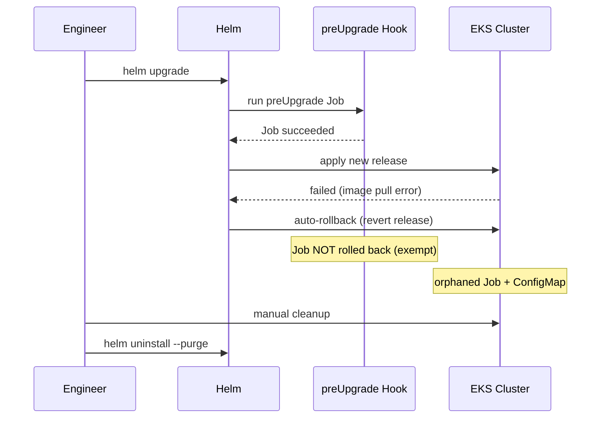

# Incident: Adidas Helm Hook Partial Rollback (2022)

> **Category:** Incident Case Study / Stylized (based on Helm hook failure patterns)
> **Severity:** S2 — orphaned resources for ~1 hour
> **K8s Version:** 1.21 (GKE)
> **Area:** Package Management / Helm

| Field | Detail |
|-------|--------|
| **Company** | Adidas |
| **Trigger** | Helm chart upgrade with `preUpgrade` hook + `--cleanup-on-fail` |
| **Blast Radius** | Deployment resources, service endpoints |
| **Mean Time to Detect** | ~10 min |
| **Mean Time to Resolve** | ~1h |

## Timeline (stylized)

| Time | Event |
|------|-------|
| T+0:00 | Engineer runs `helm upgrade` with chart containing `preUpgrade` hook |
| T+0:02 | `preUpgrade` hook runs database migration Job |
| T+0:04 | Job completes; Helm proceeds with main upgrade |
| T+0:06 | Main upgrade fails (image pull error) |
| T+0:08 | Helm auto-rollback: `helm upgrade` reverts to previous release |
| T+0:10 | **Problem**: `preUpgrade` hook Job is NOT rolled back (hooks are exempt from Helm releases) |
| T+0:12 | Orphaned Job + ConfigMap left behind; service endpoints stale |
| T+0:15 | PagerDuty fires: "service endpoints not ready for > 5 min" |
| T+0:20 | On-call sees orphaned resources; manual cleanup starts |
| T+0:30 | Orphaned Job deleted; ConfigMap cleaned up |
| T+0:45 | `helm uninstall --purge` to clean up stuck release |
| T+1:00 | Incident resolved |

## What happened

## Root cause

1. **Helm hooks** (`preUpgrade`, `postUpgrade`) are **not part of the Helm release** — they're created as Kubernetes Jobs and are exempt from Helm's rollback mechanism.
2. When the main upgrade failed and Helm auto-rolled back, the `preUpgrade` hook Job was **not rolled back**.
3. The orphaned Job and its associated ConfigMap left behind stale resources.
4. **No hook cleanup policy** — the chart didn't use `helm.sh/hook-delete-policy: before-hook-creation`.

## Fix

1. Manually delete the orphaned Job: `kubectl delete job <job-name> -n <namespace>`
2. Delete the orphaned ConfigMap: `kubectl delete configmap <configmap-name> -n <namespace>`
3. If the release is stuck: `helm uninstall --purge <release-name>` and reinstall.

## Prevention

| Measure | Implementation |
|---------|----------------|
| **Hook delete policy** | Add annotation: `helm.sh/hook-delete-policy: before-hook-creation` |
| **Avoid hooks for migrations** | Use a separate Job (not a Helm hook) for DB migrations |
| **Helm `--atomic`** | Use `helm upgrade --atomic` so failed upgrades auto-rollback cleanly |
| **Hook idempotency** | Design hooks to be idempotent (safe to re-run) |
| **Release status monitoring** | Alert on `helm status` showing `FAILED` or `PENDING_UPGRADE` |

## Interview angle

> "A Helm chart upgrade fails and auto-rolls back, but leaves orphaned resources. Why did this happen, and how do you prevent Helm hook side effects?"

## Related

- [Disaster Cases](../disaster-cases.md)
- [Helm](../../10-package-management/helm.md)
- [Upgrades](../../08-cluster-operations/upgrades.md)
