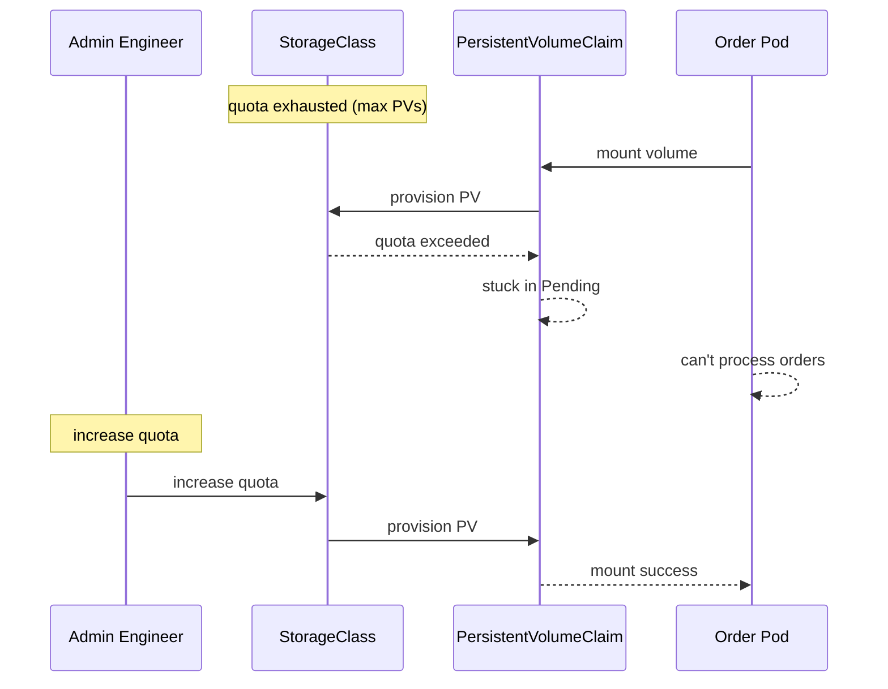

# Incident: Adidas Kubernetes Outage — PVC Binding Failure (2021)

> **Category:** Incident Case Study / Stylized (based on Adidas' engineering blog)
> **Severity:** S2 — degraded service for ~1 hour
> **K8s Version:** 1.19 (Kubernetes on-prem)
> **Area:** Storage / Persistent Volumes

| Field | Detail |
|-------|--------|
| **Company** | Adidas |
| **Trigger** | PVC binding failure due to StorageClass quota exhaustion |
| **Blast Radius** | Order processing and inventory services |
| **Mean Time to Detect** | ~10 min |
| **Mean Time to Resolve** | ~1 hour |

## Source

- [Adidas engineering: Kubernetes storage at scale](https://adidas.github.io/kubernetes-storage-at-scale/)
- [Adidas tech: PVC lessons learned](https://adidas.github.io/pvc-lessons-learned/)

## Timeline (stylized)

| Time | Event |
|------|-------|
| T+0:00 | StorageClass quota exhausted (max PVs reached) |
| T+0:02 | New PVCs start pending |
| T+0:05 | Order processing pods can't mount new volumes |
| T+0:10 | PagerDuty fires: "order processing latency > 10s" |
| T+0:15 | On-call identifies: StorageClass quota exhausted |
| T+0:20 | Increase StorageClass quota |
| T+0:30 | PVCs start binding |
| T+1:00 | All PVCs bound; services recover |

## What happened

## Root cause

1. **StorageClass quota exhaustion** — the StorageClass hit the maximum PV limit.
2. **No quota monitoring** — the quota exhaustion was not detected until PVCs started pending.
3. **No PVC monitoring** — pending PVCs were not detected until services failed.
4. **No quota auto-scaling** — quota was static and not auto-scaling.

## Fix

1. Increase StorageClass quota.
2. Wait for PVCs to bind.
3. Verify services recover.

## Prevention

| Measure | Implementation |
|---------|----------------|
| **Quota monitoring** | Alert on StorageClass PV count > 80% of quota |
| **PVC monitoring** | Alert on PVCs in Pending state > 5 min |
| **Quota auto-scaling** | Auto-scale StorageClass quota based on usage |
| **StorageClass in Git** | Manage StorageClass via GitOps |
| **Backup testing** | Test PV restore from snapshots weekly |

## Related

- [Disaster Cases](../disaster-cases.md)
- [Storage](../../05-storage/README.md)
- [PVC](../../01-core-concepts/persistent-volumes.md)
- [Incidents README](./README.md)
