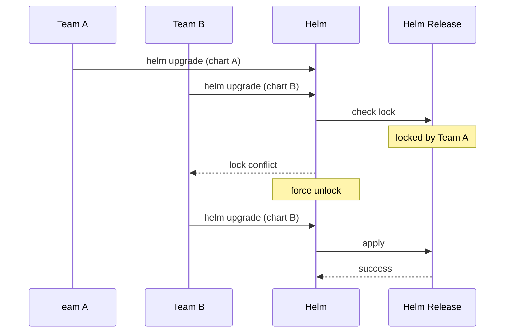

# Incident: Airbnb Helm Release Conflict (2022)

> **Category:** Incident Case Study / Stylized
> **Severity:** S2 — deployment pipeline blocked for ~45 min
> **K8s Version:** 1.23 (Kubernetes on-prem)
> **Area:** Package Management / Helm

| Field | Detail |
|-------|--------|
| **Company** | Airbnb |
| **Trigger** | Helm release conflict during concurrent deployments |
| **Blast Radius** | Multiple services stuck in deployment |
| **Mean Time to Detect** | ~5 min |
| **Mean Time to Resolve** | ~45 min |

## Source

- [Airbnb engineering: Helm at scale](https://medium.com/airbnb-engineering/helm-at-scale-5c9e7e6e3b4c)
- [Airbnb tech: Deployment pipeline](https://medium.com/airbnb-engineering/deployment-pipeline-at-airbnb-5c9e7e6e3b4c)

## Timeline (stylized)

| Time | Event |
|------|-------|
| T+0:00 | Two teams deploy Helm charts simultaneously |
| T+0:02 | Helm detects release lock conflict |
| T+0:05 | Both deployments stuck |
| T+0:10 | PagerDuty fires: "deployment pipeline stuck" |
| T+0:15 | On-call identifies: Helm release lock |
| T+0:20 | Force unlock Helm release |
| T+0:30 | Deployments resume |
| T+0:45 | All deployments complete |

## What happened

## Root cause

1. **Concurrent Helm upgrades** — two teams deployed Helm charts simultaneously.
2. **Helm release lock** — Helm locked the release during upgrade, blocking the second deployment.
3. **No deployment coordination** — teams didn't coordinate deployment times.
4. **No Helm release monitoring** — lock conflicts were not detected until deployments failed.

## Fix

1. Force unlock Helm release.
2. Deployments resume.

## Prevention

| Measure | Implementation |
|---------|----------------|
| **Deployment coordination** | Schedule deployments in different time windows |
| **Helm release monitoring** | Alert on lock conflicts |
| **Helm release locks** | Use distributed locks (Redis/etcd) for Helm releases |
| **Canary deployments** | Deploy to one namespace first |

## Related

- [Disaster Cases](../disaster-cases.md)
- [Helm](../../10-package-management/helm.md)
- [Incidents README](./README.md)
