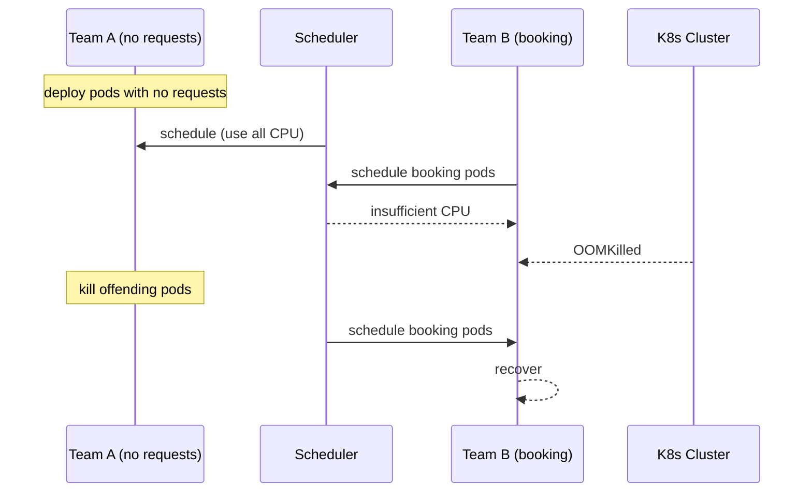

# Incident: Airbnb Kubernetes Outage — Resource Exhaustion (2020)

> **Category:** Incident Case Study / Stylized (based on Airbnb's engineering blog)
> **Severity:** S2 — degraded service for ~1 hour
> **K8s Version:** 1.18 (Kubernetes on-prem)
> **Area:** Resource Management / Scheduling

| Field | Detail |
|-------|--------|
| **Company** | Airbnb |
| **Trigger** | Resource quota exhaustion across namespaces |
| **Blast Radius** | Booking and search services |
| **Mean Time to Detect** | ~5 min |
| **Mean Time to Resolve** | ~1 hour |

## Source

- [Airbnb engineering: Resource management at scale](https://medium.com/airbnb-engineering/resource-management-at-scale-5977f84e3e3b)
- [Airbnb tech: Kubernetes at Airbnb](https://medium.com/airbnb-engineering/kubernetes-at-airbnb-f0c6209f1c28)

## Timeline (stylized)

| Time | Event |
|------|-------|
| T+0:00 | One team deploys pods with no resource requests |
| T+0:05 | Scheduler assigns all available CPU to this team's pods |
| T+0:10 | Other teams' pods start getting OOM killed |
| T+0:15 | Booking service pods OOM killed |
| T+0:20 | PagerDuty fires: "booking latency > 5s" |
| T+0:25 | On-call identifies: resource quota exhausted |
| T+0:30 | Kill the offending pods |
| T+0:45 | Scheduler reclaims resources |
| T+1:00 | All services recover |

## What happened

## Root cause

1. **No resource requests** — one team deployed pods without `resources.requests.cpu`.
2. **Scheduler starvation** — the scheduler assigned all available CPU to this team's pods.
3. **No ResourceQuota** — the namespace didn't have a ResourceQuota to limit total usage.
4. **No LimitRange** — no default resource limits were enforced.

## Fix

1. Kill the offending pods (no resource requests).
2. Add ResourceQuota to the namespace.
3. Add LimitRange to enforce default requests.

## Prevention

| Measure | Implementation |
|---------|----------------|
| **ResourceQuota** | Set CPU/memory limits per namespace |
| **LimitRange** | Enforce default requests for all pods |
| **VPA** | Right-size resource requests based on actual usage |
| **Admission controller** | Deny pods without resource requests |
| **Resource monitoring** | Alert on namespace CPU/memory > 80% |

## Related

- [Disaster Cases](../disaster-cases.md)
- [Resource Management](../../07-scheduling-autoscaling/resource-management.md)
- [Resource Quotas](../../01-core-concepts/resource-quotas.md)
- [Incidents README](./README.md)
