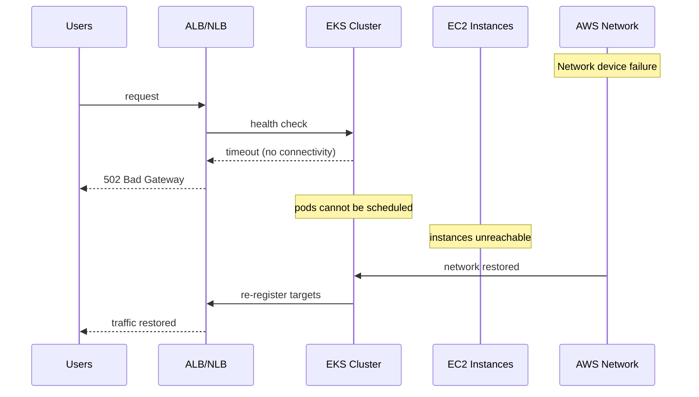

# Incident: Amazon US-EAST-1 Outage — K8s Networking (2021)

> **Category:** Incident Case Study / Stylized (based on Amazon's public postmortem)
> **Severity:** S0 — major AWS outage affecting multiple services
> **K8s Version:** N/A (AWS infrastructure)
> **Area:** Networking / Infrastructure

| Field | Detail |
|-------|--------|
| **Company** | Amazon Web Services |
| **Trigger** | Network device failure in US-EAST-1 |
| **Blast Radius** | Multiple AWS services (EC2, ECS, EKS, RDS, S3) |
| **Mean Time to Detect** | ~5 min |
| **Mean Time to Resolve** | ~4 hours |

## Source

- [AWS postmortem: Increased Error Rates for AWS Services in US-EAST-1 Region](https://aws.amazon.com/message/485636/)
- [TechCrunch: AWS outage affects a wide range of services](https://techcrunch.com/2021/12/07/amazon-aws-outage-affects-a-wide-range-of-services/)

## Timeline (stylized)

| Time | Event |
|------|-------|
| T+0:00 | Network device failure in US-EAST-1 |
| T+0:02 | K8s control plane nodes lose connectivity to etcd |
| T+0:05 | EKS clusters in US-EAST-1 become unresponsive |
| T+0:10 | EC2 instances in affected AZ cannot reach metadata service |
| T+0:15 | ALB/NLB health checks fail; load balancers return 502 |
| T+0:20 | ECS/EKS services cannot register new tasks/pods |
| T+0:30 | AWS engineers isolate the failed network device |
| T+1:00 | Network connectivity restored; services begin recovery |
| T+2:00 | K8s control planes reconnect to etcd; pods reschedule |
| T+4:00 | Full recovery across all affected services |

## What happened

## Root cause

1. **Network device failure** in a critical AZ of US-EAST-1.
2. K8s control plane nodes lost connectivity to etcd and to worker nodes.
3. **No cross-AZ failover** for the affected services — EKS control plane was single-AZ.
4. **Cascading failure** — ALB/NLB health checks failed, causing load balancers to return 502s.

## Fix

1. AWS engineers isolated the failed network device.
2. Network connectivity restored; K8s control planes reconnected.
3. Pods automatically rescheduled on healthy nodes.

## Prevention

| Measure | Implementation |
|---------|----------------|
| **Multi-AZ deployments** | Run EKS control plane across multiple AZs |
| **Pod Disruption Budgets** | Ensure minimum availability during node failures |
| **Cross-region failover** | Deploy critical services in multiple regions |
| **Health check tuning** | Increase ALB health check intervals to avoid flapping |
| **Observability** | Monitor AWS health dashboard + regional connectivity |

## Related

- [Disaster Cases](../disaster-cases.md)
- [Networking](../../04-networking/README.md)
- [EKS](../../09-cloud-integrations/eks.md)
- [Incidents README](./README.md)
