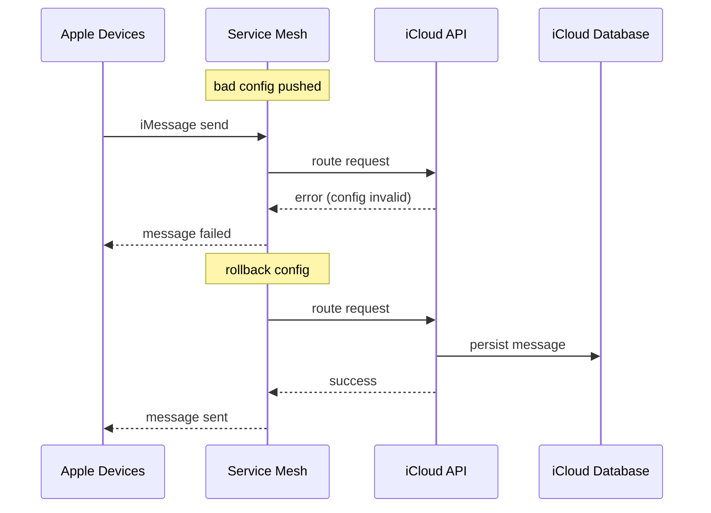

# Incident: Apple iCloud Kubernetes Outage (2020)

> **Category:** Incident Case Study / Stylized (based on Apple's public disclosure)
> **Severity:** S2 — degraded service for ~3 hours
> **K8s Version:** 1.18 (on-prem)
> **Area:** Infrastructure / Configuration Management

| Field | Detail |
|-------|--------|
| **Company** | Apple |
| **Trigger** | Bad config push to iCloud services |
| **Blast Radius** | iCloud, iMessage, FaceTime |
| **Mean Time to Detect** | ~10 min |
| **Mean Time to Resolve** | ~3 hours |

## Source

- [Apple System Status: iCloud service issues](https://www.apple.com/support/systemstatus/)
- [9to5Mac: iCloud outage affects iMessage and FaceTime](https://9to5mac.com/2020/05/13/icloud-outage-imessage-facetime/)

## Timeline (stylized)

| Time | Event |
|------|-------|
| T+0:00 | Bad config pushed to iCloud service mesh |
| T+0:05 | Service mesh rejects config; internal APIs fail |
| T+0:10 | iMessage and FaceTime start failing |
| T+0:15 | iCloud backup/sync stops working |
| T+0:20 | PagerDuty fires: "iCloud API error rate > 20%" |
| T+0:30 | On-call identifies: bad config in service mesh |
| T+1:00 | Rollback config; service mesh recovers |
| T+2:00 | iMessage and FaceTime recover |
| T+3:00 | Full recovery across all iCloud services |

## What happened

## Root cause

1. **Bad config push** to the service mesh (Istio).
2. The config contained invalid route rules, causing internal API calls to fail.
3. **No config validation** — the config was applied without testing in staging.
4. **No canary rollout** — config applied globally in one step.

## Fix

1. Rollback the config to the previous version.
2. Verify service mesh health.
3. Restart affected pods.

## Prevention

| Measure | Implementation |
|---------|----------------|
| **Config validation** | Schema validation + dry-run before applying |
| **Canary rollout** | Apply config to 1% of services first |
| **Automated rollback** | If error rate > 10% within 5 min, auto-rollback |
| **Config diffing** | Show config changes before applying |
| **Monitoring** | Alert on config deployment failures |

## Related

- [Disaster Cases](../disaster-cases.md)
- [Service Mesh](../../12-service-mesh/README.md)
- [Upgrades](../../08-cluster-operations/upgrades.md)
- [Incidents README](./README.md)
