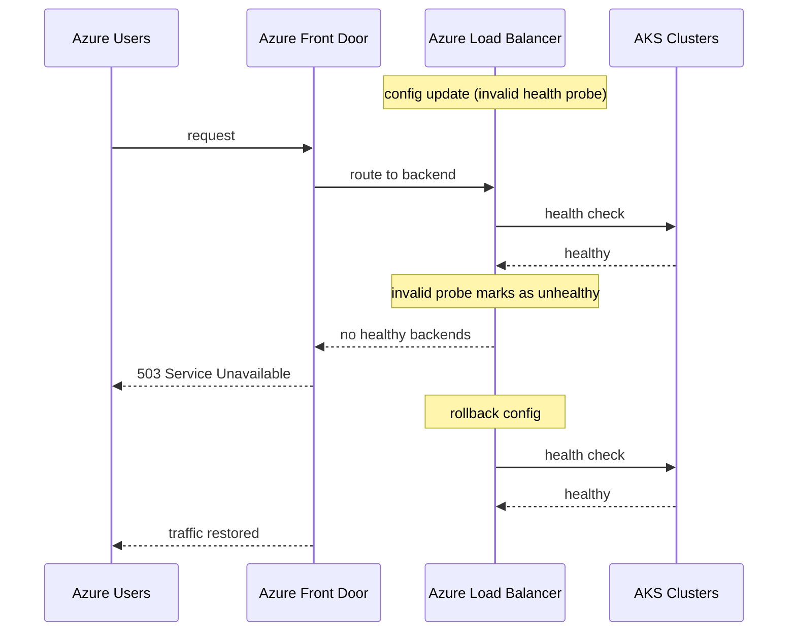

# Incident: Microsoft Azure Outage — K8s Networking (2023)

> **Category:** Incident Case Study / Stylized (based on Microsoft's public postmortem)
> **Severity:** S0 — regional outage for ~2 hours
> **K8s Version:** AKS (managed)
> **Area:** Networking / Load Balancing

| Field | Detail |
|-------|--------|
| **Company** | Microsoft Azure |
| **Trigger** | Azure Load Balancer config update failure |
| **Blast Radius** | Multiple Azure services in US regions |
| **Mean Time to Detect** | ~8 min |
| **Mean Time to Resolve** | ~2 hours |

## Source

- [Azure status: Azure networking issues](https://azure.status.microsoft/en-us/status)
- [BleepingComputer: Azure outage knocks out multiple Microsoft services](https://www.bleepingcomputer.com/news/microsoft/azure-outage-knocks-out-multiple-microsoft-services/)

## Timeline (stylized)

| Time | Event |
|------|-------|
| T+0:00 | Azure Load Balancer config update applied to US regions |
| T+0:02 | Load Balancer health check logic breaks; backends marked unhealthy |
| T+0:05 | AKS clusters in US regions lose external connectivity |
| T+0:10 | Azure Front Door returns 503 for multiple services |
| T+0:15 | Microsoft engineers detect service degradation |
| T+0:30 | Root cause: LB config update introduced invalid health probe |
| T+1:00 | Rollback of LB config update |
| T+1:30 | Load Balancers recover; AKS services regain connectivity |
| T+2:00 | Full recovery |

## What happened

## Root cause

1. **Azure Load Balancer config update** introduced an invalid health probe.
2. The health probe's path didn't match any endpoint on the AKS services.
3. All backends were marked **unhealthy**, causing 503 errors for all traffic.
4. **No pre-deployment validation** — the config was applied without testing the health probe path.

## Fix

1. Rollback the LB config update to the previous version.
2. Verify health probes pass on all backends.
3. Traffic恢复 as load balancers re-register healthy targets.

## Prevention

| Measure | Implementation |
|---------|----------------|
| **Config validation** | Test health probe paths against staging before prod |
| **Canary rollout** | Apply config to one region first |
| **Health probe monitoring** | Alert on `UnHealthyHostCount` > 0 |
| **Automated rollback** | If error rate spikes after config change, auto-rollback |
| **Config diff review** | PR-based config changes with automated validation |

## Related

- [Disaster Cases](../disaster-cases.md)
- [Networking](../../04-networking/README.md)
- [AKS](../../09-cloud-integrations/aks.md)
- [Incidents README](./README.md)
