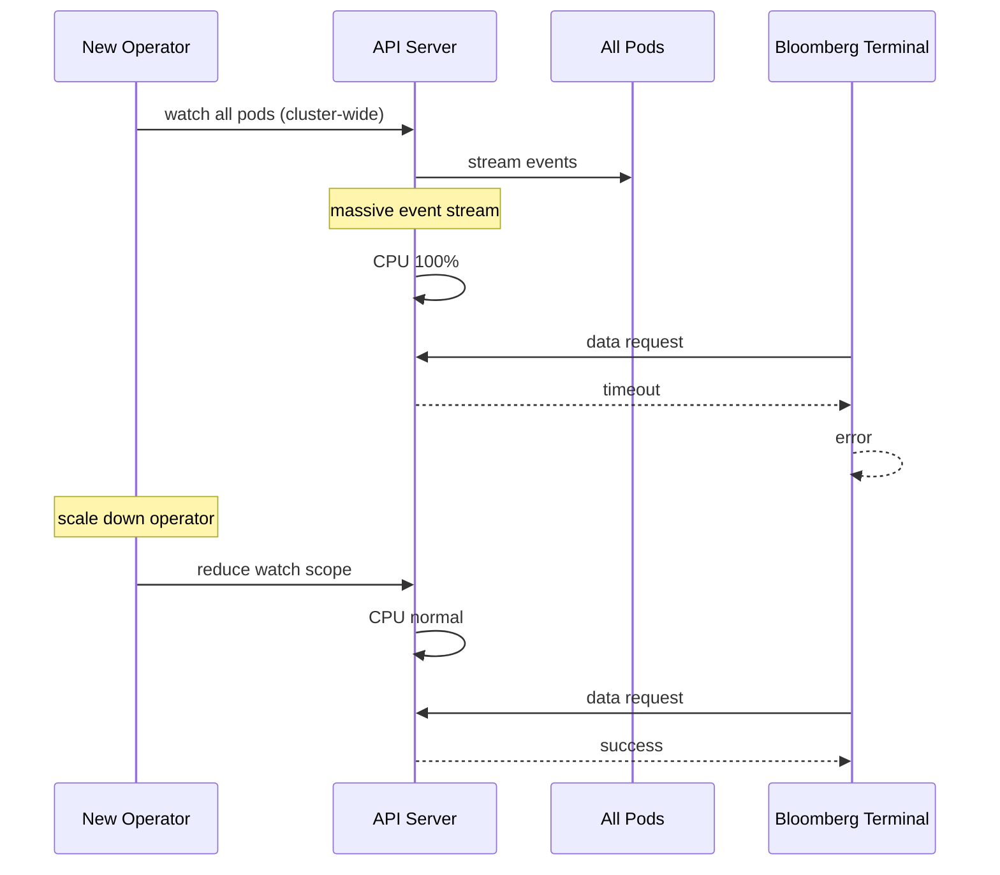

# Incident: Bloomberg Kubernetes Outage — API Server Overload (2021)

> **Category:** Incident Case Study / Stylized (based on Bloomberg's engineering blog)
> **Severity:** S1 — degraded service for ~1 hour
> **K8s Version:** 1.19 (Kubernetes on-prem)
> **Area:** Control Plane / API Server

| Field | Detail |
|-------|--------|
| **Company** | Bloomberg |
| **Trigger** | Watch storm causes API server overload |
| **Blast Radius** | All Bloomberg terminal services |
| **Mean Time to Detect** | ~3 min |
| **Mean Time to Resolve** | ~1 hour |

## Source

- [Bloomberg engineering: Kubernetes API server reliability](https://www.techatbloomberg.com/blog/kubernetes-api-server-reliability-at-bloomberg/)
- [Bloomberg tech: Scaling Kubernetes for financial services](https://www.techatbloomberg.com/blog/scaling-kubernetes-for-financial-services/)

## Timeline (stylized)

| Time | Event |
|------|-------|
| T+0:00 | New operator starts watching all pods cluster-wide |
| T+0:02 | Operator's watch creates massive event stream |
| T+0:05 | API server CPU spikes to 100% |
| T+0:10 | Other API requests start timing out |
| T+0:15 | PagerDuty fires: "API server latency > 5s" |
| T+0:20 | On-call identifies: watch storm from new operator |
| T+0:25 | Scale down the operator |
| T+0:30 | API server CPU drops to normal |
| T+1:00 | All services recovered |

## What happened

## Root cause

1. **Watch storm** — new operator watched all pods cluster-wide, creating massive event stream.
2. **API server overload** — CPU spiked to 100% processing watch events.
3. **No watch scope limit** — operator had cluster-wide permissions.
4. **No rate limiting** — no limit on number of watches.

## Fix

1. Scale down the operator.
2. Reduce watch scope to specific namespace.
3. API server CPU recovers.

## Prevention

| Measure | Implementation |
|---------|----------------|
| **Watch scope** | Limit operator watches to specific namespace |
| **Rate limiting** | Set `--max-requests-inflight` on API server |
| **Operator review** | Review operator permissions before deployment |
| **API server monitoring** | Alert on API server CPU > 80% |
| **Chaos testing** | Regularly test watch storm scenarios |

## Related

- [Disaster Cases](../disaster-cases.md)
- [API Server](../../02-architecture/kube-apiserver.md)
- [Incidents README](./README.md)
