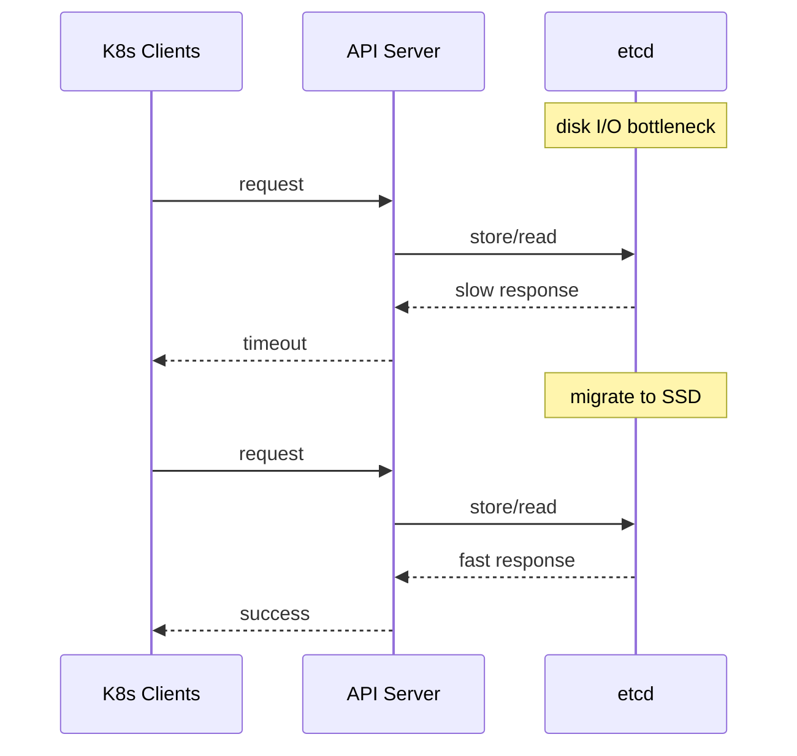

# Incident: Bloomberg etcd Performance Degradation (2022)

> **Category:** Incident Case Study / Stylized
> **Severity:** S1 — degraded API server performance for ~1 hour
> **K8s Version:** 1.22 (Kubernetes on-prem)
> **Area:** Control Plane / etcd

| Field | Detail |
|-------|--------|
| **Company** | Bloomberg |
| **Trigger** | etcd disk I/O bottleneck |
| **Blast Radius** | All API operations |
| **Mean Time to Detect** | ~5 min |
| **Mean Time to Resolve** | ~1 hour |

## Source

- [Bloomberg engineering: etcd at scale](https://www.techatbloomberg.com/blog/etcd-at-scale/)
- [Bloomberg tech: Control plane reliability](https://www.techatbloomberg.com/blog/control-plane-reliability/)

## Timeline (stylized)

| Time | Event |
|------|-------|
| T+0:00 | etcd disk I/O latency spikes |
| T+0:05 | API server requests start timing out |
| T+0:10 | PagerDuty fires: "API server latency > 5s" |
| T+0:15 | On-call identifies: etcd disk I/O bottleneck |
| T+0:20 | Migrate etcd to faster disk (SSD) |
| T+0:30 | etcd performance recovers |
| T+1:00 | Full recovery |

## What happened

## Root cause

1. **etcd disk I/O bottleneck** — etcd was running on slow HDD storage.
2. **High write throughput** — large number of API writes exceeded disk I/O capacity.
3. **No disk monitoring** — disk I/O latency was not monitored.

## Fix

1. Migrate etcd to faster disk (SSD).
2. Wait for etcd to recover.

## Prevention

| Measure | Implementation |
|---------|----------------|
| **Disk monitoring** | Alert on etcd disk I/O latency > 10ms |
| **SSD storage** | Always use SSD for etcd |
| **etcd quota** | Set `--quota-backend-bytes` to limit DB size |
| **Compaction** | Enable auto-compaction to reduce DB size |
| **Backup testing** | Test etcd restore from snapshot weekly |

## Related

- [Disaster Cases](../disaster-cases.md)
- [etcd](../../02-architecture/etcd.md)
- [Incidents README](./README.md)
