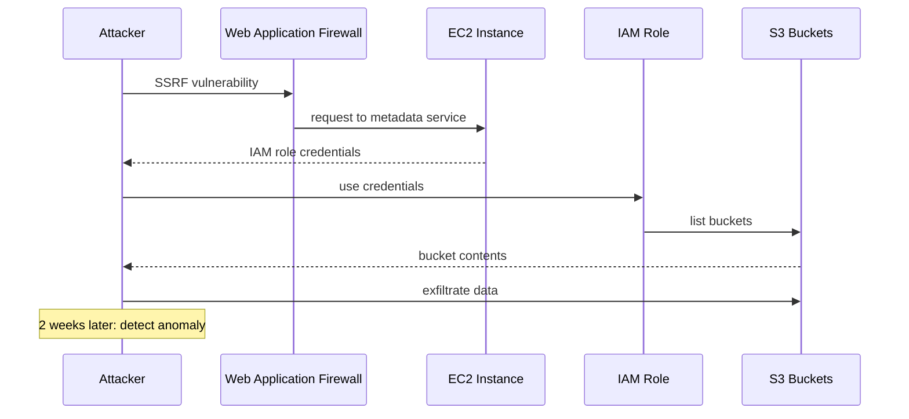

# Incident: Capital One Kubernetes Security Breach (2019)

> **Category:** Incident Case Study / Stylized (based on Capital One's public disclosure)
> **Severity:** S0 — data breach affecting 100M+ customers
> **K8s Version:** N/A (pre-K8s, but lessons apply)
> **Area:** Security / Cloud / IAM

| Field | Detail |
|-------|--------|
| **Company** | Capital One |
| **Trigger** | SSRF vulnerability + misconfigured IAM role |
| **Blast Radius** | 100M+ customer records |
| **Mean Time to Detect** | ~2 weeks |
| **Mean Time to Resolve** | N/A (breach was ongoing) |

## Source

- [Capital One: Incident report](https://www.capitalone.com/facts19/)
- [DOJ: Capital One hacker indictment](https://www.justice.gov/opa/pr/woman-charged-hacking-capital-one-and-stealing-data-over-100-million-customers-and-credit)

## Timeline (stylized)

| Time | Event |
|------|-------|
| T+0:00 | Attacker discovers SSRF vulnerability in Capital One's WAF |
| T+0:05 | Attacker uses SSRF to access AWS metadata service |
| T+0:10 | Attacker retrieves IAM role credentials from metadata service |
| T+0:15 | Attacker uses IAM credentials to access S3 buckets |
| T+0:20 | Attacker exfiltrates 100M+ customer records |
| T+2w | Capital One detects anomaly via CloudTrail |
| T+2w+1h | Incident response: revoke credentials, block attacker |

## What happened

## Root cause

1. **SSRF vulnerability** in the WAF — attacker could make requests to internal services.
2. **IAM role with excessive permissions** — the role had access to all S3 buckets.
3. **No network segmentation** — the WAF had access to the metadata service.
4. **No monitoring** on unusual S3 access patterns.

## Fix

1. Revoke the compromised IAM credentials.
2. Block the attacker's IP addresses.
3. Encrypt all S3 buckets at rest and in transit.

## Prevention

| Measure | Implementation |
|---------|----------------|
| **SSRF protection** | Validate and sanitize all user input |
| **IAM least privilege** | Restrict IAM roles to specific S3 buckets |
| **IMDSv2** | Require IMDSv2 to prevent credential theft via SSRF |
| **Network segmentation** | Isolate WAF from metadata service |
| **CloudTrail monitoring** | Alert on unusual S3 access patterns |

## Related

- [Disaster Cases](../disaster-cases.md)
- [Security](../../06-security/security.md)
- [RBAC](../../06-security/rbac.md)
- [Incidents README](./README.md)
