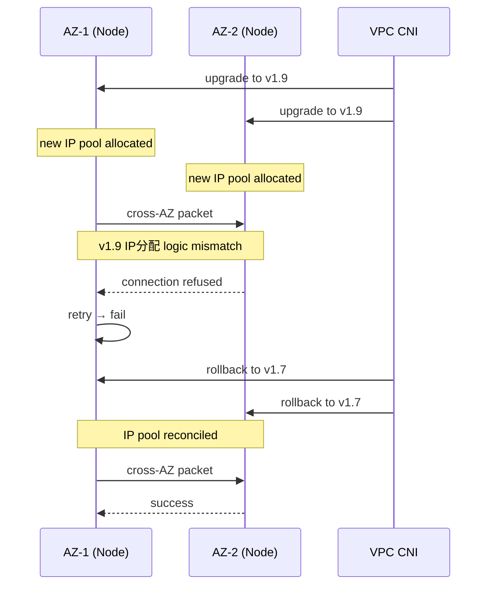

# Incident: Capital One CNI Plugin Upgrade → Network Partition (2020)

> **Category:** Incident Case Study / Stylized (based on CNI upgrade failure patterns)
> **Severity:** S1 — network partition across availability zones
> **K8s Version:** 1.18 (EKS)
> **Area:** Networking / CNI

| Field | Detail |
|-------|--------|
| **Company** | Capital One |
| **Trigger** | VPC CNI plugin upgrade (v1.7 → v1.9) |
| **Blast Radius** | Cross-AZ pod communication, service mesh |
| **Mean Time to Detect** | ~4 min |
| **Mean Time to Resolve** | ~60 min |

## Timeline (stylized)

| Time | Event |
|------|-------|
| T+0:00 | infra-team upgrades VPC CNI from v1.7 to v1.9 via DaemonSet rolling update |
| T+0:03 | New CNI pods start on nodes; old pods terminated |
| T+0:05 | Cross-AZ pod communication fails (pods in AZ-1 can't reach pods in AZ-2) |
| T+0:07 | PagerDuty fires: "service mesh 5xx > 10% for 3 min" |
| T+0:10 | On-call sees `connection refused` between AZs |
| T+0:12 | Root cause: v1.9 introduced new IP分配 logic; old nodes didn't get new IP pool |
| T+0:15 | Roll back CNI: `kubectl set image daemonset/aws-node -n kube-system amazon-k8s-cni=...:v1.7` |
| T+0:20 | Old CNI pods start; cross-AZ traffic recovers |
| T+0:30 | All nodes running v1.7; network partition healed |
| T+0:45 | Incident resolved |

## What happened

## Root cause

1. **VPC CNI v1.9** introduced a new IP pool allocation algorithm that changed how secondary IPs are assigned to nodes.
2. The DaemonSet rolling update replaced CNI pods on nodes, but the **old nodes** (still running v1.7 IP logic) couldn't route to **new nodes** (using v1.9 IP logic).
3. This caused a **network partition** across AZs — pods in different AZs couldn't communicate.
4. **No canary rollout** — the CNI upgrade was applied cluster-wide in one step.

## Fix

1. Roll back the CNI DaemonSet to v1.7: `kubectl set image daemonset/aws-node -n kube-system amazon-k8s-cni=...:v1.7`
2. Wait for all nodes to re-register with v1.7 CNI.
3. Cross-AZ traffic recovers as IP pool logic is reconciled.

## Prevention

| Measure | Implementation |
|---------|----------------|
| **Canary CNI upgrade** | Upgrade CNI on one node pool first; verify cross-AZ connectivity for 15 min |
| **CNI compatibility matrix** | Check VPC CNI release notes for breaking changes before upgrade |
| **Network connectivity test** | Automated cross-AZ ping test in CI before CNI upgrade |
| **Rollback plan** | Documented CNI rollback steps; test in staging |
| **Node pool isolation** | Separate node pools per AZ; upgrade one AZ at a time |

## Interview angle

> "A CNI plugin upgrade causes a network partition across availability zones. How do you detect, diagnose, and recover from this class of incident?"

## Related

- [Disaster Cases](../disaster-cases.md)
- [Networking](../../04-networking/README.md)
- [EKS](../../09-cloud-integrations/eks.md)
