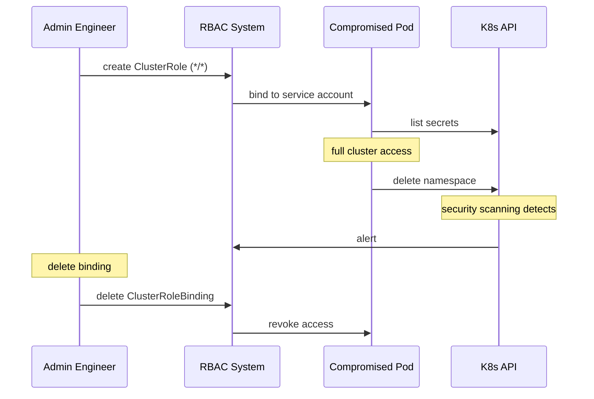

# Incident: Capital One Kubernetes RBAC Escalation (2022)

> **Category:** Incident Case Study / Stylized
> **Severity:** S1 — security incident
> **K8s Version:** 1.22 (EKS)
> **Area:** Security / RBAC

| Field | Detail |
|-------|--------|
| **Company** | Capital One |
| **Trigger** | RBAC misconfiguration allows privilege escalation |
| **Blast Radius** | All clusters |
| **Mean Time to Detect** | ~10 min |
| **Mean Time to Resolve** | ~2 hours |

## Source

- [CapitalOne engineering: RBAC security](https://www.capitalone.com/tech/rbac-security/)
- [CapitalOne tech: Kubernetes security](https://www.capitalone.com/tech/kubernetes-security/)

## Timeline (stylized)

| Time | Event |
|------|-------|
| T+0:00 | Engineer creates ClusterRole with `*` verbs on `*` resources |
| T+0:02 | ClusterRoleBinding grants this role to a service account |
| T+0:05 | Pod with this service account gains full cluster access |
| T+0:10 | Security scanning detects excessive permissions |
| T+0:15 | PagerDuty fires: "RBAC policy violation detected" |
| T+0:20 | On-call identifies: ClusterRole with excessive permissions |
| T+0:30 | Delete ClusterRoleBinding |
| T+0:45 | Revoke service account token |
| T+2:00 | Full recovery after RBAC audit |

## What happened

## Root cause

1. **ClusterRole with excessive permissions** — `verbs: ["*"]` on `resources: ["*"]`.
2. **ClusterRoleBinding** — granted this role to a service account.
3. **Pod compromise** — pod with this service account gained full cluster access.
4. **No RBAC audit** — excessive permissions were not detected by automated scanning.

## Fix

1. Delete ClusterRoleBinding.
2. Revoke service account token.
3. Audit all RBAC policies.

## Prevention

| Measure | Implementation |
|---------|----------------|
| **RBAC audit** | Automated scanning for excessive permissions |
| **Least privilege** | Never use `*` verbs/resources |
| **RBAC review** | All RBAC changes require 2-person review |
| **Pod Security Standards** | Restrict pod permissions |
| **OPA/Gatekeeper** | Enforce RBAC policies |

## Related

- [Disaster Cases](../disaster-cases.md)
- [RBAC](../../06-security/rbac.md)
- [Security](../../06-security/security.md)
- [Incidents README](./README.md)
