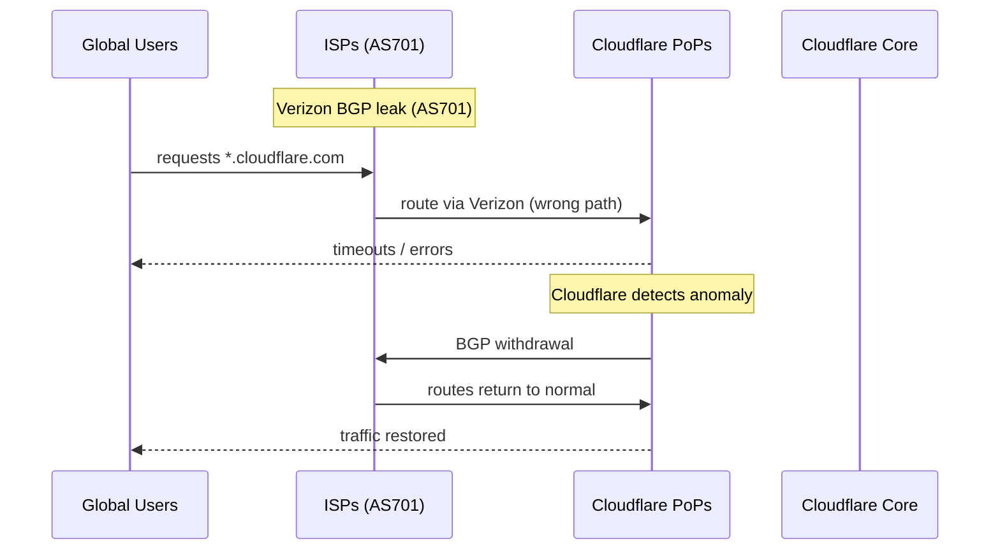

# Incident: Cloudflare Global Outage — BGP Leak (2019)

> **Category:** Incident Case Study / Stylized (based on Cloudflare's public postmortem)
> **Severity:** S0 — global outage for ~30 minutes
> **K8s Version:** N/A (infrastructure-level)
> **Area:** Networking / BGP / Infrastructure

| Field | Detail |
|-------|--------|
| **Company** | Cloudflare |
| **Trigger** | Verizon misconfigured BGP route leak |
| **Blast Radius** | Global — all Cloudflare customers |
| **Mean Time to Detect** | ~1 min |
| **Mean Time to Resolve** | ~30 min |

## Source

- [Cloudflare blog: How and why the July 2019 outage happened](https://blog.cloudflare.com/how-and-why-the-july-2019-outage-happened/)
- [Cloudflare postmortem: July 2, 2019 network outage](https://blog.cloudflare.com/post-mortem-of-the-july-2-2019-network-outage/)

## Timeline (stylized)

| Time | Event |
|------|-------|
| T+0:00 | Verizon (AS701) accidentally announces a more specific route for Cloudflare's IP space |
| T+0:02 | Traffic from multiple ISPs starts routing through Verizon's network |
| T+0:05 | Cloudflare detects anomaly in traffic patterns |
| T+0:07 | Verizon's AS path filter fails; malicious route propagates globally |
| T+0:10 | Cloudflare engineers begin mitigation |
| T+0:15 | BGP community triggered to withdraw the leak |
| T+0:20 | Traffic routes return to normal paths |
| T+0:30 | Full recovery; all services operational |

## What happened

## Root cause

1. **Verizon (AS701)** accidentally announced a more-specific BGP route for Cloudflare's IP space to other ISPs.
2. This caused global traffic to be misrouted through Verizon's network, which couldn't handle the load.
3. **BGP lacked route origin validation (ROV)** — there was no mechanism to verify the route was legitimate.

## Fix

1. Cloudflare triggered a **BGP community** to have Verizon withdraw the leaked route.
2. Traffic returned to normal paths within minutes.
3. Cloudflare added **RPKI (Resource Public Key Infrastructure)** validation to prevent future leaks.

## Prevention

| Measure | Implementation |
|---------|----------------|
| **RPKI / ROV** | Deploy Route Origin Authorizations to validate BGP routes |
| **BGP monitoring** | Alert on unexpected route changes (> 10% traffic shift in 5 min) |
| **Multi-path diversity** | Ensure traffic can route around a single ISP failure |
| **Geographic failover** | Cloudflare's anycast automatically reroutes to healthy PoPs |
| **Incident response** | Pre-configured BGP communities for emergency route withdrawal |

## Related

- [Disaster Cases](../disaster-cases.md)
- [Networking](../../04-networking/README.md)
- [Incidents README](./README.md)
