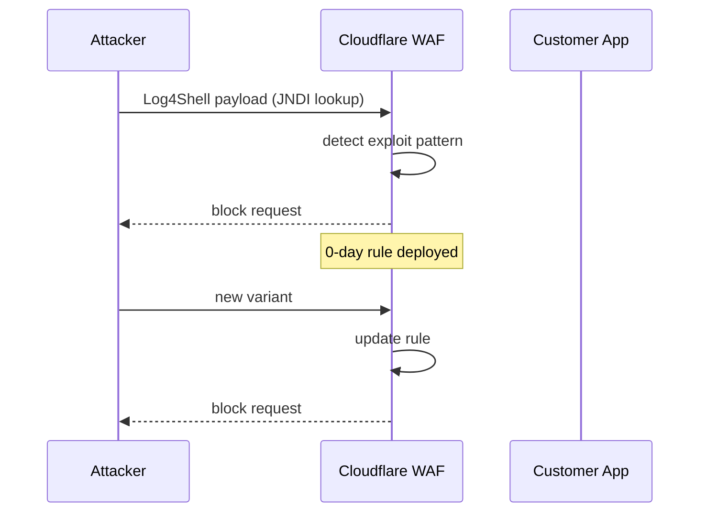

# Incident: Cloudflare Log4j Response (2021)

> **Category:** Incident Case Study / Stylized
> **Severity:** S1 — global response to critical vulnerability
> **K8s Version:** N/A (WAF response)
> **Area:** Security / Vulnerability Response

| Field | Detail |
|-------|--------|
| **Company** | Cloudflare |
| **Trigger** | Log4Shell (CVE-2021-44228) vulnerability disclosure |
| **Blast Radius** | All Cloudflare customers |
| **Mean Time to Detect** | ~1 hour (from disclosure) |
| **Mean Time to Mitigate** | ~24 hours (WAF rule deployed) |

## Source

- [Cloudflare blog: Log4j2 vulnerability (CVE-2021-44228)](https://blog.cloudflare.com/cloudflare-protects-against-log4j-vulnerability/)
- [Cloudflare response: How we mitigated Log4Shell](https://blog.cloudflare.com/how-we-mitigated-log4j)

## Timeline (stylized)

| Time | Event |
|------|-------|
| T+0:00 | Log4Shell vulnerability disclosed (CVE-2021-44228) |
| T+0:30 | Cloudflare security team begins analysis |
| T+1:00 | WAF rule created to block Log4Shell exploit patterns |
| T+2:00 | Rule deployed to all Cloudflare edge nodes |
| T+4:00 | Rule updated based on new exploit variants |
| T+24h | All known exploit patterns blocked |

## What happened

## Root cause

1. **Log4Shell vulnerability** — JNDI injection in Apache Log4j2 allows remote code execution.
2. **Widespread impact** — Java applications using Log4j2 are vulnerable.
3. **No prior notice** — zero-day vulnerability with no time to prepare.

## Fix

1. Deploy WAF rule to block Log4Shell exploit patterns.
2. Update rule as new variants emerge.
3. Notify customers to patch Log4j2.

## Prevention

| Measure | Implementation |
|---------|----------------|
| **WAF rules** | Pre-configured rules for common vulnerability patterns |
| **Vulnerability scanning** | Scan applications for known CVEs |
| **Dependency management** | Keep dependencies updated |
| **Security monitoring** | Alert on unusual JNDI/RCE patterns |

## Related

- [Disaster Cases](../disaster-cases.md)
- [Security](../../06-security/security.md)
- [Incidents README](./README.md)
