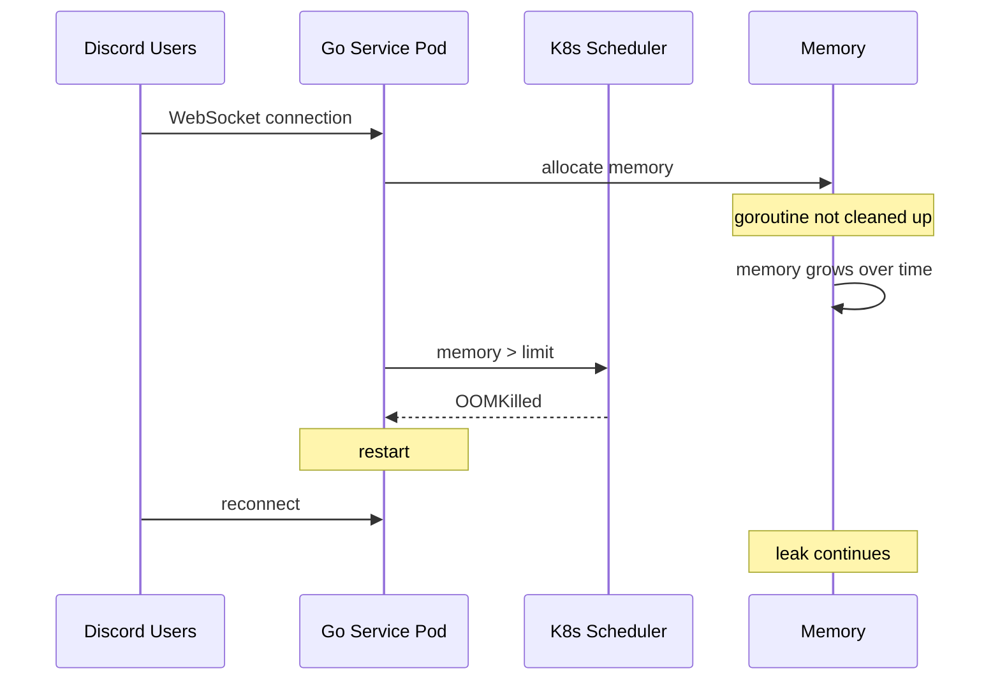

# Incident: Discord Kubernetes Memory Leak (2021)

> **Category:** Incident Case Study / Stylized (based on Discord's engineering blog)
> **Severity:** S2 — degraded service for ~2 hours
> **K8s Version:** 1.19 (GKE)
> **Area:** Application Performance / Memory Management

| Field | Detail |
|-------|--------|
| **Company** | Discord |
| **Trigger** | Memory leak in Go service on Kubernetes |
| **Blast Radius** | Voice and text services (high latency) |
| **Mean Time to Detect** | ~15 min |
| **Mean Time to Resolve** | ~2 hours |

## Source

- [Discord engineering: How Discord stores trillions of messages](https://discord.com/blog/how-discord-stores-trillions-of-messages)
- [Discord tech: Scaling Discord to 15 million users](https://discord.com/blog/scaling-discord-to-15-million-users)

## Timeline (stylized)

| Time | Event |
|------|-------|
| T+0:00 | New Go service deployed with memory leak |
| T+0:05 | Pods start consuming more memory over time |
| T+0:15 | Memory usage approaches 80% of limit |
| T+0:30 | First OOM kill; pod restarts |
| T+0:45 | More pods OOM killed; voice service degrades |
| T+1:00 | PagerDuty fires: "voice latency > 500ms" |
| T+1:15 | On-call identifies memory leak via pprof |
| T+1:30 | Root cause: Goroutine leak in WebSocket handler |
| T+1:45 | Rollback to previous version |
| T+2:00 | Services stabilize; memory usage returns to normal |

## What happened

## Root cause

1. **Goroutine leak** in the WebSocket handler — goroutines were spawned but never cleaned up when connections closed.
2. Memory usage grew linearly with active connections.
3. Eventually hit the memory limit; Kubernetes OOM killed the pod.
4. **No goroutine monitoring** — the leak was undetected until pods started crashing.

## Fix

1. Rollback to the previous version (no goroutine leak).
2. Add goroutine leak detection in CI (leaktest package).
3. Add memory profiling endpoint to production pods.

## Prevention

| Measure | Implementation |
|---------|----------------|
| **Goroutine monitoring** | Alert on `go_goroutines` > 1000 per pod |
| **Memory profiling** | Continuous pprof in production |
| **Leak detection in CI** | Use `goleak` in unit tests |
| **Resource limits** | Set memory limits based on 99th percentile + 20% buffer |
| **Canary deployment** | Monitor memory for 30 min before full rollout |

## Related

- [Disaster Cases](../disaster-cases.md)
- [Resource Management](../../07-scheduling-autoscaling/resource-management.md)
- [Incidents README](./README.md)
