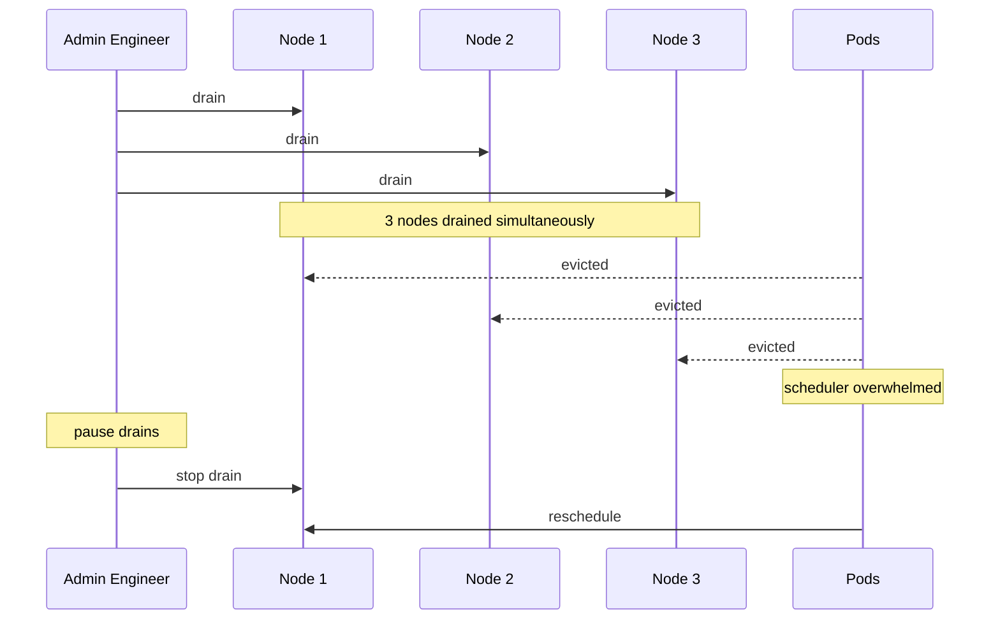

# Incident: Discord Kubernetes Node Drain Storm (2022)

> **Category:** Incident Case Study / Stylized
> **Severity:** S1 — degraded service for ~1 hour
> **K8s Version:** 1.23 (GKE)
> **Area:** Cluster Operations / Node Management

| Field | Detail |
|-------|--------|
| **Company** | Discord |
| **Trigger** | Node drain storm causes pod evictions |
| **Blast Radius** | Voice and text services |
| **Mean Time to Detect** | ~3 min |
| **Mean Time to Resolve** | ~1 hour |

## Source

- [Discord engineering: Node drain at scale](https://discord.com/blog/node-drain-at-scale)
- [Discord tech: Kubernetes reliability](https://discord.com/blog/kubernetes-reliability)

## Timeline (stylized)

| Time | Event |
|------|-------|
| T+0:00 | Maintenance window starts; multiple nodes drained simultaneously |
| T+0:02 | Pods evicted from drained nodes |
| T+0:05 | Scheduler tries to reschedule pods; some can't find nodes |
| T+0:10 | PagerDuty fires: "voice latency > 500ms" |
| T+0:15 | On-call identifies: node drain storm |
| T+0:20 | Pause node drains |
| T+0:30 | Pods rescheduled; services recover |
| T+1:00 | Full recovery |

## What happened

## Root cause

1. **Node drain storm** — multiple nodes were drained simultaneously during maintenance.
2. **Pod evictions** — all pods on drained nodes were evicted at once.
3. **Scheduler overload** — scheduler couldn't handle the sudden burst of pod scheduling.
4. **No PDB** — no Pod Disruption Budgets to limit evictions.

## Fix

1. Pause node drains.
2. Wait for pods to reschedule.

## Prevention

| Measure | Implementation |
|---------|----------------|
| **PDBs** | Set `minAvailable` on critical deployments |
| **Sequential drains** | Drain one node at a time |
| **Node drain monitoring** | Alert on node drain count > 3 per 5 min |
| **Maintenance windows** | Schedule maintenance during low-traffic periods |
| **Pod priority** | Use PriorityClasses to protect critical pods |

## Related

- [Disaster Cases](../disaster-cases.md)
- [PDB](../../03-workloads/pdb.md)
- [Node Management](../../02-architecture/kubelet.md)
- [Incidents README](./README.md)
