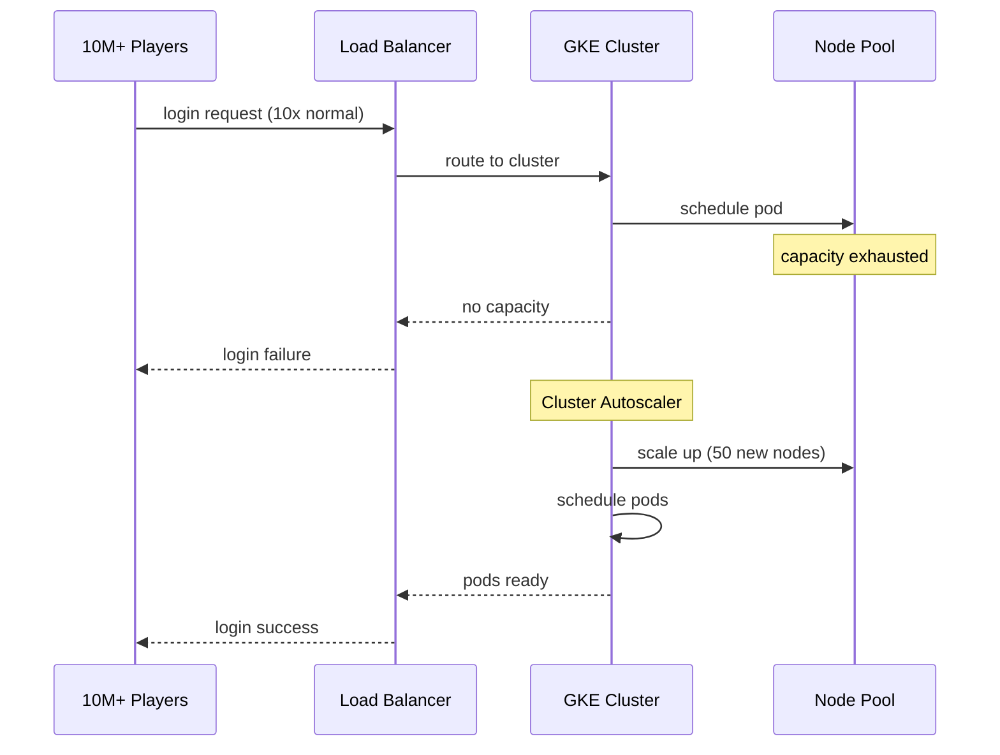

# Incident: Epic Games Fortnite Kubernetes Outage (2019)

> **Category:** Incident Case Study / Stylized (based on Epic Games' public disclosure)
> **Severity:** S0 — global outage affecting millions of players
> **K8s Version:** 1.16 (GKE)
> **Area:** Infrastructure / Capacity Planning

| Field | Detail |
|-------|--------|
| **Company** | Epic Games |
| **Trigger** | Traffic surge from new season launch + K8s capacity exhaustion |
| **Blast Radius** | All Fortnite services (login, matchmaking, matchmaking) |
| **Mean Time to Detect** | ~2 min |
| **Mean Time to Resolve** | ~8 hours |

## Source

- [Epic Games status: Fortnite service disruption](https://status.epicgames.com/)
- [The Verge: Fortnite outage affects millions of players](https://www.theverge.com/2019/10/13/20913513/fortnite-outage-server-maintenance-season-11)

## Timeline (stylized)

| Time | Event |
|------|-------|
| T+0:00 | New Fortnite season launches; 10x normal traffic |
| T+0:02 | GKE node pool capacity exhausted (max nodes reached) |
| T+0:05 | New pods cannot be scheduled (Insufficient CPU) |
| T+0:10 | Login and matchmaking services start failing |
| T+0:15 | PagerDuty fires: "Fortnite login > 50% failure" |
| T+0:20 | On-call identifies: GKE node pool at 100% capacity |
| T+0:30 | Emergency: increase node pool max size |
| T+0:45 | Cluster Autoscaler scales up new nodes |
| T+1:00 | Pods start scheduling on new nodes |
| T+2:00 | Services partially recovered |
| T+8:00 | Full recovery after node pool stabilization |

## What happened

## Root cause

1. **Traffic surge** from new season launch — 10x normal traffic.
2. **GKE node pool capacity exhausted** — max nodes reached before autoscaler could scale.
3. **Cluster Autoscaler lag** — scaling up took 10-15 minutes for new nodes to be ready.
4. **No pre-scaling** — node pool wasn't increased before the launch event.

## Fix

1. Emergency increase of node pool max size (from 100 to 500 nodes).
2. Cluster Autoscaler scales up new nodes.
3. Pods start scheduling on new nodes; services recover.

## Prevention

| Measure | Implementation |
|---------|----------------|
| **Pre-scaling** | Increase node pool before major launches |
| **Traffic forecasting** | Use historical data to predict capacity needs |
| **Pod Disruption Budgets** | Ensure minimum availability during scale-up |
| **Multi-region** | Deploy across regions to distribute load |
| **Load testing** | Simulate 10x traffic before major launches |

## Related

- [Disaster Cases](../disaster-cases.md)
- [Cluster Autoscaler](../../03-workloads/cluster-autoscaler.md)
- [GKE](../../09-cloud-integrations/gke.md)
- [Incidents README](./README.md)
