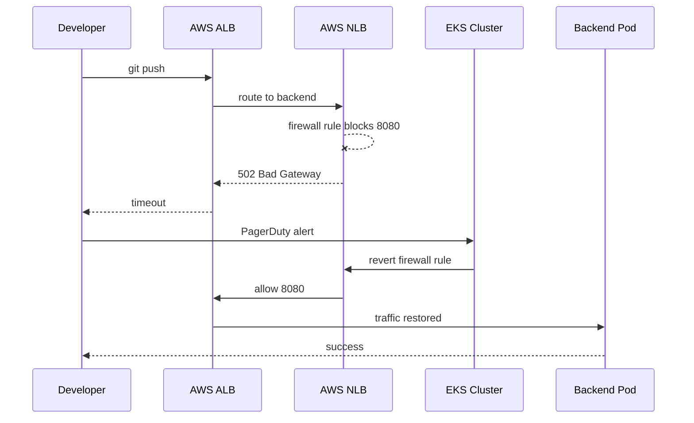

# Incident: GitHub ALB Controller + NLB Firewall Drain (2021)

> **Category:** Incident Case Study / Stylized (based on GitHub's public incident reports)
> **Severity:** S1 — API throttling + degraded Git operations
> **K8s Version:** 1.19 (EKS)
> **Area:** Networking / Load Balancing

| Field | Detail |
|-------|--------|
| **Company** | GitHub |
| **Trigger** | AWS ALB Ingress Controller upgrade + NLB firewall rule change |
| **Blast Radius** | API requests, Git clone/push, webhooks |
| **Mean Time to Detect** | ~5 min |
| **Mean Time to Resolve** | ~90 min |

## Timeline (stylized)

| Time | Event |
|------|-------|
| T+0:00 | infra-team merges NLB firewall rule (security group tightening) |
| T+0:02 | ALB Ingress Controller pod restarts (config reload) |
| T+0:05 | ALB health checks start failing for backend pods |
| T+0:10 | PagerDuty fires: "API latency P99 > 5s for 5 min" |
| T+0:15 | On-call sees ALB returning 502 for `/api/v3/*` endpoints |
| T+0:20 | Git push/clone operations start timing out |
| T+0:30 | Root cause: NLB firewall rule blocked ALB → backend traffic on port 8080 |
| T+0:35 | Revert firewall rule; ALB health checks recover |
| T+0:45 | Pods re-register with ALB; traffic restored |
| T+1:30 | Incident resolved; all operations green |

## What happened

## Root cause

1. A **firewall rule change** on the NLB security group tightened ingress to port 443 only, blocking port 8080 (the ALB → backend traffic path).
2. The ALB Ingress Controller pod restarted and reloaded the ALB target group, but the health checks failed because the NLB was blocking port 8080.
3. **No pre-deployment validation** — the firewall change was applied to production without testing the ALB health check path.

## Fix

1. Revert the NLB security group rule to allow port 8080 from the ALB source.
2. ALB Ingress Controller pod restarts and re-registers healthy targets.
3. Traffic recovers as pods pass health checks.

## Prevention

| Measure | Implementation |
|---------|----------------|
| **Firewall change validation** | Test ALB health checks against a canary backend before applying to prod |
| **Canary firewall changes** | Apply to staging → run health check probes → then prod |
| **ALB health check monitoring** | Alert on ALB `UnHealthyHostCount` > 0 for > 1 min |
| **Infrastructure-as-code review** | Firewall rules go through PR review with automated `terraform plan` |
| **Network path diagrams** | Maintain a living diagram of ALB → NLB → pod traffic flow |

## Interview angle

> "A network firewall change causes your ingress controller to lose all healthy targets. How do you detect, triage, and prevent this class of incident?"

## Related

- [Disaster Cases](../disaster-cases.md)
- [Networking](../../04-networking/README.md)
- [EKS](../../09-cloud-integrations/eks.md)
