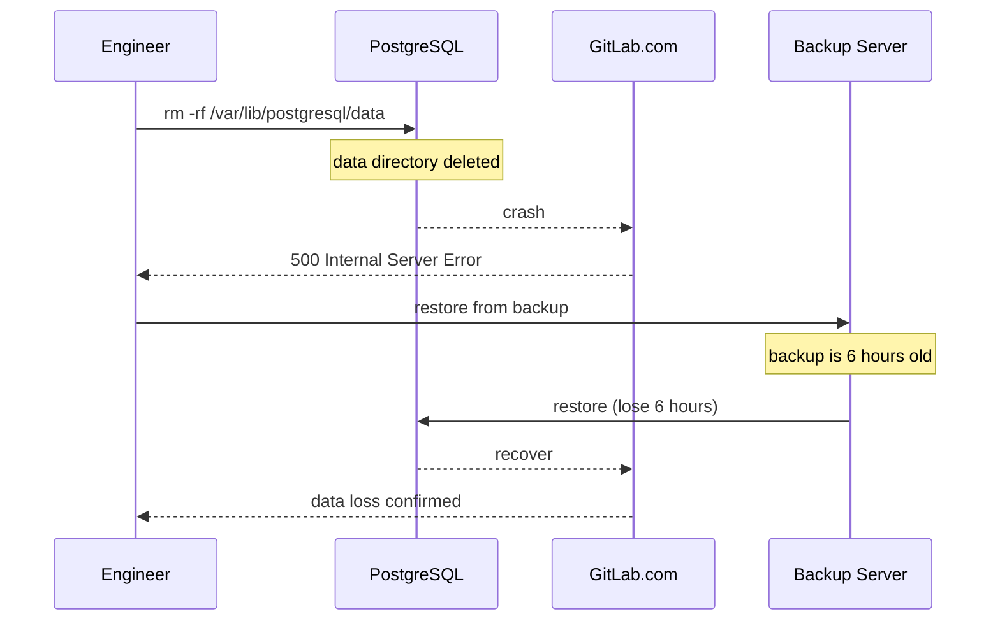

# Incident: GitLab Database Incident (2017)

> **Category:** Incident Case Study / Stylized (based on GitLab's famous public postmortem)
> **Severity:** S0 — data loss for ~18 hours
> **K8s Version:** N/A (pre-K8s era, but lessons apply)
> **Area:** Infrastructure / Storage / Operations

| Field | Detail |
|-------|--------|
| **Company** | GitLab |
| **Trigger** | Accidental database deletion during maintenance |
| **Blast Radius** | All GitLab.com services (git, CI/CD, issues, wikis) |
| **Mean Time to Detect** | ~5 min |
| **Mean Time to Resolve** | ~18 hours |

## Source

- [GitLab postmortem: Database deletion](https://about.gitlab.com/blog/2017/02/01/gitlab-dot-com-database-incident/)
- [GitLab incident timeline](https://about.gitlab.com/blog/2017/02/02/gitlab-com-performance-issue/)

## Timeline (stylized)

| Time | Event |
|------|-------|
| T+0:00 | Engineer attempts to remove stale PostgreSQL database |
| T+0:02 | `rm -rf /var/lib/postgresql/data` executed (wrong server!) |
| T+0:05 | PostgreSQL data directory deleted; database crashes |
| T+0:10 | GitLab.com goes down; all services unavailable |
| T+0:15 | PagerDuty fires: "PostgreSQL connection refused" |
| T+0:20 | On-call discovers: data directory deleted |
| T+0:30 | Attempt to restore from backup: backup is 6 hours old |
| T+1:00 | Attempt to restore from WAL archiving: WAL logs incomplete |
| T+2:00 | Attempt to restore from replication: replica also corrupted |
| T+6:00 | Decision: restore from oldest available backup (6 hours old) |
| T+12:00 | Database restored; data loss: 6 hours of git push/CI data |
| T+18:00 | Full service recovery |

## What happened

## Root cause

1. **Accidental deletion** — engineer ran `rm -rf` on the wrong server (production instead of staging).
2. **No confirmation prompt** — the command executed without asking for confirmation.
3. **No backup verification** — backups were not tested regularly.
4. **No point-in-time recovery** — WAL archiving was not properly configured.

## Fix

1. Restore from the oldest available backup (6 hours old).
2. Accept data loss for the 6-hour window.
3. Rebuild Git services from backup.

## Prevention

| Measure | Implementation |
|---------|----------------|
| **Confirmation prompts** | Require `yes/no` for destructive commands |
| **Production access controls** | Restrict SSH access to production servers |
| **Regular backup testing** | Test restore from backup weekly |
| **Point-in-time recovery** | Configure WAL archiving for PostgreSQL |
| **Change management** | All production changes go through PR review |

## Related

- [Disaster Cases](../disaster-cases.md)
- [Backup & DR](../../08-cluster-operations/backup-disaster-recovery.md)
- [Incidents README](./README.md)
