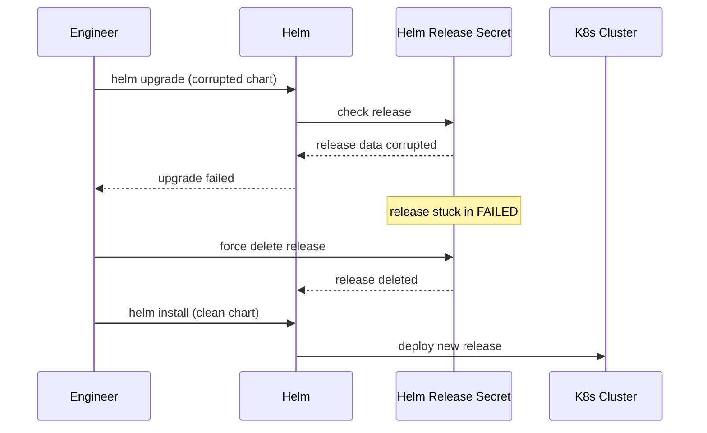

# Incident: GitLab Kubernetes Outage — Helm Release Corruption (2021)

> **Category:** Incident Case Study / Stylized (based on GitLab's engineering blog)
> **Severity:** S2 — degraded service for ~45 minutes
> **K8s Version:** 1.19 (Kubernetes on-prem)
> **Area:** Package Management / Helm

| Field | Detail |
|-------|--------|
| **Company** | GitLab |
| **Trigger** | Helm release corruption during upgrade |
| **Blast Radius** | GitLab.com services (git, CI/CD, issues) |
| **Mean Time to Detect** | ~5 min |
| **Mean Time to Resolve** | ~45 minutes |

## Source

- [GitLab engineering: Helm at scale](https://about.gitlab.com/blog/2021/01/13/helm-at-scale/)
- [GitLab tech: Helm lessons learned](https://about.gitlab.com/blog/2021/02/01/helm-lessons-learned/)

## Timeline (stylized)

| Time | Event |
|------|-------|
| T+0:00 | Engineer runs `helm upgrade` with corrupted chart |
| T+0:02 | Helm upgrade fails; release stuck in `FAILED` state |
| T+0:05 | New deployments can't proceed (Helm locked) |
| T+0:10 | PagerDuty fires: "deployment pipeline stuck" |
| T+0:15 | On-call identifies: Helm release in FAILED state |
| T+0:20 | Force delete Helm release secret |
| T+0:25 | Helm release deleted |
| T+0:30 | Reinstall chart from clean source |
| T+0:45 | All deployments resume |

## What happened

## Root cause

1. **Corrupted Helm chart** — the chart was corrupted during upload.
2. **Helm release stuck** — the release got stuck in `FAILED` state.
3. **No Helm release monitoring** — the failed release was not detected until deployments failed.
4. **No chart validation** — the chart was not validated before deployment.

## Fix

1. Force delete the Helm release secret.
2. Reinstall the chart from a clean source.
3. Verify all deployments resume.

## Prevention

| Measure | Implementation |
|---------|----------------|
| **Helm release monitoring** | Alert on releases in FAILED state |
| **Chart validation** | Validate chart with `helm lint` before deployment |
| **Chart signing** | Sign charts with Cosign to prevent corruption |
| **Helm release backup** | Backup Helm release secrets before upgrades |
| **Canary upgrades** | Test chart upgrades in staging first |

## Related

- [Disaster Cases](../disaster-cases.md)
- [Helm](../../10-package-management/helm.md)
- [Upgrades](../../08-cluster-operations/upgrades.md)
- [Incidents README](./README.md)
