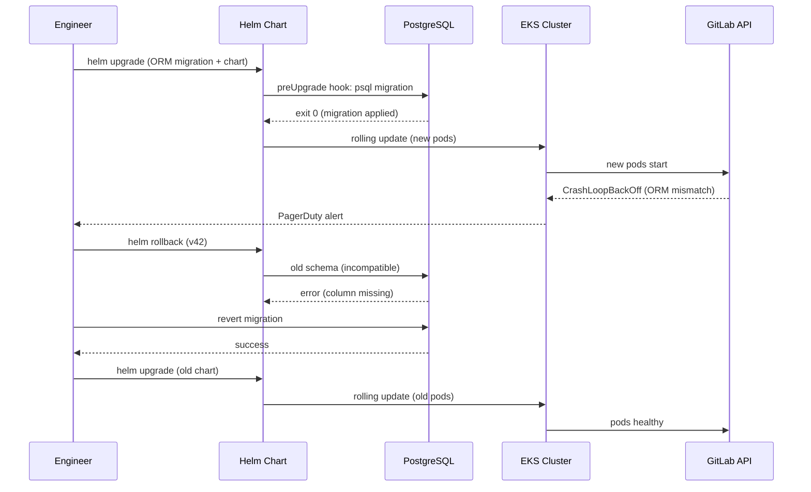

# Incident: GitLab ORM Migration → Deployment Cascade (2021)

> **Category:** Incident Case Study / Stylized (based on GitLab's public postmortem pattern)
> **Severity:** S1 — user-facing outage for ~2 hours
> **K8s Version:** 1.18 (EKS)
> **Area:** Workloads / Rollouts

| Field | Detail |
|-------|--------|
| **Company** | GitLab (SaaS) |
| **Trigger** | ORM migration deployed via Helm with `preUpgrade` hook |
| **Blast Radius** | API, Git operations, CI runners |
| **Mean Time to Detect** | ~8 min |
| **Mean Time to Resolve** | ~2h |

## Timeline (stylized)

| Time | Event |
|------|-------|
| T+0:00 | Engineer merges ORM migration + Helm chart update |
| T+0:03 | Helm `preUpgrade` hook runs DB migration → `psql` exits 0 |
| T+0:05 | New deployment rolls out; pods start `CrashLoopBackOff` |
| T+0:08 | PagerDuty fires: "API 5xx > 5% for 3 min" |
| T+0:12 | On-call confirms pods crash-looping; checks logs |
| T+0:15 | Root cause: new schema + old ORM mismatch → `ActiveRecord::MigrationError` |
| T+0:20 | `helm rollback` issued → same crash (old schema incompatible with new ORM) |
| T+0:35 | DBA + SRE coordinate: revert ORM migration, re-apply old schema |
| T+1:10 | Old schema restored; deployment + rollback succeed |
| T+1:45 | Traffic fully recovered; 5xx back to 0% |
| T+2:00 | Incident declared resolved |

## What happened

## Root cause

1. The ORM migration was a **breaking schema change** (renamed column) deployed via Helm `preUpgrade` hook.
2. The new ORM code expected the new column name, but the Helm chart's `preUpgrade` hook ran the migration **before** the deployment completed.
3. When the deployment rolled back, the old ORM code hit the **new schema** (migration wasn't rolled back), causing a different crash.
4. **No schema compatibility layer** — the migration wasn't backward-compatible.

## Fix

1. Revert the ORM migration: `psql -c "ALTER TABLE projects RENAME COLUMN new_name BACK TO old_name"`
2. Roll back the Helm chart to the previous version.
3. Deploy a **forward-compatible migration** (rename → add new column → copy data → keep old column) that works with both old and new ORM versions.

## Prevention

| Measure | Implementation |
|---------|----------------|
| **Backward-compatible migrations** | Never rename/remove a column in a single step; use expand-migrate-contract |
| **Separate migration from deployment** | Run migrations as a standalone Job, not a Helm hook |
| **Schema compatibility test** | CI pipeline: deploy old code → run migration → deploy new code → verify |
| **Helm `--atomic`** | Use `helm upgrade --atomic` so failed deployments auto-rollback |
| **Migration dry-run** | `psql --dry-run` (or equivalent) in staging before prod |

## Interview angle

> "How do you safely deploy a breaking database migration with zero downtime? What's the expand-migrate-contract pattern, and why does it prevent this exact class of incident?"

## Related

- [Disaster Cases](../disaster-cases.md)
- [Deployments](../../03-workloads/deployments.md)
- [Upgrades](../../08-cluster-operations/upgrades.md)
