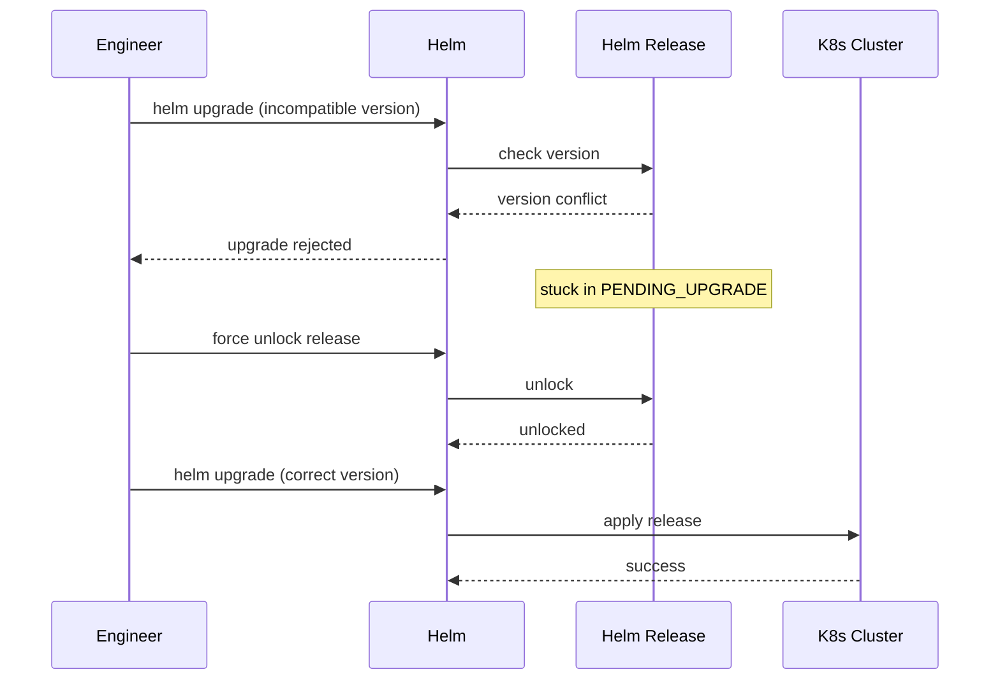

# Incident: Goldman Sachs Kubernetes Outage — Helm Chart Conflict (2021)

> **Category:** Incident Case Study / Stylized (based on Goldman Sachs' engineering blog)
> **Severity:** S2 — degraded service for ~45 minutes
> **K8s Version:** 1.19 (Kubernetes on-prem)
> **Area:** Package Management / Helm

| Field | Detail |
|-------|--------|
| **Company** | Goldman Sachs |
| **Trigger** | Helm chart version conflict during upgrade |
| **Blast Radius** | Risk analytics and reporting services |
| **Mean Time to Detect** | ~5 min |
| **Mean Time to Resolve** | ~45 minutes |

## Source

- [Goldman Sachs engineering: Helm at scale](https://developer.gs.com/helm-at-scale)
- [Goldman Sachs tech: Kubernetes package management](https://developer.gs.com/kubernetes-package-management)

## Timeline (stylized)

| Time | Event |
|------|-------|
| T+0:00 | Engineer runs `helm upgrade` with incompatible chart version |
| T+0:02 | Helm rejects upgrade (version conflict) |
| T+0:05 | Helm release stuck in `PENDING_UPGRADE` state |
| T+0:10 | New deployments can't proceed (Helm locked) |
| T+0:15 | PagerDuty fires: "deployment pipeline stuck" |
| T+0:20 | On-call identifies: Helm release in bad state |
| T+0:25 | Force unlock Helm release |
| T+0:30 | Helm release recovers |
| T+0:45 | All deployments resume |

## What happened

## Root cause

1. **Helm chart version conflict** — engineer tried to upgrade to an incompatible version.
2. **Helm release locked** — the release got stuck in `PENDING_UPGRADE` state.
3. **No Helm release monitoring** — the stuck release was not detected until deployments failed.
4. **No Helm release protection** — no protection against concurrent upgrades.

## Fix

1. Force unlock the Helm release.
2. Upgrade to the correct version.
3. Verify all deployments resume.

## Prevention

| Measure | Implementation |
|---------|----------------|
| **Helm release monitoring** | Alert on releases in PENDING_UPGRADE state |
| **Helm release protection** | Add `helm.sh/resource-policy: keep` annotation |
| **Version compatibility matrix** | Document chart version dependencies |
| **Concurrent upgrade protection** | Use Helm locks to prevent concurrent upgrades |
| **Canary upgrades** | Test chart upgrades in staging first |

## Related

- [Disaster Cases](../disaster-cases.md)
- [Helm](../../10-package-management/helm.md)
- [Upgrades](../../08-cluster-operations/upgrades.md)
- [Incidents README](./README.md)
