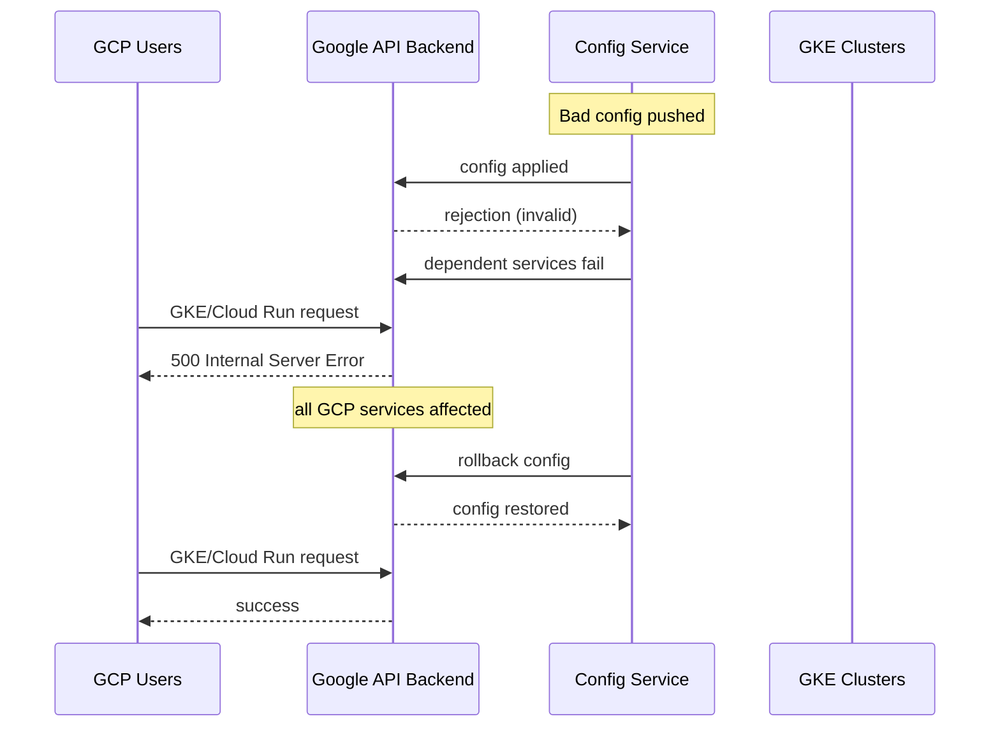

# Incident: Google Cloud Global Outage — Config Push (2023)

> **Category:** Incident Case Study / Stylized (based on Google's public postmortem)
> **Severity:** S0 — global outage for ~45 minutes
> **K8s Version:** GKE (managed)
> **Area:** Infrastructure / Configuration Management

| Field | Detail |
|-------|--------|
| **Company** | Google Cloud |
| **Trigger** | Bad config push to Google's internal service management |
| **Blast Radius** | Global — all GCP services (GKE, Cloud Run, Cloud SQL) |
| **Mean Time to Detect** | ~3 min |
| **Mean Time to Resolve** | ~45 min |

## Source

- [Google Cloud incident: Configuration push caused service management outage](https://status.cloud.google.com/incident/an/23017)
- [The Verge: Google Cloud outage knocked out multiple services](https://www.theverge.com/2023/6/2/23747898/google-cloud-outage-multiple-services-down)

## Timeline (stylized)

| Time | Event |
|------|-------|
| T+0:00 | Bad config pushed to Google's service management system |
| T+0:02 | Service management rejects config; all dependent services fail |
| T+0:05 | GKE control planes lose connectivity to Google's API backend |
| T+0:10 | Cloud Run, Cloud SQL, GKE all return errors |
| T+0:15 | Google engineers detect anomalous error rates |
| T+0:20 | Bad config identified; rollback initiated |
| T+0:30 | Config rollback complete; services begin recovery |
| T+0:45 | Full recovery |

## What happened

## Root cause

1. **Bad config push** to Google's internal service management system.
2. The config was **not validated** before deployment (missing schema validation).
3. **No canary rollout** — config applied globally in one step.
4. **No rollback automation** — engineers had to manually identify and rollback the bad config.

## Fix

1. Identify the bad config commit.
2. Rollback to the previous config version.
3. Verify all services recover.

## Prevention

| Measure | Implementation |
|---------|----------------|
| **Config validation** | Schema validation before deployment |
| **Canary config rollout** | Apply config to 1% of instances first |
| **Automated rollback** | If error rate > 5% within 5 min, auto-rollback |
| **Config diffing** | Show config changes before applying |
| **Monitoring** | Alert on config deployment failures |

## Related

- [Disaster Cases](../disaster-cases.md)
- [Upgrades](../../08-cluster-operations/upgrades.md)
- [Incidents README](./README.md)
