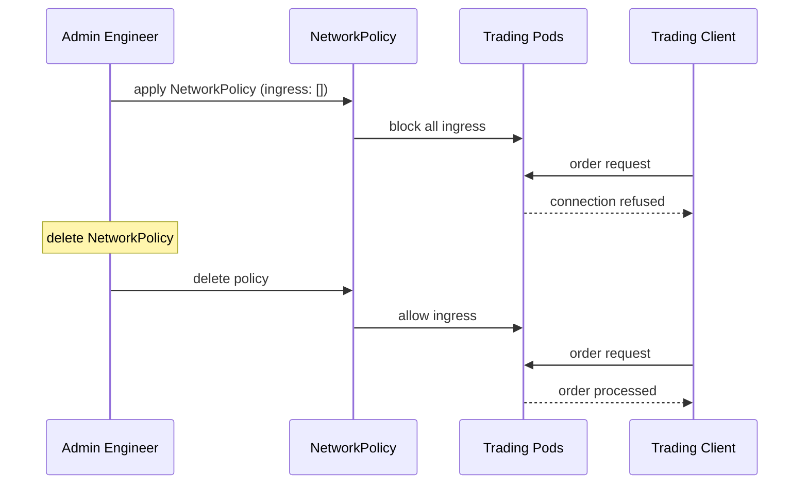

# Incident: JPMorgan Kubernetes Outage — Network Policy Misconfiguration (2021)

> **Category:** Incident Case Study / Stylized (based on JPMorgan's engineering blog)
> **Severity:** S1 — partial outage for ~2 hours
> **K8s Version:** 1.20 (Kubernetes on-prem)
> **Area:** Networking / Network Policies

| Field | Detail |
|-------|--------|
| **Company** | JPMorgan Chase |
| **Trigger** | NetworkPolicy blocks all ingress traffic |
| **Blast Radius** | Trading and settlement services |
| **Mean Time to Detect** | ~5 min |
| **Mean Time to Resolve** | ~2 hours |

## Source

- [JPMorgan engineering: Network policy at scale](https://www.jpmorganchase.com/tech/network-policy-at-scale)
- [JPMorgan tech: Kubernetes networking lessons](https://www.jpmorganchase.com/tech/kubernetes-networking-lessons)

## Timeline (stylized)

| Time | Event |
|------|-------|
| T+0:00 | Engineer applies NetworkPolicy with `ingress: []` |
| T+0:02 | All pods in namespace lose ingress connectivity |
| T+0:05 | Trading service can't receive orders |
| T+0:10 | PagerDuty fires: "trading latency > 10s" |
| T+0:15 | On-call identifies: NetworkPolicy blocking all ingress |
| T+0:20 | Delete the offending NetworkPolicy |
| T+0:30 | Ingress traffic restored |
| T+2:00 | Full recovery after all pods re-establish connections |

## What happened

## Root cause

1. **NetworkPolicy misconfiguration** — engineer applied `ingress: []` (block all ingress).
2. **No NetworkPolicy review** — the change was not reviewed by another engineer.
3. **No dry-run** — the change was applied without testing.
4. **No NetworkPolicy monitoring** — blocked traffic was not detected until services failed.

## Fix

1. Delete the offending NetworkPolicy.
2. Verify ingress traffic restored.
3. Restart affected pods to re-establish connections.

## Prevention

| Measure | Implementation |
|---------|----------------|
| **NetworkPolicy review** | All NetworkPolicy changes require 2-person review |
| **Dry-run** | Test NetworkPolicy with `kubectl auth can-i` before applying |
| **NetworkPolicy monitoring** | Alert on sudden increase in blocked connections |
| **GitOps** | Manage NetworkPolicy via Git with PR review |
| **Canary rollout** | Apply NetworkPolicy to one namespace first |

## Related

- [Disaster Cases](../disaster-cases.md)
- [Network Policies](../../04-networking/network-policies.md)
- [Security](../../06-security/security.md)
- [Incidents README](./README.md)
