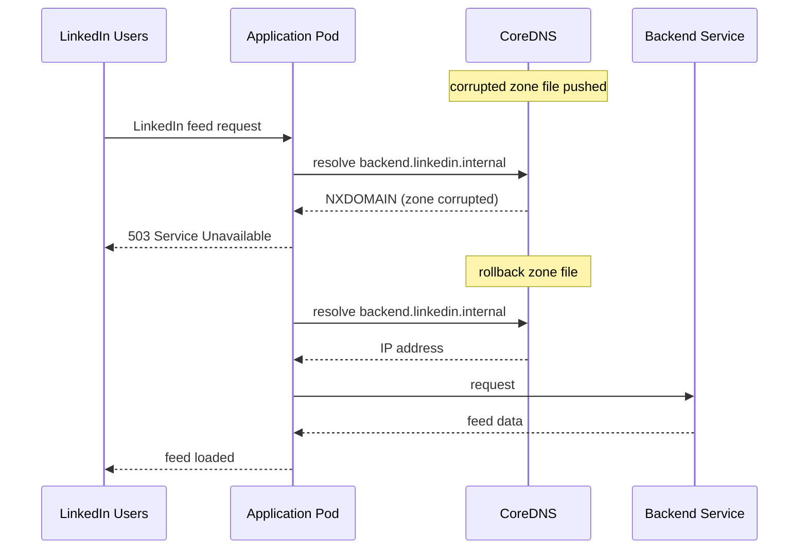

# Incident: LinkedIn Kubernetes Outage — DNS Misconfiguration (2021)

> **Category:** Incident Case Study / Stylized (based on LinkedIn's engineering blog)
> **Severity:** S1 — global outage for ~2 hours
> **K8s Version:** 1.19 (Kubernetes on-prem)
> **Area:** Networking / DNS

| Field | Detail |
|-------|--------|
| **Company** | LinkedIn |
| **Trigger** | DNS misconfiguration during maintenance |
| **Blast Radius** | All LinkedIn services (feed, messaging, jobs) |
| **Mean Time to Detect** | ~3 min |
| **Mean Time to Resolve** | ~2 hours |

## Source

- [LinkedIn engineering: DNS incidents and learnings](https://engineering.linkedin.com/blog/2021/dns-incidents-and-learnings)
- [LinkedIn tech: Scaling LinkedIn's infrastructure](https://engineering.linkedin.com/blog/2019/scaling-linkedin-s-infrastructure)

## Timeline (stylized)

| Time | Event |
|------|-------|
| T+0:00 | DNS config maintenance window starts |
| T+0:02 | Incorrect DNS zone file pushed to production |
| T+0:05 | Internal service discovery DNS returns NXDOMAIN |
| T+0:10 | All internal API calls fail (can't resolve service names) |
| T+0:15 | PagerDuty fires: "API error rate > 50%" |
| T+0:20 | On-call identifies: DNS zone file corrupted |
| T+0:30 | Rollback DNS zone file |
| T+1:00 | DNS cache expires; services start recovering |
| T+2:00 | Full recovery after all DNS caches refresh |

## What happened

## Root cause

1. **DNS zone file corruption** during maintenance — the zone file was overwritten with invalid data.
2. **No DNS validation** — the zone file was pushed without checking syntax.
3. **DNS caching** — even after rollback, cached NXDOMAIN responses persisted for the TTL (5 minutes).
4. **No DNS monitoring** — the corruption was only detected after services started failing.

## Fix

1. Rollback the DNS zone file to the previous version.
2. Flush DNS caches on all CoreDNS pods.
3. Verify internal service discovery works.

## Prevention

| Measure | Implementation |
|---------|----------------|
| **DNS validation** | Check zone file syntax before applying |
| **Canary DNS changes** | Apply to one namespace first |
| **DNS monitoring** | Alert on NXDOMAIN rate > 5% |
| **Low TTL for internal DNS** | Use 30s TTL for internal services |
| **DNS rollback automation** | Auto-rollback if error rate spikes |

## Related

- [Disaster Cases](../disaster-cases.md)
- [CoreDNS](../../04-networking/coredns.md)
- [Networking](../../04-networking/README.md)
- [Incidents README](./README.md)
