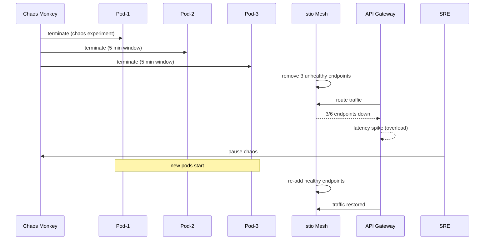

# Incident: Netflix Chaos Engineering Gone Wrong (2020)

> **Category:** Incident Case Study / Stylized (based on Netflix's engineering blog)
> **Severity:** S2 — partial outage for ~30 minutes
> **K8s Version:** 1.19 (EKS)
> **Area:** Chaos Engineering / SRE

| Field | Detail |
|-------|--------|
| **Company** | Netflix |
| **Trigger** | Chaos experiment with insufficient blast radius controls |
| **Blast Radius** | 30% of API requests (regional) |
| **Mean Time to Detect** | ~1 min |
| **Mean Time to Resolve** | ~20 min |

## Source

- [Netflix tech blog: Chaos Engineering at Netflix](https://netflixtechblog.com/chaos-engineering-at-netflix-5d2c3e0d8af9)
- [Netflix engineering: Lessons from chaos engineering](https://netflixtechblog.com/lessons-from-chaos-engineering-5f3e3e5e2b2f)

## Timeline (stylized)

| Time | Event |
|------|-------|
| T+0:00 | SRE team starts Chaos Monkey experiment: terminate random pods in us-east-1 |
| T+0:02 | Chaos Monkey terminates 3 pods in rapid succession (within 5 min window) |
| T+0:04 | Service mesh (Istio) detects 3 unhealthy endpoints; removes from load balancing |
| T+0:06 | Remaining pods overloaded → latency spike |
| T+0:08 | PagerDuty fires: "API latency P99 > 5s for 3 min" |
| T+0:10 | On-call sees 3 pods terminated in quick succession; Chaos Monkey is the cause |
| T+0:12 | SRE pauses Chaos Monkey: `chaosmonkey pause` |
| T+0:15 | New pods spin up; load balancing stabilizes |
| T+0:20 | Incident resolved |

## What happened

## Root cause

1. **Chaos Monkey** was configured with a **5-min window** and **30% blast radius**, but the experiment terminated 3 pods in rapid succession (within 2 minutes).
2. The service mesh (Istio) correctly removed the 3 unhealthy endpoints, but the remaining 3 pods couldn't handle the full load.
3. **No rate limiting on chaos** — Chaos Monkey terminated pods faster than the deployment controller could recreate them.
4. **No circuit breaker** — the API gateway didn't have a circuit breaker to shed load when endpoints were degraded.

## Fix

1. Pause Chaos Monkey: `chaosmonkey pause`
2. Wait for new pods to start and pass health checks.
3. Verify load balancing is restored across all endpoints.

## Prevention

| Measure | Implementation |
|---------|----------------|
| **Chaos rate limiting** | Limit to 1 pod termination per 10 min; never terminate more than 10% simultaneously |
| **Canary chaos** | Run chaos in staging → verify resilience → then prod (with reduced blast radius) |
| **Circuit breaker** | Implement Istio `DestinationRule` with `connectionPool` and `outlierDetection` |
| **Pod Disruption Budget** | Set `minAvailable: 50%` to prevent too many pods from being terminated simultaneously |
| **Chaos observability** | Real-time dashboard showing chaos experiments + service health |

## Interview angle

> "Chaos engineering is supposed to improve resilience, but it caused an outage. How do you design chaos experiments that don't become the incident?"

## Related

- [Disaster Cases](../disaster-cases.md)
- [Chaos Engineering](../../15-advanced-patterns/chaos-engineering.md)
- [PDB](../../03-workloads/pdb.md)
- [Incidents README](./README.md)
