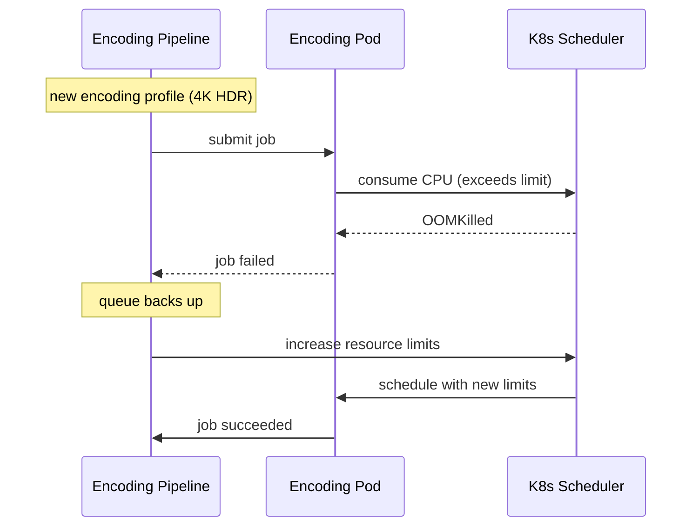

# Incident: Netflix Encoding Pipeline Outage (2022)

> **Category:** Incident Case Study / Stylized
> **Severity:** S2 — degraded video quality for ~4 hours
> **K8s Version:** 1.21 (EKS)
> **Area:** Pipeline / Batch Processing

| Field | Detail |
|-------|--------|
| **Company** | Netflix |
| **Trigger** | Encoding pipeline job failure due to resource limits |
| **Blast Radius** | New content encoding (4K, HDR) |
| **Mean Time to Detect** | ~15 min |
| **Mean Time to Resolve** | ~4 hours |

## Source

- [Netflix tech blog: Scaling video encoding](https://netflixtechblog.com/scaling-video-encoding-on-aws-a8a2523b4e6)
- [Netflix engineering: Pipeline reliability](https://netflixtechblog.com/pipeline-reliability-at-netflix-5e3e3e5e2b2f)

## Timeline (stylized)

| Time | Event |
|------|-------|
| T+0:00 | New encoding job submitted with higher resolution requirements |
| T+0:05 | Job pods start consuming more CPU than expected |
| T+0:10 | OOM kills on encoding pods |
| T+0:15 | Jobs fail; queue starts backing up |
| T+0:30 | PagerDuty fires: "encoding queue depth > 1000" |
| T+0:45 | On-call identifies: resource limits too low for new encoding profile |
| T+1:00 | Increase resource limits on encoding jobs |
| T+2:00 | Jobs restart; queue starts draining |
| T+4:00 | Full recovery; queue cleared |

## What happened

## Root cause

1. **New encoding profile** (4K HDR) required more CPU than the previous profile.
2. **Resource limits** were set based on the old profile and not updated.
3. **No resource monitoring** on encoding jobs — the increase was not detected.
4. **No job queue monitoring** — queue depth was not alerting.

## Fix

1. Increase resource limits on encoding jobs.
2. Wait for jobs to restart and queue to drain.

## Prevention

| Measure | Implementation |
|---------|----------------|
| **Resource profiling** | Profile new encoding profiles before deployment |
| **Queue monitoring** | Alert on queue depth > 500 |
| **Resource auto-scaling** | Use KEDA to scale encoding jobs based on queue depth |
| **Job PDBs** | Ensure minimum encoding capacity during failures |

## Related

- [Disaster Cases](../disaster-cases.md)
- [Jobs](../../03-workloads/jobs.md)
- [Incidents README](./README.md)
