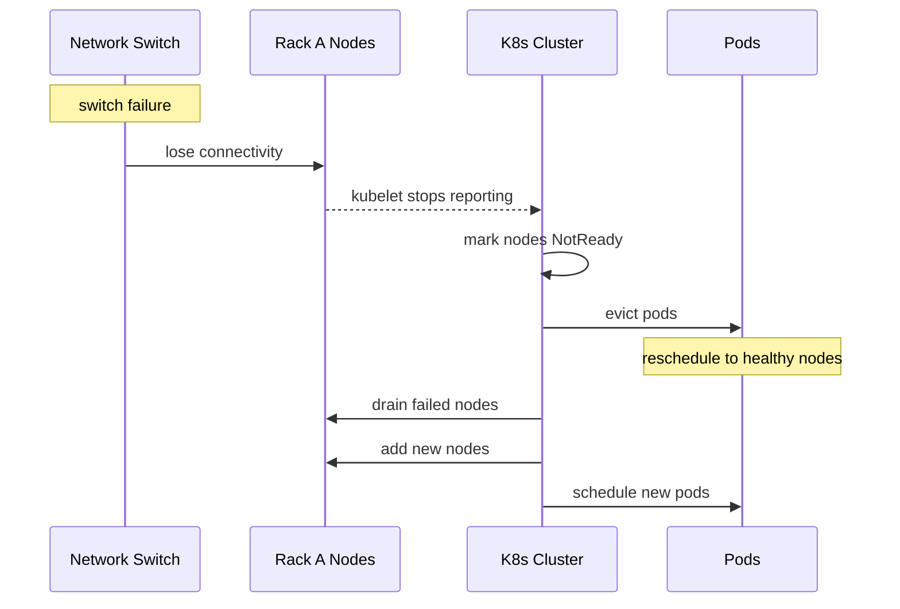

# Incident: Pinterest Kubernetes Outage — Node Failure Storm (2020)

> **Category:** Incident Case Study / Stylized (based on Pinterest's engineering blog)
> **Severity:** S1 — partial outage for ~2 hours
> **K8s Version:** 1.17 (Kubernetes on-prem)
> **Area:** Infrastructure / Node Management

| Field | Detail |
|-------|--------|
| **Company** | Pinterest |
| **Trigger** | Hardware failure cascade across node pool |
| **Blast Radius** | Image upload and recommendation services |
| **Mean Time to Detect** | ~3 min |
| **Mean Time to Resolve** | ~2 hours |

## Source

- [Pinterest engineering: Scaling Kubernetes reliability](https://medium.com/pinterest-engineering/scaling-kubernetes-reliability-at-pinterest-5c9e7e6e3b4c)
- [Pinterest tech: Node failure handling](https://medium.com/pinterest-engineering/node-failure-handling-in-kubernetes-5b9e3c4b7f0a)

## Timeline (stylized)

| Time | Event |
|------|-------|
| T+0:00 | Network switch failure in rack A |
| T+0:02 | 20 nodes in rack A become unreachable |
| T+0:05 | Kubelet stops reporting; nodes marked NotReady |
| T+0:10 | Pods on failed nodes start evicting |
| T+0:15 | Scheduler tries to reschedule pods; some can't find nodes |
| T+0:20 | PagerDuty fires: "image upload > 30% failure" |
| T+0:25 | On-call identifies: rack A network failure |
| T+0:30 | Drain failed nodes; trigger node replacement |
| T+1:00 | New nodes come online |
| T+2:00 | All pods rescheduled; services recovered |

## What happened

## Root cause

1. **Hardware failure** — network switch in rack A failed.
2. **20 nodes** in the rack became unreachable simultaneously.
3. **No pod anti-affinity** — all pods in the deployment were in the same rack.
4. **No node pool segmentation** — no rack-aware scheduling.

## Fix

1. Drain failed nodes.
2. Trigger node replacement.
3. Wait for new nodes to come online.
4. Pods reschedule automatically.

## Prevention

| Measure | Implementation |
|---------|----------------|
| **Pod anti-affinity** | Spread pods across racks/zones |
| **Topology spread constraints** | Distribute pods evenly across failure domains |
| **Node pool segmentation** | Separate node pools per rack/zone |
| **Hardware monitoring** | Alert on network switch health |
| **Chaos testing** | Regularly test node failure scenarios |

## Related

- [Disaster Cases](../disaster-cases.md)
- [Node Management](../../02-architecture/kubelet.md)
- [Incidents README](./README.md)
