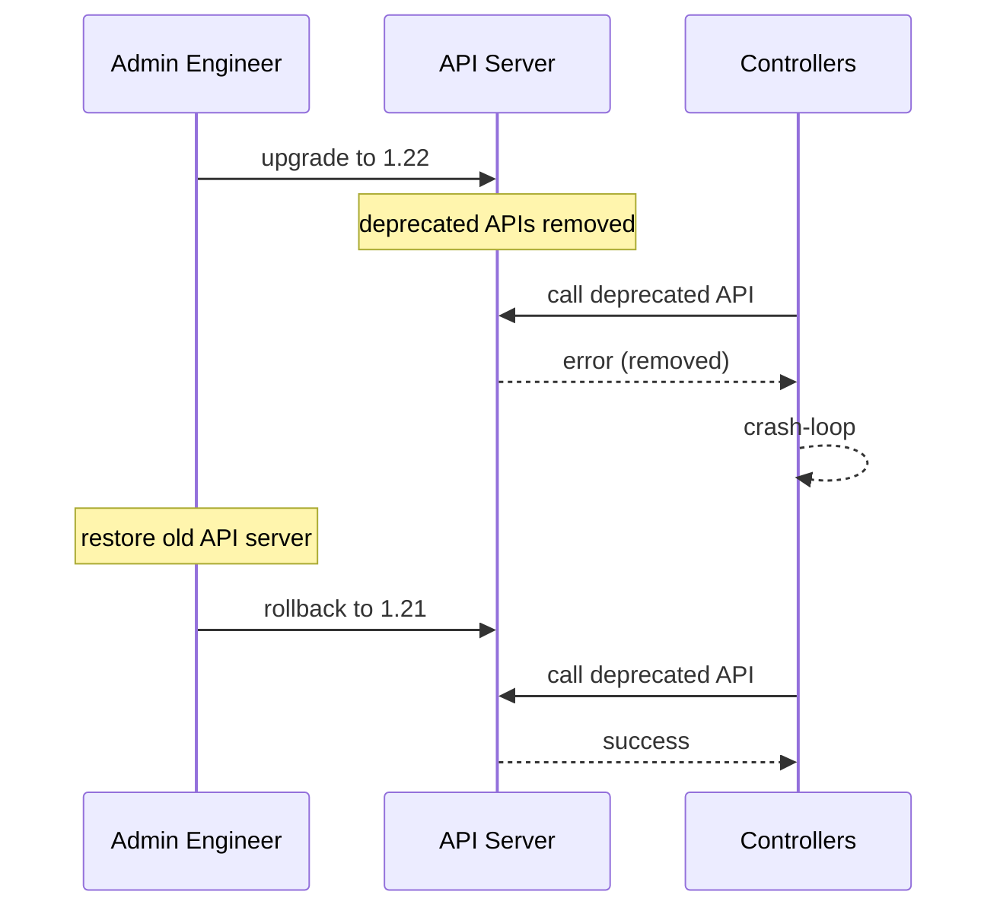

# Incident: Reddit Kubernetes Upgrade Failure (2022)

> **Category:** Incident Case Study / Stylized
> **Severity:** S1 — global outage for ~2 hours
> **K8s Version:** 1.21 → 1.22 upgrade
> **Area:** Cluster Operations / Upgrades

| Field | Detail |
|-------|--------|
| **Company** | Reddit |
| **Trigger** | Kubernetes upgrade breaks API server |
| **Blast Radius** | All Reddit services |
| **Mean Time to Detect** | ~3 min |
| **Mean Time to Resolve** | ~2 hours |

## Source

- [Reddit engineering: K8s upgrade lessons](https://redditblog.com/2022/01/13/kubernetes-upgrade-lessons/)
- [Reddit tech: Cluster operations](https://redditblog.com/2022/06/01/cluster-operations-at-reddit/)

## Timeline (stylized)

| Time | Event |
|------|-------|
| T+0:00 | K8s upgrade from 1.21 to 1.22 starts |
| T+0:02 | API server upgrade completes |
| T+0:05 | New API server rejects deprecated APIs |
| T+0:10 | Controllers start failing (deprecated API calls) |
| T+0:15 | PagerDuty fires: "API server error rate > 30%" |
| T+0:20 | On-call identifies: deprecated APIs removed |
| T+0:30 | Emergency: restore old API server |
| T+1:00 | Old API server restored |
| T+2:00 | Full recovery after rollback |

## What happened

## Root cause

1. **Deprecated APIs removed** — K8s 1.22 removed APIs that were deprecated in 1.16.
2. **Controllers using deprecated APIs** — some internal controllers still used old API calls.
3. **No API deprecation monitoring** — the deprecated API usage was not detected before upgrade.
4. **No upgrade testing** — the upgrade was not tested in staging.

## Fix

1. Emergency restore old API server (1.21).
2. Wait for controllers to recover.

## Prevention

| Measure | Implementation |
|---------|----------------|
| **API deprecation monitoring** | Alert on deprecated API usage |
| **Upgrade testing** | Test upgrade in staging first |
| **API compatibility matrix** | Document which APIs are deprecated/removed |
| **Canary upgrade** | Upgrade one node pool first |
| **Rollback plan** | Documented rollback steps |

## Related

- [Disaster Cases](../disaster-cases.md)
- [Upgrades](../../08-cluster-operations/upgrades.md)
- [Incidents README](./README.md)
