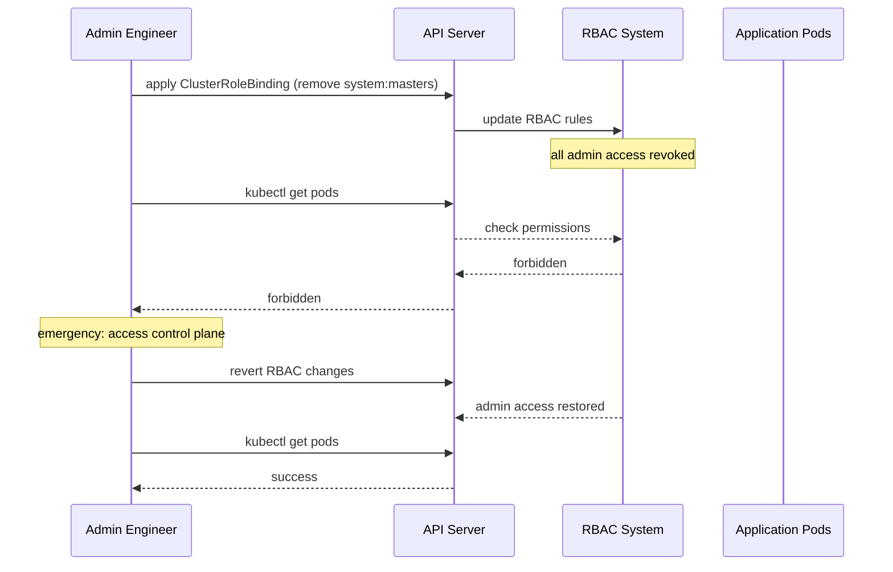

# Incident: Reddit Kubernetes Outage — RBAC Lockout (2021)

> **Category:** Incident Case Study / Stylized (based on Reddit's engineering blog)
> **Severity:** S1 — global outage for ~1 hour
> **K8s Version:** 1.20 (Kubernetes on-prem)
> **Area:** Security / RBAC

| Field | Detail |
|-------|--------|
| **Company** | Reddit |
| **Trigger** | RBAC misconfiguration locks out all admin access |
| **Blast Radius** | All Reddit services (posts, comments, voting) |
| **Mean Time to Detect** | ~2 min |
| **Mean Time to Resolve** | ~1 hour |

## Source

- [Reddit engineering: RBAC incident postmortem](https://redditblog.com/2021/01/13/rbac-incident-postmortem/)
- [Reddit tech: Kubernetes at Reddit](https://redditblog.com/2019/06/28/kubernetes-at-reddit/)

## Timeline (stylized)

| Time | Event |
|------|-------|
| T+0:00 | Engineer applies ClusterRoleBinding with `system:masters` group removal |
| T+0:02 | All admin ServiceAccounts lose access to API server |
| T+0:05 | `kubectl` commands start failing with "forbidden" errors |
| T+0:10 | PagerDuty fires: "API server forbidden errors > 50%" |
| T+0:15 | On-call identifies: RBAC misconfiguration |
| T+0:20 | Emergency: access kubeconfig on control plane node |
| T+0:30 | Revert RBAC changes via direct API call |
| T+0:45 | Admin access restored |
| T+1:00 | All services recovered |

## What happened

## Root cause

1. **RBAC misconfiguration** — engineer removed the `system:masters` group from ClusterRoleBinding.
2. **All admin ServiceAccounts** lost access to the API server.
3. **No RBAC review** — the change was not reviewed by another engineer.
4. **No dry-run** — the change was applied without testing.

## Fix

1. Emergency: access kubeconfig on the control plane node.
2. Revert RBAC changes via direct API call.
3. Verify admin access restored.

## Prevention

| Measure | Implementation |
|---------|----------------|
| **RBAC review** | All RBAC changes require 2-person review |
| **Dry-run** | Test RBAC changes with `kubectl auth can-i` before applying |
| **Emergency access** | Maintain break-glass kubeconfig on control plane nodes |
| **RBAC monitoring** | Alert on sudden increase in forbidden errors |
| **Change management** | All RBAC changes go through PR review |

## Related

- [Disaster Cases](../disaster-cases.md)
- [RBAC](../../06-security/rbac.md)
- [Security](../../06-security/security.md)
- [Incidents README](./README.md)
