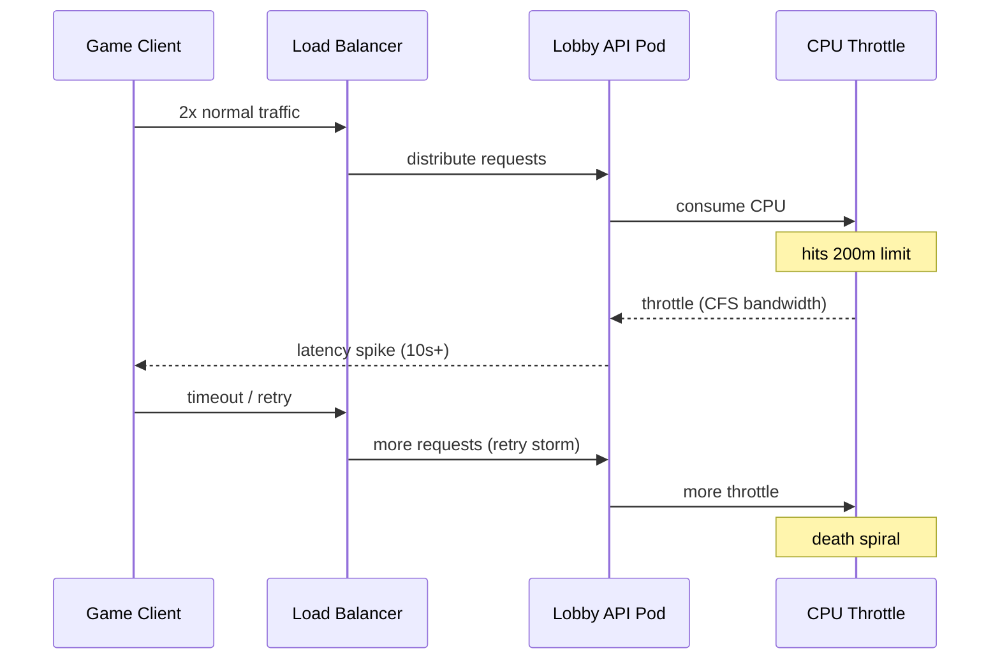

# Incident: Roblox CPU Throttling Under Load (2022)

> **Category:** Incident Case Study / Stylized (based on CPU throttling patterns)
> **Severity:** S2 — latency spike for ~40 min
> **K8s Version:** 1.22 (EKS)
> **Area:** Resource Management / Performance

| Field | Detail |
|-------|--------|
| **Company** | Roblox |
| **Trigger** | Hard CPU limits + traffic surge |
| **Blast Radius** | Game lobby API (high-latency) |
| **Mean Time to Detect** | ~5 min |
| **Mean Time to Resolve** | ~40 min |

## Timeline (stylized)

| Time | Event |
|------|-------|
| T+0:00 | Traffic surge: 2x normal (major game launch event) |
| T+0:02 | Game lobby API pods hit CPU limits → throttled |
| T+0:05 | PagerDuty fires: "API latency P99 > 10s for 5 min" |
| T+0:08 | On-call sees `container_cpu_cfs_throttled_periods_total` spiking |
| T+0:10 | Root cause: hard `resources.limits.cpu: 200m` on all pods |
| T+0:15 | Temporarily remove CPU limits: `kubectl patch deployment --type=merge -p '{"spec":{"template":{"spec":{"containers":[{"name":"api","resources":{"limits":{}}}]}}}}'` |
| T+0:20 | Pods restart without CPU limits; latency drops |
| T+0:30 | Traffic normalizes; throttle rate returns to 0% |
| T+0:40 | Incident resolved |

## What happened

## Root cause

1. **Hard CPU limits** (`resources.limits.cpu: 200m`) were set on all game lobby API pods to "prevent runaway CPU usage."
2. During a traffic surge (2x normal), pods hit the CPU limit and were **throttled** by the Linux CFS scheduler.
3. Throttled pods took longer to process requests, causing **retry storms** from clients, which increased load further.
4. **No HPA** — the deployment had no autoscaler, so pod count stayed fixed during the surge.
5. **CPU limits are a trap** for latency-sensitive workloads — they throttle rather than throttle-and-kill.

## Fix

1. Remove CPU limits: `kubectl patch deployment` to remove `resources.limits.cpu`.
2. Keep CPU requests (for scheduling), but let pods burst when needed.
3. Optionally: set `resources.requests.cpu: 200m` and remove limits entirely, or use VPA to right-size requests.

## Prevention

| Measure | Implementation |
|---------|----------------|
| **Remove CPU limits** for latency-sensitive workloads | Keep requests, remove limits; let pods burst |
| **HPA** | Add `kubectl autoscale deployment lobby-api --cpu-percent=70 --min=3 --max=20` |
| **VPA** | Right-size requests based on actual usage (not peak) |
| **Throttle monitoring** | Alert on `container_cpu_cfs_throttled_periods_total / container_cpu_cfs_periods_total > 0.25` |
| **Load testing** | Simulate 2x traffic in staging; verify no throttle |

## Interview angle

> "Why are CPU limits often harmful for latency-sensitive workloads? When should you use them, and when should you remove them?"

## Related

- [Disaster Cases](../disaster-cases.md)
- [HPA/VPA](../../07-scheduling-autoscaling/hpa-vpa.md)
- [Resource Management](../../07-scheduling-autoscaling/resource-management.md)
