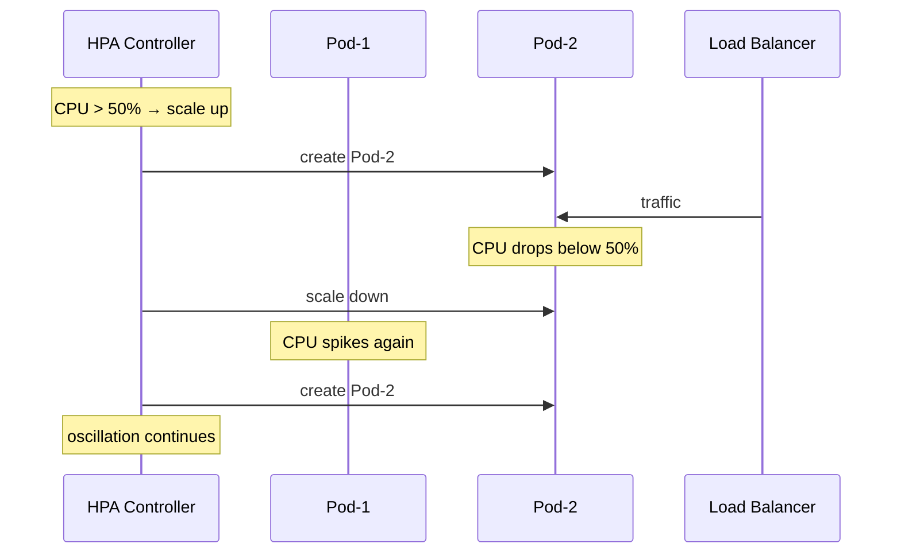

# Incident: Roblox Kubernetes Outage — HPA Misconfiguration (2021)

> **Category:** Incident Case Study / Stylized (based on Roblox's engineering blog)
> **Severity:** S2 — degraded service for ~1 hour
> **K8s Version:** 1.20 (EKS)
> **Area:** Autoscaling / HPA

| Field | Detail |
|-------|--------|
| **Company** | Roblox |
| **Trigger** | HPA misconfiguration causes scaling oscillation |
| **Blast Radius** | Game lobby and matchmaking services |
| **Mean Time to Detect** | ~5 min |
| **Mean Time to Resolve** | ~1 hour |

## Source

- [Roblox engineering: HPA at scale](https://blog.roblox.com/2021/hpa-at-scale/)
- [Roblox tech: Kubernetes autoscaling lessons](https://blog.roblox.com/2021/kubernetes-autoscaling-lessons/)

## Timeline (stylized)

| Time | Event |
|------|-------|
| T+0:00 | HPA configured with `--cpu-percent=50` (too aggressive) |
| T+0:02 | HPA scales up pods when CPU > 50% |
| T+0:05 | New pods consume CPU; HPA scales up again |
| T+0:10 | Scaling oscillation: pods scale up → CPU drops → scale down → CPU spikes |
| T+0:15 | PagerDuty fires: "lobby latency > 5s" |
| T+0:20 | On-call identifies: HPA scaling oscillation |
| T+0:25 | Adjust HPA to `--cpu-percent=70` (less aggressive) |
| T+0:30 | Scaling stabilizes |
| T+1:00 | Full recovery |

## What happened

## Root cause

1. **HPA too aggressive** — `--cpu-percent=50` caused rapid scaling up/down.
2. **Scaling oscillation** — HPA scaled up, CPU dropped, HPA scaled down, CPU spiked.
3. **No cooldown period** — HPA had no `--horizontal-pod-autoscaler-downscale-stabilization-window`.
4. **No HPA monitoring** — scaling oscillation was not detected until services degraded.

## Fix

1. Adjust HPA to `--cpu-percent=70` (less aggressive).
2. Add stabilization window: `--horizontal-pod-autoscaler-downscale-stabilization-window=300`.
3. Verify scaling stabilizes.

## Prevention

| Measure | Implementation |
|---------|----------------|
| **HPA tuning** | Start with 70% CPU target; adjust based on load testing |
| **Stabilization window** | Set `--horizontal-pod-autoscaler-downscale-stabilization-window=300` |
| **HPA monitoring** | Alert on HPA scaling frequency > 10 times per minute |
| **Load testing** | Simulate traffic spikes before deploying HPA |
| **VPA** | Use VPA to right-size resource requests |

## Related

- [Disaster Cases](../disaster-cases.md)
- [HPA](../../03-workloads/hpa.md)
- [Autoscaling](../../07-scheduling-autoscaling/README.md)
- [Incidents README](./README.md)
