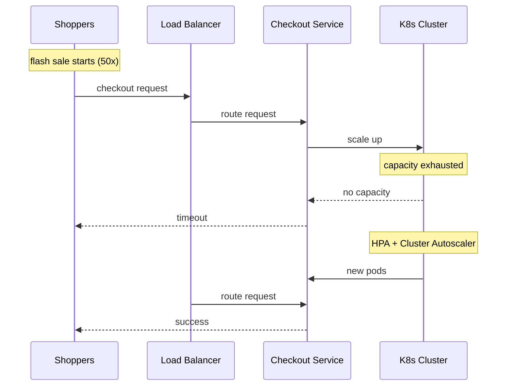

# Incident: Shopify Flash Sale Outage (2022)

> **Category:** Incident Case Study / Stylized
> **Severity:** S1 — checkout failure during flash sale
> **K8s Version:** 1.22 (GKE)
> **Area:** Capacity Planning / Traffic Management

| Field | Detail |
|-------|--------|
| **Company** | Shopify |
| **Trigger** | Flash sale traffic surge exceeds capacity |
| **Blast Radius** | Checkout and payment services |
| **Mean Time to Detect** | ~2 min |
| **Mean Time to Resolve** | ~1 hour |

## Source

- [Shopify engineering: Scaling for flash sales](https://shopify.engineering/scaling-for-flash-sales)
- [Shopify tech: Traffic management](https://shopify.engineering/traffic-management-at-scale)

## Timeline (stylized)

| Time | Event |
|------|-------|
| T+0:00 | Flash sale starts; 50x normal traffic |
| T+0:02 | Checkout service pods at 100% CPU |
| T+0:05 | Checkout requests start timing out |
| T+0:10 | PagerDuty fires: "checkout latency > 10s" |
| T+0:15 | On-call identifies: capacity exhausted |
| T+0:20 | Emergency scale-up (HPA max increased) |
| T+0:30 | Cluster Autoscaler adds new nodes |
| T+0:45 | Pods scheduled on new nodes |
| T+1:00 | Checkout service recovers |

## What happened

## Root cause

1. **Traffic surge** — flash sale generated 50x normal traffic.
2. **HPA max too low** — HPA was capped at 10 pods, but 50 were needed.
3. **Cluster Autoscaler lag** — scaling up took 10-15 minutes.
4. **No pre-scaling** — node pool wasn't increased before the sale.

## Fix

1. Increase HPA max (from 10 to 100).
2. Cluster Autoscaler scales up nodes.
3. Pods start scheduling on new nodes.

## Prevention

| Measure | Implementation |
|---------|----------------|
| **Pre-scaling** | Increase node pool before major sales |
| **HPA tuning** | Set HPA max based on peak traffic estimates |
| **Load testing** | Simulate 50x traffic before major sales |
| **Circuit breaker** | Shed non-critical load during peak |
| **Queue-based scaling** | Use KEDA to scale based on queue depth |

## Related

- [Disaster Cases](../disaster-cases.md)
- [HPA](../../03-workloads/hpa.md)
- [Cluster Autoscaler](../../03-workloads/cluster-autoscaler.md)
- [Incidents README](./README.md)
