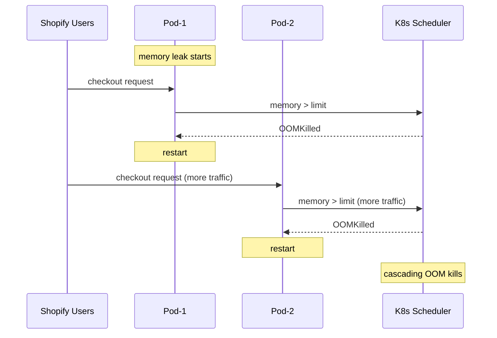

# Incident: Shopify Kubernetes Outage — OOM Kill Storm (2021)

> **Category:** Incident Case Study / Stylized (based on Shopify's engineering blog)
> **Severity:** S1 — partial outage for ~45 minutes
> **K8s Version:** 1.19 (GKE)
> **Area:** Resource Management / Performance

| Field | Detail |
|-------|--------|
| **Company** | Shopify |
| **Trigger** | Memory leak in main application pod |
| **Blast Radius** | Checkout and cart services |
| **Mean Time to Detect** | ~5 min |
| **Mean Time to Resolve** | ~45 min |

## Source

- [Shopify engineering: Dealing with a Kubernetes OOM kill storm](https://shopify.engineering/dealing-with-a-kubernetes-oom-kill-storm)
- [Shopify tech blog: Scaling Kubernetes to 10,000 pods](https://shopify.engineering/scaling-kubernetes-to-10000-pods)

## Timeline (stylized)

| Time | Event |
|------|-------|
| T+0:00 | Memory leak introduced in main app (new code deployment) |
| T+0:05 | Pods start consuming more memory than expected |
| T+0:10 | Kubernetes OOM kills the first pod |
| T+0:12 | Pod restarts; memory leak continues; OOM killed again |
| T+0:15 | Pod restart loop triggers more memory pressure on remaining pods |
| T+0:20 | Cascading OOM kills across all checkout pods |
| T+0:25 | PagerDuty fires: "checkout latency > 10s" |
| T+0:30 | On-call identifies memory leak via heap dump analysis |
| T+0:35 | Rollback to previous version |
| T+0:45 | Pods stabilize; memory usage returns to normal |

## What happened

## Root cause

1. **Memory leak** in the main application code (introduced in recent deployment).
2. Pods consumed memory gradually until hitting the `resources.limits.memory`.
3. Kubernetes **OOM killed** the pods, causing restarts.
4. Restarted pods received more traffic from load balancers, causing more memory pressure.
5. **Cascading failure** — more pods OOM killed, leading to more traffic on remaining pods.

## Fix

1. Rollback to the previous version (no memory leak).
2. Increase memory limits temporarily to prevent OOM kills.
3. Deploy memory profiling to identify the leak.

## Prevention

| Measure | Implementation |
|---------|----------------|
| **Memory profiling** | Continuous heap profiling in production |
| **VPA** | Right-size memory requests/limits based on actual usage |
| **OOM monitoring** | Alert on `container_oom_events_total` > 0 |
| **Canary deployments** | Test new code with realistic traffic before full rollout |
| **Memory budgets** | Set `resources.requests.memory` based on 99th percentile usage |

## Related

- [Disaster Cases](../disaster-cases.md)
- [Resource Management](../../07-scheduling-autoscaling/resource-management.md)
- [Deployments](../../03-workloads/deployments.md)
- [Incidents README](./README.md)
