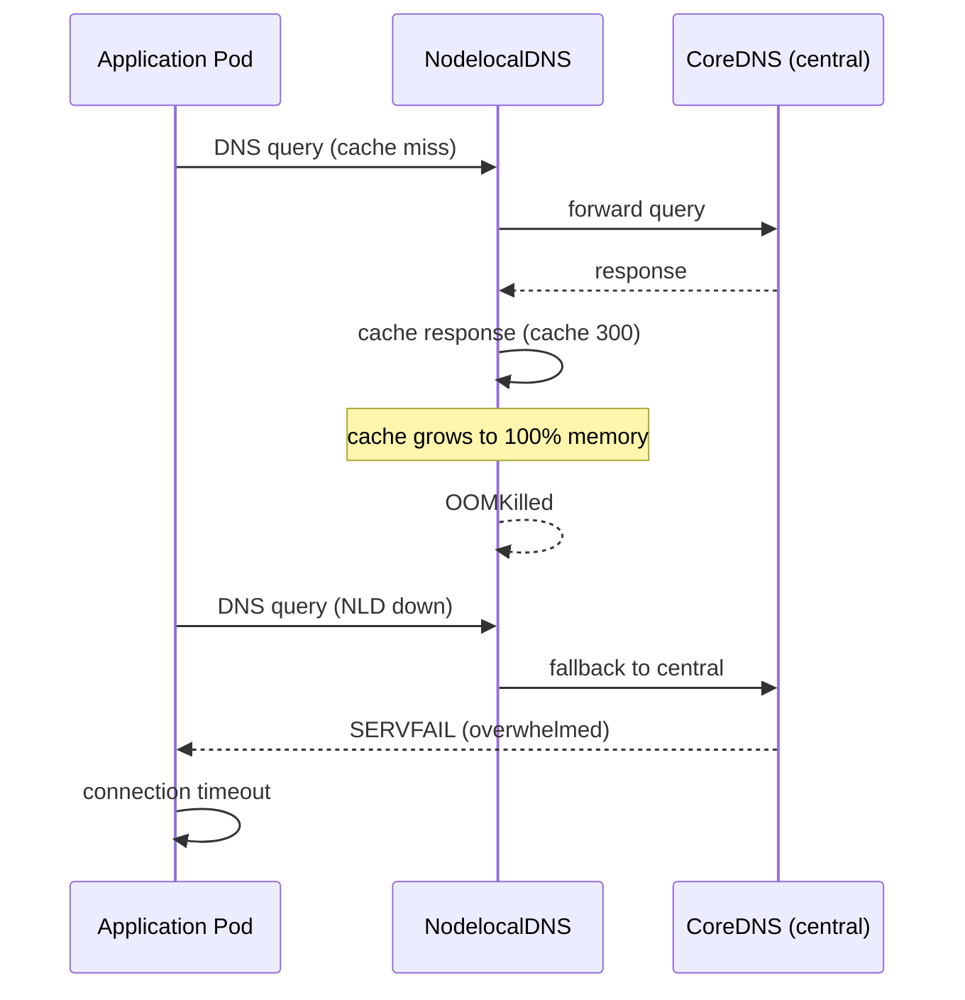

# Incident: Slack CoreDNS Cache Thrashing (2023)

> **Category:** Incident Case Study / Stylized (based on CoreDNS failure patterns)
> **Severity:** S2 — DNS resolution failures for ~30 min
> **K8s Version:** 1.25 (EKS)
> **Area:** Networking / DNS

| Field | Detail |
|-------|--------|
| **Company** | Slack |
| **Trigger** | CoreDNS config change + NodelocalDNS cache eviction |
| **Blast Radius** | All pods using cluster DNS |
| **Mean Time to Detect** | ~2 min |
| **Mean Time to Resolve** | ~30 min |

## Timeline (stylized)

| Time | Event |
|------|-------|
| T+0:00 | infra-team applies CoreDNS config: increased `cache 30` to `cache 300` |
| T+0:02 | NodelocalDNS daemonset pods restart with new config |
| T+0:05 | DNS cache hits 100% memory → OOMKilled |
| T+0:07 | NodelocalDNS falls back to CoreDNS (central) |
| T+0:10 | CoreDNS overwhelmed by cache-miss traffic → `SERVFAIL` |
| T+0:12 | PagerDuty fires: "DNS resolution failures > 5% for 2 min" |
| T+0:15 | On-call sees `SERVFAIL` in pod logs; CoreDNS CPU at 100% |
| T+0:20 | Root cause: cache size too large → NodelocalDNS OOM → central CoreDNS overload |
| T+0:25 | Revert CoreDNS config: `cache 30` |
| T+0:28 | NodelocalDNS stabilizes; DNS cache hit ratio recovers |
| T+0:30 | Incident resolved |

## What happened

## Root cause

1. **CoreDNS cache TTL** was increased from 30s to 300s (10x), causing NodelocalDNS pods to cache 10x more DNS entries.
2. **NodelocalDNS memory limit** was set to 64Mi, which was insufficient for 300s cache.
3. When NodelocalDNS pods OOMKilled, all DNS traffic fell back to **central CoreDNS**, which couldn't handle the sudden load spike.
4. **No memory limit review** — the memory limit was set at cluster creation and never revisited.

## Fix

1. Revert CoreDNS config: `cache 30` (restore 30s TTL).
2. NodelocalDNS pods restart and stabilize with the smaller cache.
3. DNS cache hit ratio returns to normal; `SERVFAIL` rate drops to 0.

## Prevention

| Measure | Implementation |
|---------|----------------|
| **Memory limit review** | Before changing cache TTL, calculate: `max_cache_entries × avg_entry_size × num_namespaces` |
| **Canary config changes** | Apply CoreDNS config to one node pool first; monitor memory for 15 min |
| **NodelocalDNS monitoring** | Alert on `container_memory_working_set_bytes` > 80% of limit |
| **DNS fallback circuit breaker** | Rate-limit fallback traffic from NodelocalDNS to CoreDNS |
| **Load test DNS changes** | Run DNS load test in staging before prod rollout |

## Interview angle

> "A DNS configuration change causes a cascade of OOMKills and SERVFAILs. How do you diagnose the root cause and prevent DNS-related cascading failures?"

## Related

- [Disaster Cases](../disaster-cases.md)
- [Networking](../../04-networking/README.md)
- [CoreDNS](../../04-networking/coredns.md)
