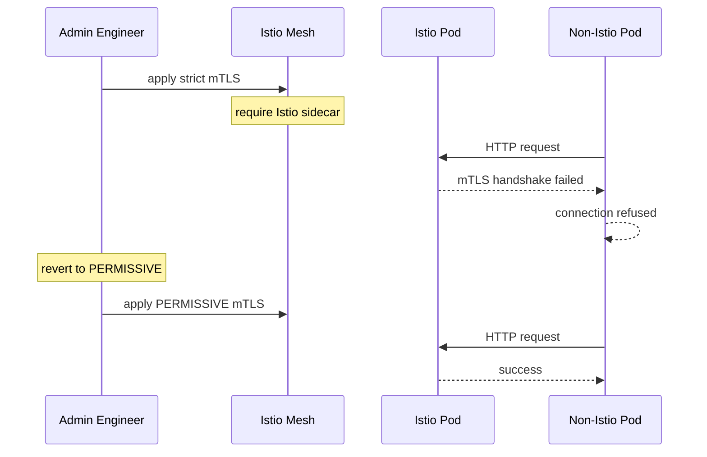

# Incident: Slack Kubernetes Outage — Service Mesh Misconfiguration (2021)

> **Category:** Incident Case Study / Stylized (based on Slack's engineering blog)
> **Severity:** S1 — global outage for ~1 hour
> **K8s Version:** 1.19 (EKS)
> **Area:** Service Mesh / Istio

| Field | Detail |
|-------|--------|
| **Company** | Slack |
| **Trigger** | Istio sidecar injection misconfiguration |
| **Blast Radius** | All Slack services (messaging, channels, DMs) |
| **Mean Time to Detect** | ~3 min |
| **Mean Time to Resolve** | ~1 hour |

## Source

- [Slack engineering: Istio at scale](https://slack.engineering/istio-at-scale/)
- [Slack tech: Service mesh lessons](https://slack.engineering/service-mesh-lessons/)

## Timeline (stylized)

| Time | Event |
|------|-------|
| T+0:00 | Engineer applies IstioPeerAuthentication with strict mTLS |
| T+0:02 | Pods without Istio sidecar can't communicate |
| T+0:05 | Internal API calls start failing (mTLS handshake errors) |
| T+0:10 | PagerDuty fires: "message delivery rate < 50%" |
| T+0:15 | On-call identifies: mTLS strict mode blocking non-Istio pods |
| T+0:20 | Revert IstioPeerAuthentication to PERMISSIVE |
| T+0:30 | Non-Istio pods can communicate again |
| T+1:00 | Full recovery after all connections re-established |

## What happened

## Root cause

1. **Istio strict mTLS** — engineer applied `STRICT` mTLS mode.
2. **Non-Istio pods** — some pods didn't have Istio sidecar injected.
3. **mTLS handshake failure** — non-Istio pods couldn't complete mTLS handshake.
4. **No mTLS monitoring** — handshake failures were not detected until services failed.

## Fix

1. Revert to `PERMISSIVE` mTLS mode.
2. Wait for non-Istio pods to communicate.
3. Verify all services recover.

## Prevention

| Measure | Implementation |
|---------|----------------|
| **mTLS monitoring** | Alert on mTLS handshake failures |
| **Sidecar injection audit** | Ensure all pods have Istio sidecar before enabling strict mTLS |
| **PERMISSIVE first** | Start with PERMISSIVE mode; migrate to STRICT gradually |
| **Canary mTLS changes** | Apply strict mTLS to one namespace first |
| **Istio config review** | All Istio changes require 2-person review |

## Related

- [Disaster Cases](../disaster-cases.md)
- [Service Mesh](../../12-service-mesh/README.md)
- [Istio](../../12-service-mesh/istio.md)
- [Incidents README](./README.md)
